# Architecture Map

Combined view: entry points, provider chain, screen flow, game phases, and full Pixi.js scene graphs.

- Blue = entry & providers
- Purple = screens & phases
- Green = Pixi.js scene graph (display objects)

See also: [entry-point-map.md](entry-point-map.md), [scene-graph.md](scene-graph.md), [architecture.md](architecture.md)

---

```mermaid
graph TB
    %% Entry & Providers
    subgraph ENTRY["Entry"]
        direction TB
        EC["entry-client.tsx"] --> APP
        ES["entry-server.tsx"] --> APP["app.tsx"]
    end

    subgraph PROVIDERS["Provider Chain"]
        direction TB
        GB["GlobalBoundary"] --> TP["TuningProvider"]
        TP --> PP["PauseProvider"]
        PP --> MP["ManifestProvider"]
        MP --> AP["AssetProvider"]
        AP --> SP["ScreenProvider"]
        SP --> SR["ScreenRenderer"]
    end

    APP --> GB

    subgraph SCREENS["Screen Flow"]
        direction LR
        LS["LoadingScreen"] -->|new| SS["StartScreen"]
        LS -->|resume| GS["GameScreen"]
        SS --> GS
        GS --> RS["ResultsScreen"]
        RS -->|retry| GS
        RS -->|menu| SS
    end

    SR --> LS

    subgraph PHASES["GameScreen Phases"]
        direction TB
        INTRO["Introduction"] --> LOADP["Loading Puzzle"]
        LOADP --> CS["Chapter Start"]
        CS --> PLAY["Playing"]
        PLAY --> CLUE_P["CluePopup\nlvl 1-9"]
        PLAY --> COMP_P["CompanionOverlay\nchapter end"]
        CLUE_P -->|next level| PLAY
        COMP_P -->|next chapter| INTRO
    end

    GS --> INTRO

    %% Pixi Scene Graph - StartScreen
    subgraph SS_STAGE["StartScreen Stage"]
        direction TB
        SS_BG["background (Sprite)"]
        SS_UI["uiContainer"]
        SS_UI --> SS_TITLE["titleSprite"]
        SS_UI --> SS_BADGE["countyBadge (Graphics)"]
        SS_UI --> SS_CTXT["countyText (Text)"]
        SS_UI --> SS_GOAL["goalPanel (Graphics)"]
        SS_UI --> SS_GTXT["goalText (Text)"]
        SS_UI --> SS_SHADOW["characterShadow"]
        SS_UI --> SS_CHAR["Character"]
        SS_CHAR --> SS_CHARSP["sprite (Sprite)"]
        SS_UI --> SS_FLAVOR["flavorText (Text)"]
        SS_UI --> SS_BTN["SpriteButton"]
        SS_BTN --> SS_BTNSP["NineSliceSprite"]
        SS_BTN --> SS_BTNTXT["labelText (Text)"]
    end

    SS -.-> SS_STAGE

    %% Pixi Scene Graph - GameScreen
    subgraph GS_STAGE["GameScreen Stage"]
        direction TB
        GS_BG["background\n(Sprite + BlurFilter)"]

        subgraph GAME["CityLinesGame"]
            direction TB
            G_GRID["gridContainer"]
            G_GRID --> G_GRIDBG["NineSliceSprite\ngrid_backing"]
            G_EXITS["exitsContainer"]
            G_EXITS --> G_EXIT["Exit ×N"]
            G_EXIT --> G_EXITROAD["roadBackgrounds"]
            G_EXIT --> G_EXITSP["sprite\nexit.png"]
            G_ROADS["roadTilesContainer"]
            G_ROADS --> G_RT["RoadTile ×N"]
            G_RT --> G_RTDEF["defaultSprite"]
            G_RT --> G_RTCOMP["completedSprite"]
            G_VFX["vfxContainer"]
            G_VFX --> G_VFXR["AnimatedSprite\nvfx-rotate"]
            G_VFX --> G_VFXB["AnimatedSprite\nvfx-blast"]
            G_DECO["decorationsContainer"]
            G_DECO --> G_DECSP["Sprite ×N\ntree/bush/flower"]
            G_LAND["landmarksContainer"]
            G_LAND --> G_LM["Landmark ×N"]
            G_LM --> G_LMROAD["roadBackgrounds"]
            G_LM --> G_LMSP["sprite\nlandmark_*.png"]
            G_TH["TutorialHand"]
            G_TH --> G_THSP["Sprite\nsprite-hand.png"]
        end

        GS_CLABEL["chapterLabel (Text)"]

        subgraph HUD["HUD"]
            direction TB
            H_PB["ProgressBar"]
            H_PB --> H_BG["backgroundGraphics"]
            H_PB --> H_FILL["fillGraphics"]
            H_PB --> H_MILE["milestoneGraphics"]
            H_PB --> H_BORDER["borderGraphics"]
        end

        subgraph OVERLAY["Overlays"]
            direction TB
            O_CLUE["CluePopup"]
            O_CLUE --> O_CIRCLE["circleContainer"]
            O_CIRCLE --> O_AVATAR["characterSprite"]
            O_CIRCLE --> O_MASK["circleMask"]
            O_CLUE --> O_DBOX["dialogueBox\nNineSliceSprite"]
            O_CLUE --> O_TXT["textField"]
            O_DARK["darkOverlay (Graphics)"]
            O_COMP["companionGroup"]
            O_COMP --> O_COMPCHAR["CompanionCharacter"]
            O_COMP --> O_COMPDLG["DialogueBox"]
            O_COMPDLG --> O_COMPBOX["NineSliceSprite"]
            O_COMPDLG --> O_COMPTXT["textField"]
        end
    end

    GS -.-> GS_STAGE

    %% Styles
    style ENTRY fill:#1e3a5f,color:#fff,stroke:#2d5f8a
    style PROVIDERS fill:#1e3a5f,color:#fff,stroke:#2d5f8a
    style SCREENS fill:#4a2060,color:#fff,stroke:#6b3a8a
    style PHASES fill:#4a2060,color:#fff,stroke:#6b3a8a
    style SS_STAGE fill:#0d4030,color:#fff,stroke:#1a6b50
    style GS_STAGE fill:#0d4030,color:#fff,stroke:#1a6b50
    style GAME fill:#1a5040,color:#fff,stroke:#2a7a60
    style HUD fill:#1a5040,color:#fff,stroke:#2a7a60
    style OVERLAY fill:#1a5040,color:#fff,stroke:#2a7a60

    style EC fill:#2d5f8a,color:#fff
    style ES fill:#2d5f8a,color:#fff
    style APP fill:#2d5f8a,color:#fff
    style GB fill:#345e80,color:#fff
    style TP fill:#345e80,color:#fff
    style PP fill:#345e80,color:#fff
    style MP fill:#345e80,color:#fff
    style AP fill:#345e80,color:#fff
    style SP fill:#345e80,color:#fff
    style SR fill:#345e80,color:#fff

    style LS fill:#6b3a8a,color:#fff
    style SS fill:#6b3a8a,color:#fff
    style GS fill:#6b3a8a,color:#fff
    style RS fill:#6b3a8a,color:#fff
    style INTRO fill:#5a2d75,color:#fff
    style LOADP fill:#5a2d75,color:#fff
    style CS fill:#5a2d75,color:#fff
    style PLAY fill:#5a2d75,color:#fff
    style CLUE_P fill:#5a2d75,color:#fff
    style COMP_P fill:#5a2d75,color:#fff
```

