# Scaffold Architecture Deep Dive Report

> **Comprehensive technical documentation for the game scaffold framework**

---

## Executive Summary

This document provides an in-depth analysis of the scaffold architecture - a reusable game development framework that cleanly separates engine concerns from game-specific logic. The CityLines game serves as the reference implementation.

**Key Metrics:**
- **6 core scaffold systems** (Assets, Screens, Tuning, Pause, Audio, Errors)
- **Clean separation** via TypeScript generics and interfaces
- **Zero game logic** in scaffold code
- **100% reusable** for new game projects

---

## Table of Contents

1. [High-Level Architecture](#1-high-level-architecture)
2. [Provider Hierarchy](#2-provider-hierarchy)
3. [Asset System Deep Dive](#3-asset-system-deep-dive)
4. [Screen System Deep Dive](#4-screen-system-deep-dive)
5. [Tuning System Deep Dive](#5-tuning-system-deep-dive)
6. [Error Handling System](#6-error-handling-system)
7. [Game Layer Integration](#7-game-layer-integration)
8. [Data Flow Analysis](#8-data-flow-analysis)
9. [File Dependency Map](#9-file-dependency-map)
10. [Development Tools](#10-development-tools)

---

## 1. High-Level Architecture

### 1.1 Layer Separation

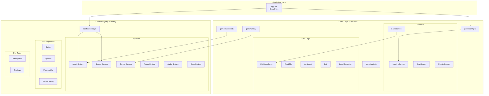
```mermaid
graph TB
    subgraph "Application Layer"
        APP[app.tsx<br/>Entry Point]
    end

    subgraph "Scaffold Layer (Reusable)"
        direction TB
        SC[scaffold/config.ts]

        subgraph "Systems"
            ASSETS[Asset System]
            SCREENS[Screen System]
            TUNING[Tuning System]
            PAUSE[Pause System]
            AUDIO[Audio System]
            ERRORS[Error System]
        end

        subgraph "UI Components"
            BTN[Button]
            SPIN[Spinner]
            PROG[ProgressBar]
            PAUSE_UI[PauseOverlay]
        end

        subgraph "Dev Tools"
            TWEAK[TuningPanel]
            BIND[Bindings]
        end
    end

    subgraph "Game Layer (CityLines)"
        direction TB
        GC[game/config.ts]
        GM[game/manifest.ts]
        GS[game/state.ts]
        GT[game/tuning/]

        subgraph "Screens"
            LOAD[LoadingScreen]
            START[StartScreen]
            GAME[GameScreen]
            RESULTS[ResultsScreen]
        end

        subgraph "Core Logic"
            CLG[CityLinesGame]
            TILE[RoadTile]
            LAND[Landmark]
            EXIT[Exit]
            LEVEL[LevelGenerator]
        end
    end

    APP --> SC
    APP --> GC
    SC --> ASSETS
    SC --> SCREENS
    GC --> LOAD
    GM --> ASSETS
    GT --> TUNING
    GAME --> CLG
```

### 1.2 Dependency Direction

The scaffold has **zero dependencies** on game code. All dependencies flow one direction:

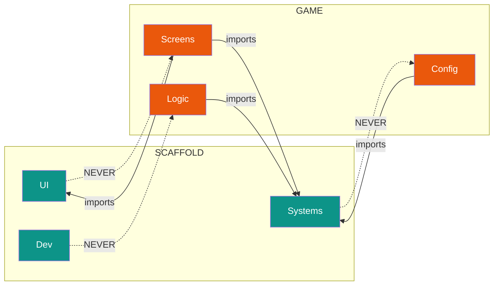
```mermaid
graph LR
    subgraph "SCAFFOLD"
        S1[Systems]
        S2[UI]
        S3[Dev]
    end

    subgraph "GAME"
        G1[Config]
        G2[Screens]
        G3[Logic]
    end

    G1 -->|imports| S1
    G2 -->|imports| S1
    G2 -->|imports| S2
    G3 -->|imports| S1

    S1 -.->|NEVER| G1
    S2 -.->|NEVER| G2
    S3 -.->|NEVER| G3

    style S1 fill:#0d9488,color:#fff
    style S2 fill:#0d9488,color:#fff
    style S3 fill:#0d9488,color:#fff
    style G1 fill:#ea580c,color:#fff
    style G2 fill:#ea580c,color:#fff
    style G3 fill:#ea580c,color:#fff
```

**Legend:** Teal = Scaffold (reusable), Orange = Game (specific)

---

## 2. Provider Hierarchy

### 2.1 Provider Nesting Order

The application uses a strict provider nesting order where each layer can access all providers above it:


```mermaid
graph TB
    subgraph "Provider Stack (app.tsx)"
        ROOT["&lt;App/&gt;"]
        TP["TuningProvider<br/><small>Loads config, provides useTuning()</small>"]
        AP["AssetProvider<br/><small>Creates coordinator, provides useAssets()</small>"]
        SP["ScreenProvider<br/><small>Screen state machine, provides useScreen()</small>"]
        PP["PauseProvider<br/><small>Pause state, provides usePause()</small>"]
        AUP["AudioProvider<br/><small>Volume state, provides useAudio()</small>"]
        SR["ScreenRenderer<br/><small>Renders current screen component</small>"]
        GS["[Game Screen]<br/><small>Has access to ALL hooks</small>"]
    end

    ROOT --> TP
    TP --> AP
    AP --> SP
    SP --> PP
    PP --> AUP
    AUP --> SR
    SR --> GS

    style ROOT fill:#1e293b,color:#fff
    style TP fill:#0d9488,color:#fff
    style AP fill:#0d9488,color:#fff
    style SP fill:#0d9488,color:#fff
    style PP fill:#0d9488,color:#fff
    style AUP fill:#0d9488,color:#fff
    style SR fill:#0d9488,color:#fff
    style GS fill:#ea580c,color:#fff
```

### 2.2 Hook Availability by Layer

| Hook | TuningProvider | AssetProvider | ScreenProvider | Game Screens |
|------|:--------------:|:-------------:|:--------------:|:------------:|
| `useTuning()` | - | Yes | Yes | Yes |
| `useAssets()` | No | - | Yes | Yes |
| `useScreen()` | No | No | - | Yes |
| `usePause()` | No | No | No | Yes |
| `useAudio()` | No | No | No | Yes |

---

## 3. Asset System Deep Dive

### 3.1 Asset Coordinator Architecture

The AssetCoordinator is the central hub that routes asset loading requests to specialized loaders:

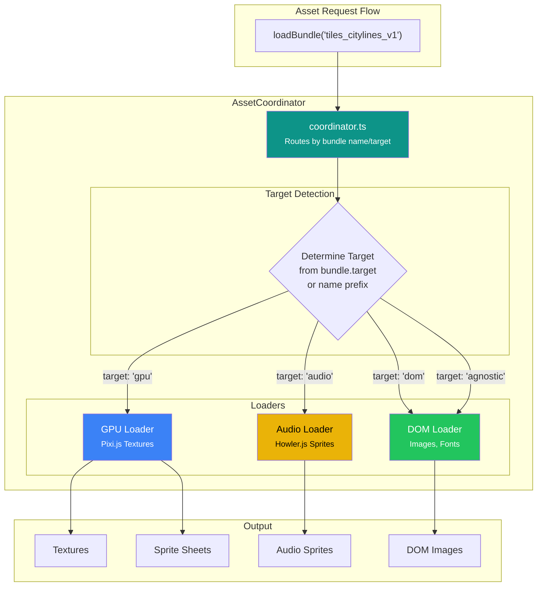
```mermaid
graph TB
    subgraph "Asset Request Flow"
        REQ["loadBundle('tiles_citylines_v1')"]
    end

    subgraph "AssetCoordinator"
        COORD[coordinator.ts<br/><small>Routes by bundle name/target</small>]

        subgraph "Target Detection"
            DET{"Determine Target<br/>from bundle.target<br/>or name prefix"}
        end

        subgraph "Loaders"
            DOM[DOM Loader<br/><small>Images, Fonts</small>]
            GPU[GPU Loader<br/><small>Pixi.js Textures</small>]
            AUD[Audio Loader<br/><small>Howler.js Sprites</small>]
        end
    end

    subgraph "Output"
        TEX[Textures]
        SPR[Sprite Sheets]
        SND[Audio Sprites]
        IMG[DOM Images]
    end

    REQ --> COORD
    COORD --> DET
    DET -->|"target: 'gpu'"| GPU
    DET -->|"target: 'dom'"| DOM
    DET -->|"target: 'audio'"| AUD
    DET -->|"target: 'agnostic'"| DOM

    GPU --> TEX
    GPU --> SPR
    AUD --> SND
    DOM --> IMG

    style COORD fill:#0d9488,color:#fff
    style GPU fill:#3b82f6,color:#fff
    style DOM fill:#22c55e,color:#fff
    style AUD fill:#eab308,color:#000
```

### 3.2 Bundle Loading Lifecycle

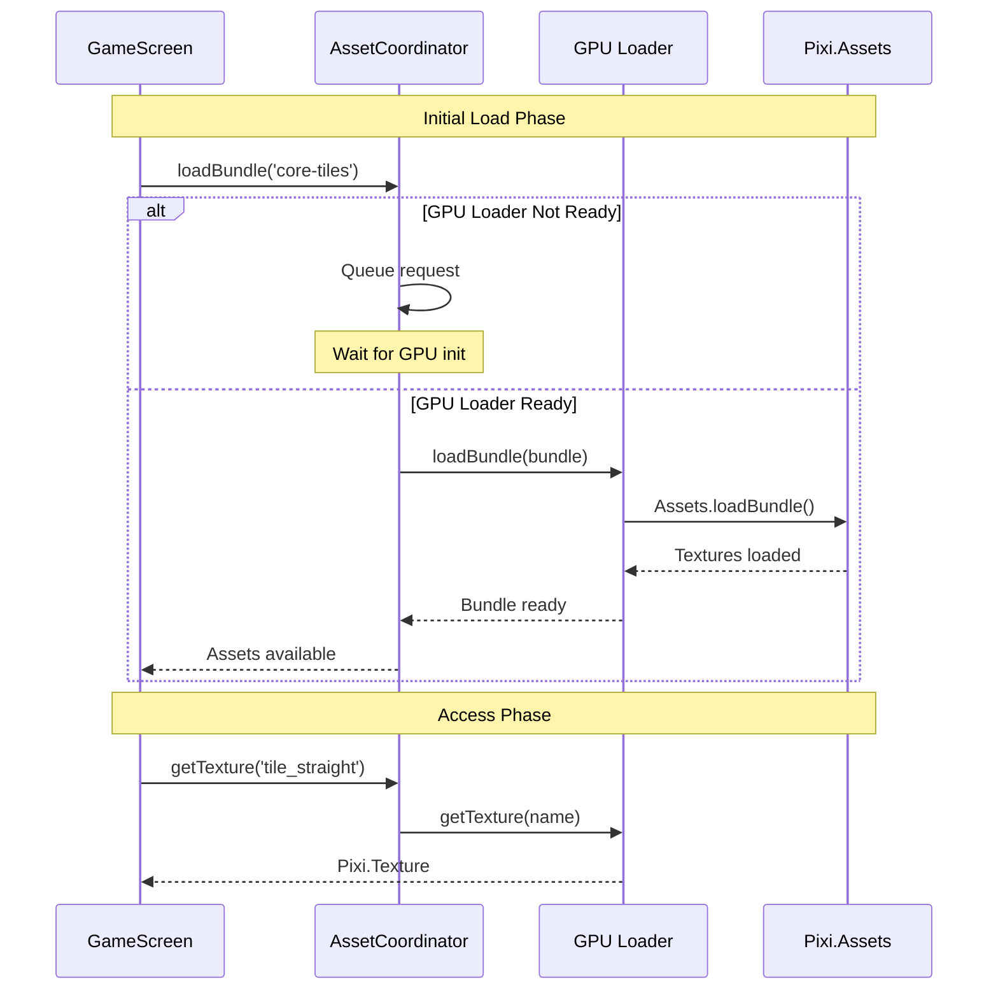
```mermaid
sequenceDiagram
    participant GS as GameScreen
    participant AC as AssetCoordinator
    participant GL as GPU Loader
    participant PI as Pixi.Assets

    Note over GS,PI: Initial Load Phase
    GS->>AC: loadBundle('core-tiles')

    alt GPU Loader Not Ready
        AC->>AC: Queue request
        Note over AC: Wait for GPU init
    else GPU Loader Ready
        AC->>GL: loadBundle(bundle)
        GL->>PI: Assets.loadBundle()
        PI-->>GL: Textures loaded
        GL-->>AC: Bundle ready
        AC-->>GS: Assets available
    end

    Note over GS,PI: Access Phase
    GS->>AC: getTexture('tile_straight')
    AC->>GL: getTexture(name)
    GL-->>GS: Pixi.Texture
```

### 3.3 Asset Target Types

| Target | Loader | Use Case | Example Assets |
|--------|--------|----------|----------------|
| `dom` | DOM Loader | UI images, fonts | Logo, icons |
| `gpu` | Pixi Loader | Game sprites, animations | Tiles, characters |
| `audio` | Audio Loader | Sound effects, music | SFX sprites |
| `agnostic` | DOM Loader | Assets used in both contexts | Branding |

### 3.4 Manifest Structure

```typescript
// game/manifest.ts
export const manifest: ManifestBundle[] = [
  {
    name: 'theme-branding',      // Bundle identifier
    target: 'agnostic',          // Loader routing
    assets: [
      { alias: 'logo', src: '/assets/logo.png' }
    ]
  },
  {
    name: 'tiles_citylines_v1',  // GPU bundle (by convention)
    target: 'gpu',
    assets: [
      { alias: 'spritesheet', src: '/assets/tiles.json' }
    ]
  },
  {
    name: 'audio-sfx-citylines', // Audio bundle
    target: 'audio',
    assets: [
      { alias: 'sfx', src: '/assets/sfx.mp3', data: { sprite: {...} } }
    ]
  }
];
```

---

## 4. Screen System Deep Dive

### 4.1 Screen State Machine

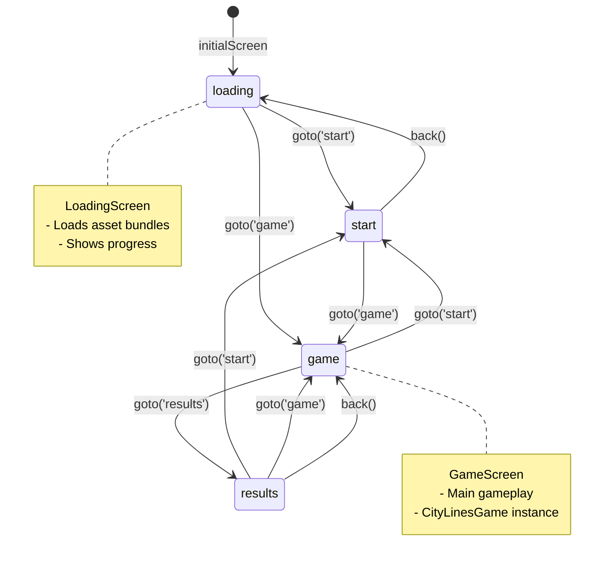
```mermaid
stateDiagram-v2
    [*] --> loading: initialScreen

    loading --> start: goto('start')
    loading --> game: goto('game')

    start --> game: goto('game')
    start --> loading: back()

    game --> results: goto('results')
    game --> start: goto('start')

    results --> start: goto('start')
    results --> game: goto('game')
    results --> game: back()

    note right of loading
        LoadingScreen
        - Loads asset bundles
        - Shows progress
    end note

    note right of game
        GameScreen
        - Main gameplay
        - CityLinesGame instance
    end note
```

### 4.2 Transition System

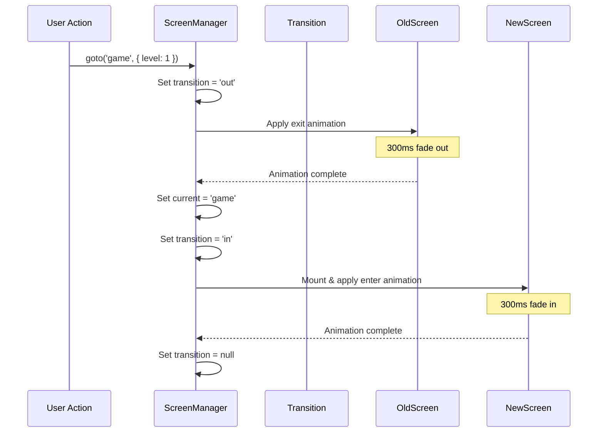
```mermaid
sequenceDiagram
    participant U as User Action
    participant SM as ScreenManager
    participant TR as Transition
    participant OLD as OldScreen
    participant NEW as NewScreen

    U->>SM: goto('game', { level: 1 })
    SM->>SM: Set transition = 'out'
    SM->>OLD: Apply exit animation

    Note over OLD: 300ms fade out

    OLD-->>SM: Animation complete
    SM->>SM: Set current = 'game'
    SM->>SM: Set transition = 'in'
    SM->>NEW: Mount & apply enter animation

    Note over NEW: 300ms fade in

    NEW-->>SM: Animation complete
    SM->>SM: Set transition = null
```

### 4.3 Transition Types

| Type | Effect | Duration | Use Case |
|------|--------|----------|----------|
| `fade` | Opacity 1→0→1 | 300ms | Default, smooth |
| `slide` | Translate X | 300ms | Sequential screens |
| `none` | Instant | 0ms | Debug, fast nav |

### 4.4 Screen Manager API

```typescript
interface ScreenManager<ScreenId> {
  // Signals (reactive state)
  current: () => ScreenId;
  previous: () => ScreenId | null;
  transition: () => TransitionState | null;
  data: () => unknown;

  // Actions
  goto: (screen: ScreenId, data?: unknown) => void;
  back: () => void;

  // Utilities
  getTransitionClass: () => string;
}
```

---

## 5. Tuning System Deep Dive

### 5.1 Configuration Loading Pipeline

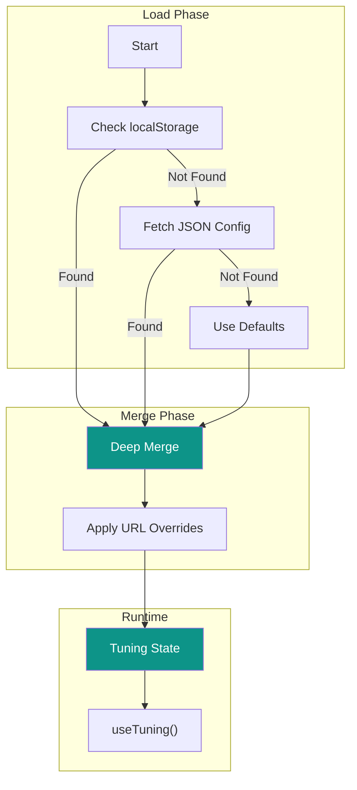
```mermaid
graph TB
    subgraph "Load Phase"
        START[Start]
        LS[Check localStorage]
        JSON[Fetch JSON Config]
        DEF[Use Defaults]
    end

    subgraph "Merge Phase"
        MERGE[Deep Merge]
        URL[Apply URL Overrides]
    end

    subgraph "Runtime"
        STATE[Tuning State]
        HOOK["useTuning()"]
    end

    START --> LS
    LS -->|Found| MERGE
    LS -->|Not Found| JSON
    JSON -->|Found| MERGE
    JSON -->|Not Found| DEF
    DEF --> MERGE
    MERGE --> URL
    URL --> STATE
    STATE --> HOOK

    style MERGE fill:#0d9488,color:#fff
    style STATE fill:#0d9488,color:#fff
```

### 5.2 Configuration Layers (Priority Order)

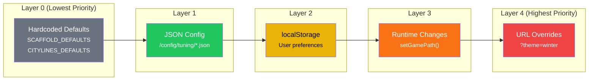
```mermaid
graph LR
    subgraph "Layer 4 (Highest Priority)"
        URL["URL Overrides<br/><small>?theme=winter</small>"]
    end

    subgraph "Layer 3"
        RUNTIME["Runtime Changes<br/><small>setGamePath()</small>"]
    end

    subgraph "Layer 2"
        LOCAL["localStorage<br/><small>User preferences</small>"]
    end

    subgraph "Layer 1"
        JSONCFG["JSON Config<br/><small>/config/tuning/*.json</small>"]
    end

    subgraph "Layer 0 (Lowest Priority)"
        DEFAULTS["Hardcoded Defaults<br/><small>SCAFFOLD_DEFAULTS</small><br/><small>CITYLINES_DEFAULTS</small>"]
    end

    DEFAULTS --> JSONCFG
    JSONCFG --> LOCAL
    LOCAL --> RUNTIME
    RUNTIME --> URL

    style URL fill:#ef4444,color:#fff
    style RUNTIME fill:#f97316,color:#fff
    style LOCAL fill:#eab308,color:#000
    style JSONCFG fill:#22c55e,color:#fff
    style DEFAULTS fill:#6b7280,color:#fff
```

### 5.3 Tuning Type Structure

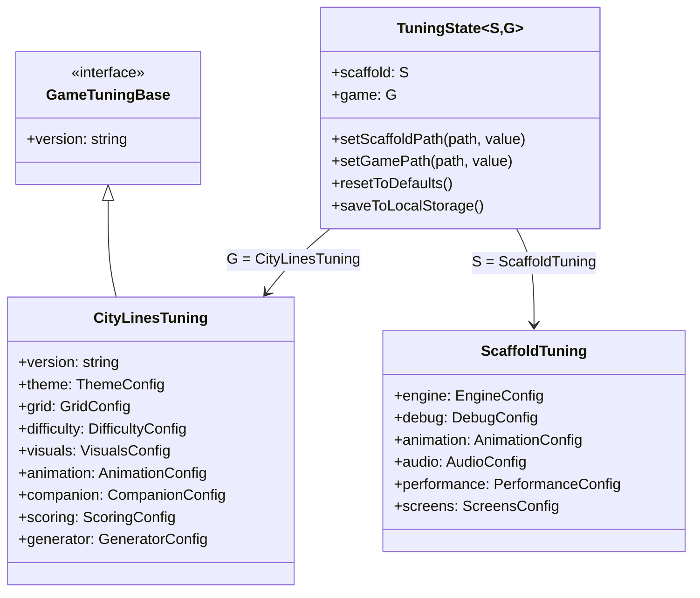
```mermaid
classDiagram
    class ScaffoldTuning {
        +engine: EngineConfig
        +debug: DebugConfig
        +animation: AnimationConfig
        +audio: AudioConfig
        +performance: PerformanceConfig
        +screens: ScreensConfig
    }

    class GameTuningBase {
        <<interface>>
        +version: string
    }

    class CityLinesTuning {
        +version: string
        +theme: ThemeConfig
        +grid: GridConfig
        +difficulty: DifficultyConfig
        +visuals: VisualsConfig
        +animation: AnimationConfig
        +companion: CompanionConfig
        +scoring: ScoringConfig
        +generator: GeneratorConfig
    }

    GameTuningBase <|-- CityLinesTuning

    class TuningState~S,G~ {
        +scaffold: S
        +game: G
        +setScaffoldPath(path, value)
        +setGamePath(path, value)
        +resetToDefaults()
        +saveToLocalStorage()
    }

    TuningState --> ScaffoldTuning : S = ScaffoldTuning
    TuningState --> CityLinesTuning : G = CityLinesTuning
```

### 5.4 Scaffold Tuning Schema

```typescript
interface ScaffoldTuning {
  engine: {
    renderer: 'webgl' | 'webgpu';
    antialias: boolean;
    resolution: number;
  };
  debug: {
    showFPS: boolean;
    showGrid: boolean;
    logLevel: 'none' | 'error' | 'warn' | 'info' | 'debug';
  };
  animation: {
    defaultDuration: number;
    defaultEasing: string;
  };
  audio: {
    masterVolume: number;
    musicVolume: number;
    sfxVolume: number;
  };
  performance: {
    targetFPS: number;
    maxParticles: number;
  };
  screens: {
    transitionDuration: number;
    transitionType: 'fade' | 'slide' | 'none';
  };
}
```

### 5.5 Game Tuning Schema (CityLines)

```typescript
interface CityLinesTuning extends GameTuningBase {
  theme: {
    tileTheme: 'regular' | 'fall' | 'winter';
  };
  grid: {
    tileSize: number;
    defaultGridSize: number;
    padding: number;
    cellGap: number;
  };
  difficulty: {
    easy: DifficultyConfig;
    medium: DifficultyConfig;
    hard: DifficultyConfig;
  };
  visuals: {
    backgroundColor: number;
    landmarkTint: number;
    exitTint: number;
  };
  animation: {
    connectionPulseDuration: number;
    levelCompleteDelay: number;
    tileRotateDuration: number;
  };
  companion: {
    slideInDelay: number;
    slideInDuration: number;
    dialogueDuration: number;
  };
  scoring: {
    baseScore: number;
    timeBonus: number;
    perfectBonus: number;
  };
  generator: {
    width: number;
    height: number;
    exitPoints: number;
    wriggleFactor: number;
  };
}
```

---

## 6. Error Handling System

### 6.1 Error Boundary Hierarchy

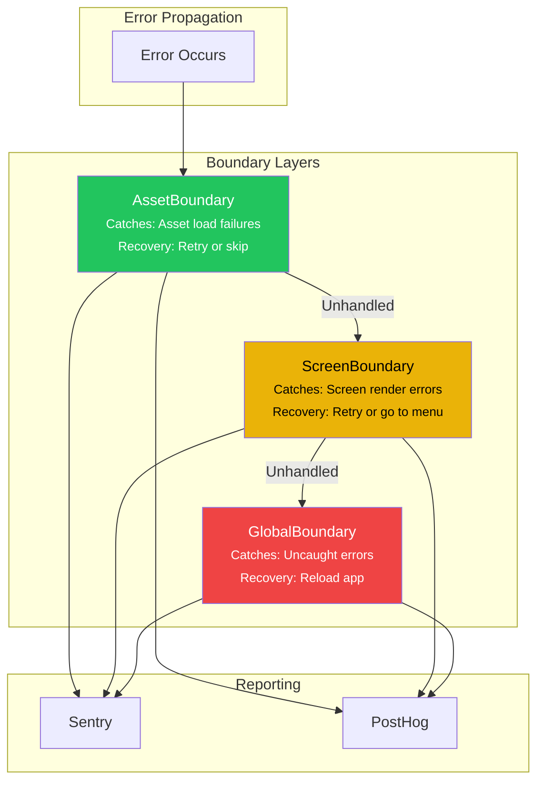
```mermaid
graph TB
    subgraph "Error Propagation"
        ERR[Error Occurs]
    end

    subgraph "Boundary Layers"
        ASSET["AssetBoundary<br/><small>Catches: Asset load failures</small><br/><small>Recovery: Retry or skip</small>"]
        SCREEN["ScreenBoundary<br/><small>Catches: Screen render errors</small><br/><small>Recovery: Retry or go to menu</small>"]
        GLOBAL["GlobalBoundary<br/><small>Catches: Uncaught errors</small><br/><small>Recovery: Reload app</small>"]
    end

    subgraph "Reporting"
        SENTRY[Sentry]
        POSTHOG[PostHog]
    end

    ERR --> ASSET
    ASSET -->|Unhandled| SCREEN
    SCREEN -->|Unhandled| GLOBAL

    ASSET --> SENTRY
    SCREEN --> SENTRY
    GLOBAL --> SENTRY

    ASSET --> POSTHOG
    SCREEN --> POSTHOG
    GLOBAL --> POSTHOG

    style ASSET fill:#22c55e,color:#fff
    style SCREEN fill:#eab308,color:#000
    style GLOBAL fill:#ef4444,color:#fff
```

### 6.2 Error Severity Levels

| Level | Boundary | User Impact | Recovery Action |
|-------|----------|-------------|-----------------|
| `warning` | Asset | Degraded experience | Continue with fallback |
| `error` | Screen | Screen unusable | Retry or navigate away |
| `fatal` | Global | App unusable | Full reload required |

### 6.3 Error Reporter Flow

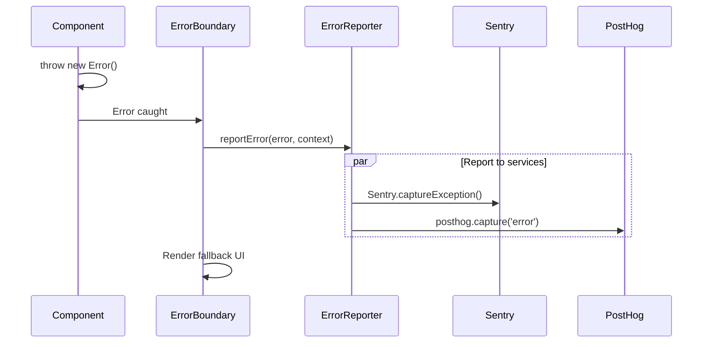
```mermaid
sequenceDiagram
    participant C as Component
    participant EB as ErrorBoundary
    participant ER as ErrorReporter
    participant S as Sentry
    participant PH as PostHog

    C->>C: throw new Error()
    C->>EB: Error caught
    EB->>ER: reportError(error, context)

    par Report to services
        ER->>S: Sentry.captureException()
        ER->>PH: posthog.capture('error')
    end

    EB->>EB: Render fallback UI
```

---

## 7. Game Layer Integration

### 7.1 Game Config Contract

The game provides configuration that the scaffold consumes:

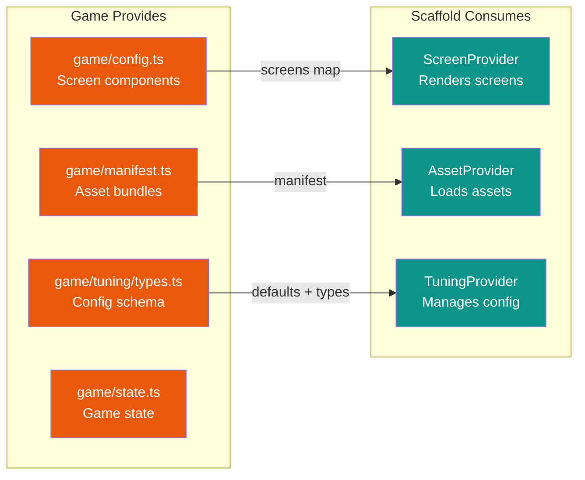
```mermaid
graph LR
    subgraph "Game Provides"
        GC["game/config.ts<br/>Screen components"]
        GM["game/manifest.ts<br/>Asset bundles"]
        GT["game/tuning/types.ts<br/>Config schema"]
        GS["game/state.ts<br/>Game state"]
    end

    subgraph "Scaffold Consumes"
        SP["ScreenProvider<br/>Renders screens"]
        AP["AssetProvider<br/>Loads assets"]
        TP["TuningProvider<br/>Manages config"]
    end

    GC -->|screens map| SP
    GM -->|manifest| AP
    GT -->|defaults + types| TP

    style GC fill:#ea580c,color:#fff
    style GM fill:#ea580c,color:#fff
    style GT fill:#ea580c,color:#fff
    style GS fill:#ea580c,color:#fff
    style SP fill:#0d9488,color:#fff
    style AP fill:#0d9488,color:#fff
    style TP fill:#0d9488,color:#fff
```

### 7.2 Game Screen Anatomy

```typescript
// game/screens/GameScreen.tsx
const GameScreen: Component = () => {
  // 1. Access scaffold systems via hooks
  const assets = useAssets();
  const tuning = useTuning<ScaffoldTuning, CityLinesTuning>();
  const screen = useScreen();
  const pause = usePause();
  const audio = useAudio();

  // 2. Get game-specific state
  const gameState = useGameState();

  // 3. Create game instance with tuning
  const game = new CityLinesGame({
    tuning: tuning.game,
    assets: assets,
  });

  // 4. Handle game events
  game.on('levelComplete', (data) => {
    gameState.addScore(data.score);
    screen.goto('results', data);
  });

  // 5. Render Pixi canvas
  return <div ref={container} />;
};
```

### 7.3 CityLinesGame Class Structure

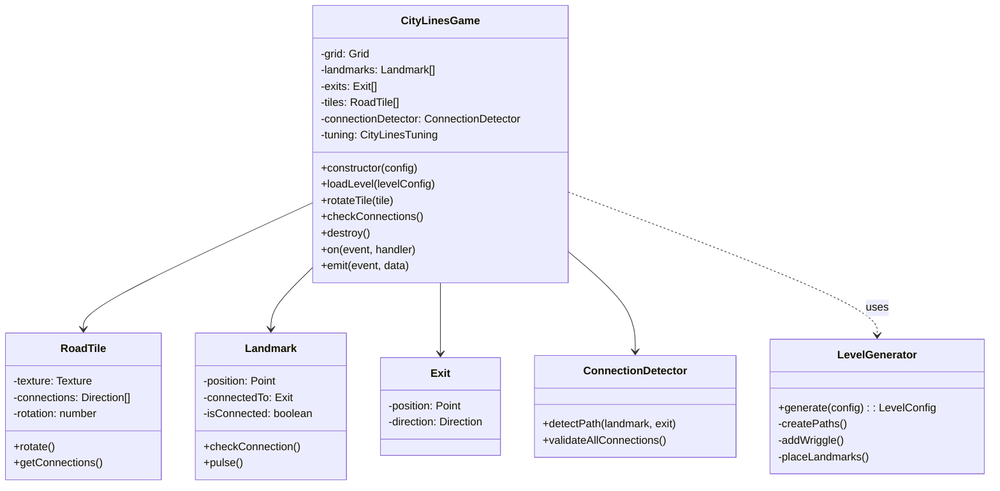
```mermaid
classDiagram
    class CityLinesGame {
        -grid: Grid
        -landmarks: Landmark[]
        -exits: Exit[]
        -tiles: RoadTile[]
        -connectionDetector: ConnectionDetector
        -tuning: CityLinesTuning

        +constructor(config)
        +loadLevel(levelConfig)
        +rotateTile(tile)
        +checkConnections()
        +destroy()

        +on(event, handler)
        +emit(event, data)
    }

    class RoadTile {
        -texture: Texture
        -connections: Direction[]
        -rotation: number

        +rotate()
        +getConnections()
    }

    class Landmark {
        -position: Point
        -connectedTo: Exit
        -isConnected: boolean

        +checkConnection()
        +pulse()
    }

    class Exit {
        -position: Point
        -direction: Direction
    }

    class ConnectionDetector {
        +detectPath(landmark, exit)
        +validateAllConnections()
    }

    class LevelGenerator {
        +generate(config): LevelConfig
        -createPaths()
        -addWriggle()
        -placeLandmarks()
    }

    CityLinesGame --> RoadTile
    CityLinesGame --> Landmark
    CityLinesGame --> Exit
    CityLinesGame --> ConnectionDetector
    CityLinesGame ..> LevelGenerator : uses
```

---

## 8. Data Flow Analysis

### 8.1 Complete Request Flow

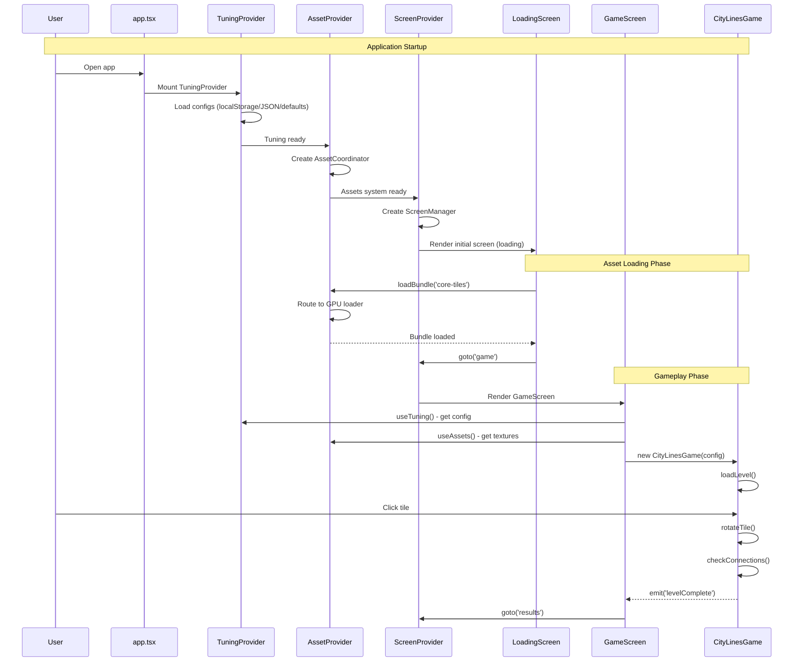
```mermaid
sequenceDiagram
    participant U as User
    participant APP as app.tsx
    participant TP as TuningProvider
    participant AP as AssetProvider
    participant SP as ScreenProvider
    participant LS as LoadingScreen
    participant GS as GameScreen
    participant CLG as CityLinesGame

    Note over U,CLG: Application Startup

    U->>APP: Open app
    APP->>TP: Mount TuningProvider
    TP->>TP: Load configs (localStorage/JSON/defaults)
    TP->>AP: Tuning ready
    AP->>AP: Create AssetCoordinator
    AP->>SP: Assets system ready
    SP->>SP: Create ScreenManager
    SP->>LS: Render initial screen (loading)

    Note over LS,CLG: Asset Loading Phase

    LS->>AP: loadBundle('core-tiles')
    AP->>AP: Route to GPU loader
    AP-->>LS: Bundle loaded
    LS->>SP: goto('game')

    Note over GS,CLG: Gameplay Phase

    SP->>GS: Render GameScreen
    GS->>TP: useTuning() - get config
    GS->>AP: useAssets() - get textures
    GS->>CLG: new CityLinesGame(config)
    CLG->>CLG: loadLevel()

    U->>CLG: Click tile
    CLG->>CLG: rotateTile()
    CLG->>CLG: checkConnections()
    CLG-->>GS: emit('levelComplete')
    GS->>SP: goto('results')
```

### 8.2 Tuning Update Flow

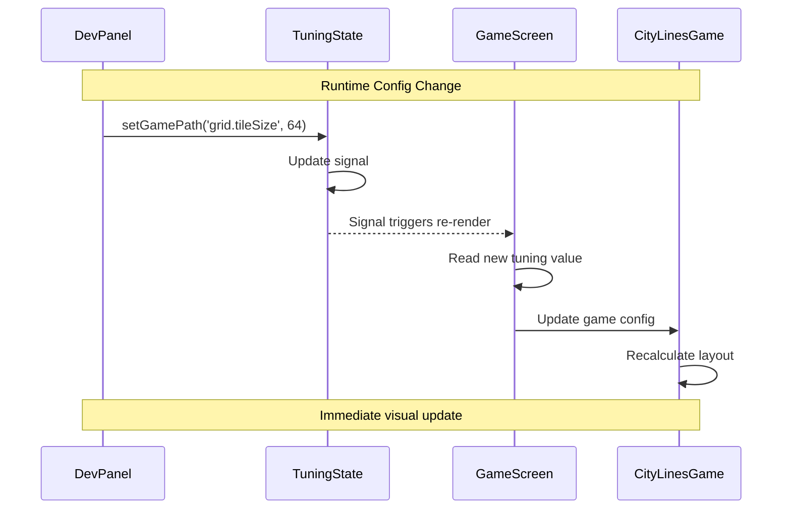
```mermaid
sequenceDiagram
    participant DP as DevPanel
    participant TS as TuningState
    participant GS as GameScreen
    participant CLG as CityLinesGame

    Note over DP,CLG: Runtime Config Change

    DP->>TS: setGamePath('grid.tileSize', 64)
    TS->>TS: Update signal
    TS-->>GS: Signal triggers re-render
    GS->>GS: Read new tuning value
    GS->>CLG: Update game config
    CLG->>CLG: Recalculate layout

    Note over DP,CLG: Immediate visual update
```

---

## 9. File Dependency Map

### 9.1 Scaffold Internal Dependencies

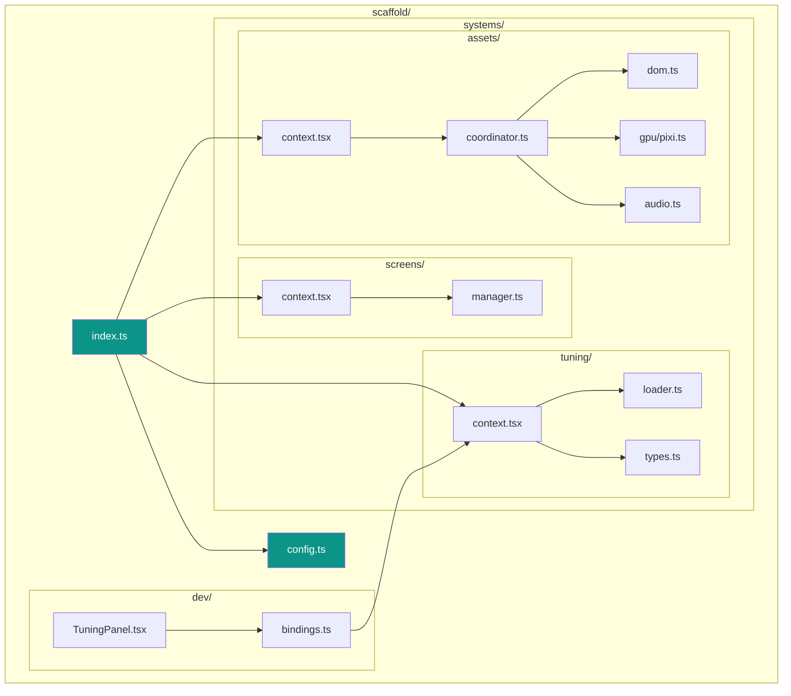
```mermaid
graph TB
    subgraph "scaffold/"
        CONFIG[config.ts]
        INDEX[index.ts]

        subgraph "systems/"
            subgraph "assets/"
                AC[coordinator.ts]
                AD[dom.ts]
                AG[gpu/pixi.ts]
                AA[audio.ts]
                ACX[context.tsx]
            end

            subgraph "screens/"
                SM[manager.ts]
                SCX[context.tsx]
            end

            subgraph "tuning/"
                TL[loader.ts]
                TT[types.ts]
                TCX[context.tsx]
            end
        end

        subgraph "dev/"
            TP[TuningPanel.tsx]
            TB[bindings.ts]
        end
    end

    INDEX --> CONFIG
    INDEX --> ACX
    INDEX --> SCX
    INDEX --> TCX

    AC --> AD
    AC --> AG
    AC --> AA
    ACX --> AC

    SCX --> SM
    TCX --> TL
    TCX --> TT

    TP --> TB
    TB --> TCX

    style CONFIG fill:#0d9488,color:#fff
    style INDEX fill:#0d9488,color:#fff
```

### 9.2 Game to Scaffold Dependencies

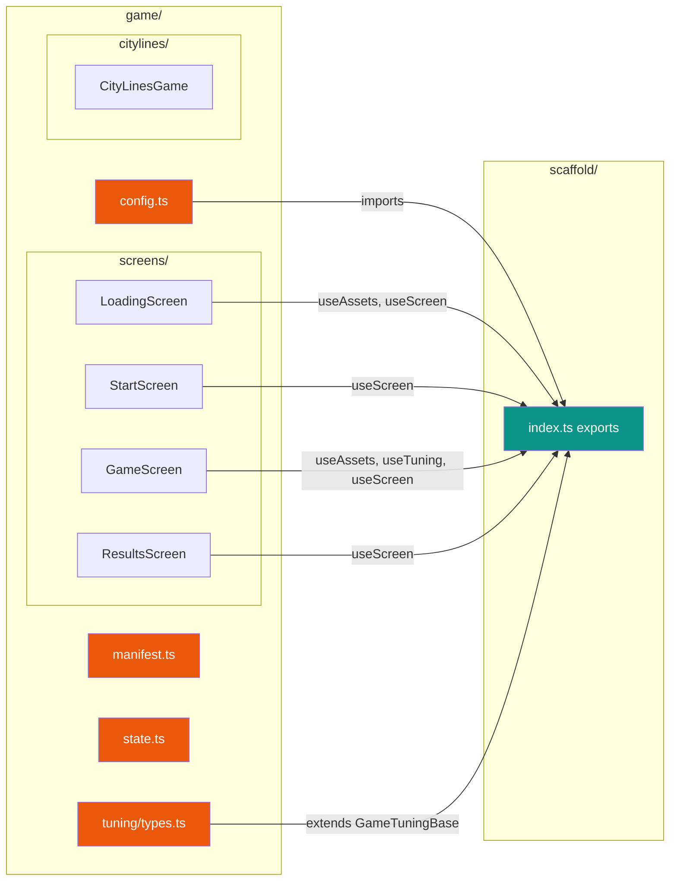
```mermaid
graph LR
    subgraph "game/"
        GCONFIG[config.ts]
        GMANIFEST[manifest.ts]
        GSTATE[state.ts]
        GTUNING[tuning/types.ts]

        subgraph "screens/"
            GLS[LoadingScreen]
            GSS[StartScreen]
            GGS[GameScreen]
            GRS[ResultsScreen]
        end

        subgraph "citylines/"
            GCLG[CityLinesGame]
        end
    end

    subgraph "scaffold/"
        SINDEX[index.ts exports]
    end

    GCONFIG -->|imports| SINDEX
    GLS -->|useAssets, useScreen| SINDEX
    GSS -->|useScreen| SINDEX
    GGS -->|useAssets, useTuning, useScreen| SINDEX
    GRS -->|useScreen| SINDEX
    GTUNING -->|extends GameTuningBase| SINDEX

    style SINDEX fill:#0d9488,color:#fff
    style GCONFIG fill:#ea580c,color:#fff
    style GMANIFEST fill:#ea580c,color:#fff
    style GSTATE fill:#ea580c,color:#fff
    style GTUNING fill:#ea580c,color:#fff
```

---

## 10. Development Tools

### 10.1 TuningPanel Architecture

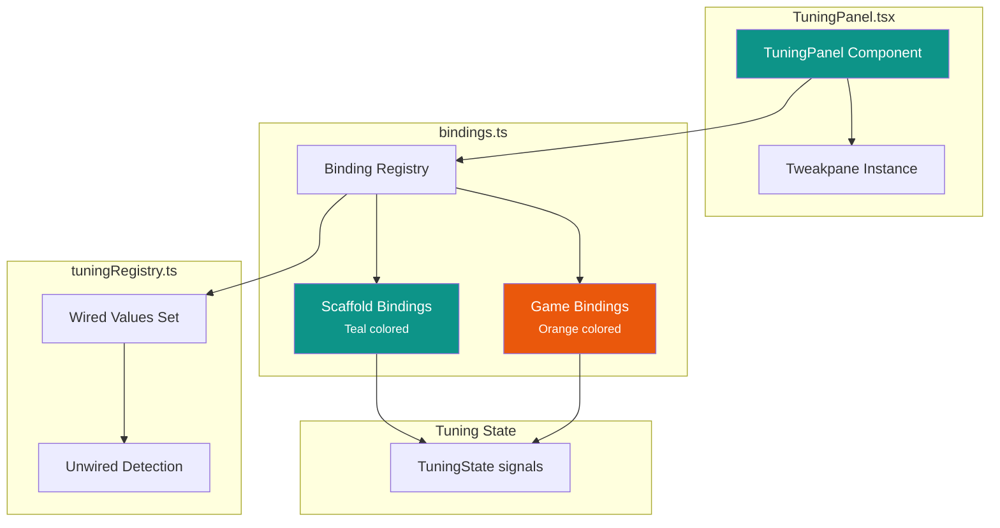
```mermaid
graph TB
    subgraph "TuningPanel.tsx"
        TP[TuningPanel Component]
        TW[Tweakpane Instance]
    end

    subgraph "bindings.ts"
        REG[Binding Registry]
        SCAFFOLD_BIND[Scaffold Bindings<br/><small>Teal colored</small>]
        GAME_BIND[Game Bindings<br/><small>Orange colored</small>]
    end

    subgraph "tuningRegistry.ts"
        WIRED[Wired Values Set]
        UNWIRED[Unwired Detection]
    end

    subgraph "Tuning State"
        TS[TuningState signals]
    end

    TP --> TW
    TP --> REG
    REG --> SCAFFOLD_BIND
    REG --> GAME_BIND
    SCAFFOLD_BIND --> TS
    GAME_BIND --> TS

    REG --> WIRED
    WIRED --> UNWIRED

    style TP fill:#0d9488,color:#fff
    style SCAFFOLD_BIND fill:#0d9488,color:#fff
    style GAME_BIND fill:#ea580c,color:#fff
```

### 10.2 Binding Definition Example

```typescript
// dev/bindings.ts
export const gameBindings: BindingDefinition[] = [
  {
    folder: 'Grid',
    bindings: [
      {
        key: 'grid.tileSize',
        label: 'Tile Size',
        min: 32,
        max: 128,
        step: 8,
      },
      {
        key: 'grid.cellGap',
        label: 'Cell Gap',
        min: 0,
        max: 16,
        step: 1,
      },
    ],
  },
  {
    folder: 'Animation',
    bindings: [
      {
        key: 'animation.tileRotateDuration',
        label: 'Rotate Duration',
        min: 0.1,
        max: 1.0,
        step: 0.05,
      },
    ],
  },
];
```

### 10.3 URL Override System

```
https://game.example.com/?theme=winter&debug=true&grid.tileSize=80

URL Parameters:
├── theme=winter          → game.theme.tileTheme = 'winter'
├── debug=true            → scaffold.debug.showFPS = true
└── grid.tileSize=80      → game.grid.tileSize = 80
```

---

## Appendix A: Quick Reference Cards

### Scaffold Hooks

| Hook | Returns | Use Case |
|------|---------|----------|
| `useAssets()` | AssetCoordinator | Load/access assets |
| `useScreen()` | ScreenManager | Navigate screens |
| `useTuning<S,G>()` | TuningState | Read/write config |
| `usePause()` | PauseState | Check/set pause |
| `useAudio()` | AudioState | Volume controls |

### File Locations

| Purpose | Scaffold Location | Game Location |
|---------|-------------------|---------------|
| Config | `scaffold/config.ts` | `game/config.ts` |
| Assets | `scaffold/systems/assets/` | `game/manifest.ts` |
| Screens | `scaffold/systems/screens/` | `game/screens/` |
| Tuning | `scaffold/systems/tuning/` | `game/tuning/` |
| State | - | `game/state.ts` |
| Logic | - | `game/citylines/` |

### Adding New Features Checklist

**New Scaffold System:**
- [ ] Create `scaffold/systems/newSystem/`
- [ ] Define types in `types.ts`
- [ ] Create state in `state.ts`
- [ ] Create provider + hook in `context.tsx`
- [ ] Export from `scaffold/index.ts`
- [ ] Add provider to `app.tsx` stack

**New Game Feature:**
- [ ] Add logic to `game/citylines/`
- [ ] Add config to `game/tuning/types.ts`
- [ ] Add assets to `game/manifest.ts`
- [ ] Update screens if needed
- [ ] Add dev bindings if tunable

---

## Appendix B: Diagram Tools & Rendering

### Recommended Tools for Rendering Mermaid Diagrams

| Tool | Best For | Notes |
|------|----------|-------|
| **GitHub** | Documentation | Native rendering in .md files |
| **VS Code** | Development | Use "Markdown Preview Mermaid" extension |
| **Notion** | Team docs | Native support with /mermaid block |
| **Confluence** | Enterprise | Use Mermaid plugin |
| **mermaid.live** | Quick edits | Online editor with export |
| **Excalidraw** | Hand-drawn style | Can import Mermaid |

### Export Options

```bash
# Install mermaid-cli for PNG/SVG export
npm install -g @mermaid-js/mermaid-cli

# Generate PNG
mmdc -i diagram.mmd -o diagram.png

# Generate SVG
mmdc -i diagram.mmd -o diagram.svg -b transparent
```

### LLM Diagram Generation

For custom diagrams, use this prompt template with Claude or GPT-4:

```
Create a Mermaid diagram showing [description].
Requirements:
- Use [graph TB/LR | sequenceDiagram | classDiagram | stateDiagram-v2]
- Include subgraphs for logical grouping
- Use colors: #0d9488 for scaffold, #ea580c for game
- Add small annotations with <small> tags
- Keep labels concise (max 3-4 words)
```

---

*Document generated for Scaffold Architecture Deep Dive Meeting*
