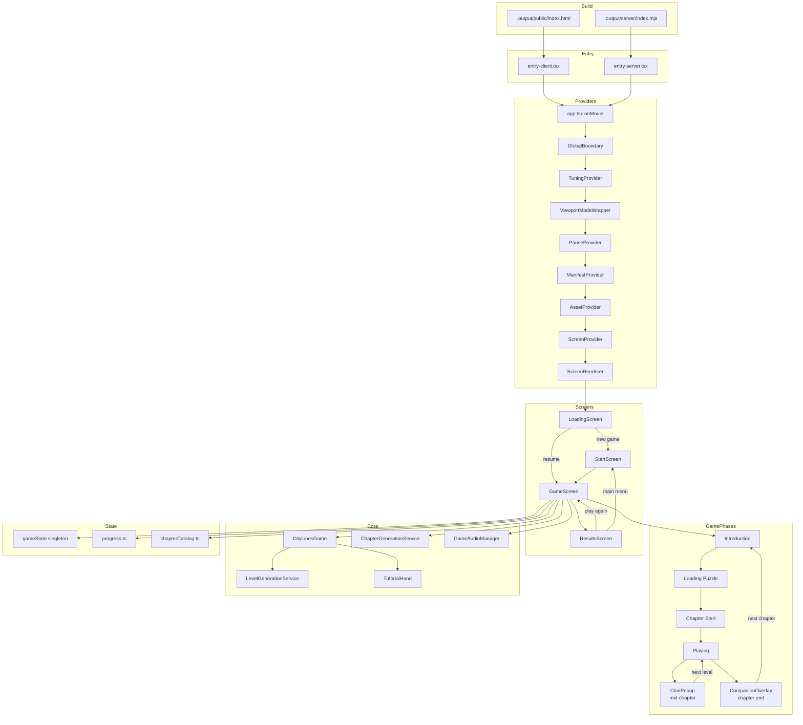

# Entry Point Map

Visual traversal from build output through providers, screens, game phases, and core systems.

See also: [entry-points.md](entry-points.md) (detailed text), [architecture.md](architecture.md), [context-map.md](context-map.md)

---

