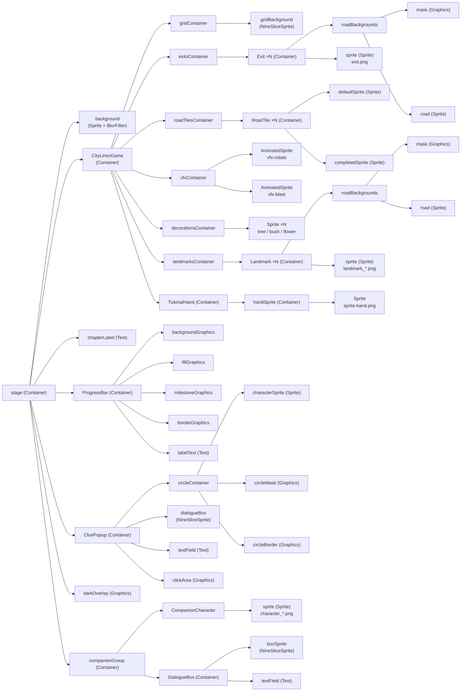
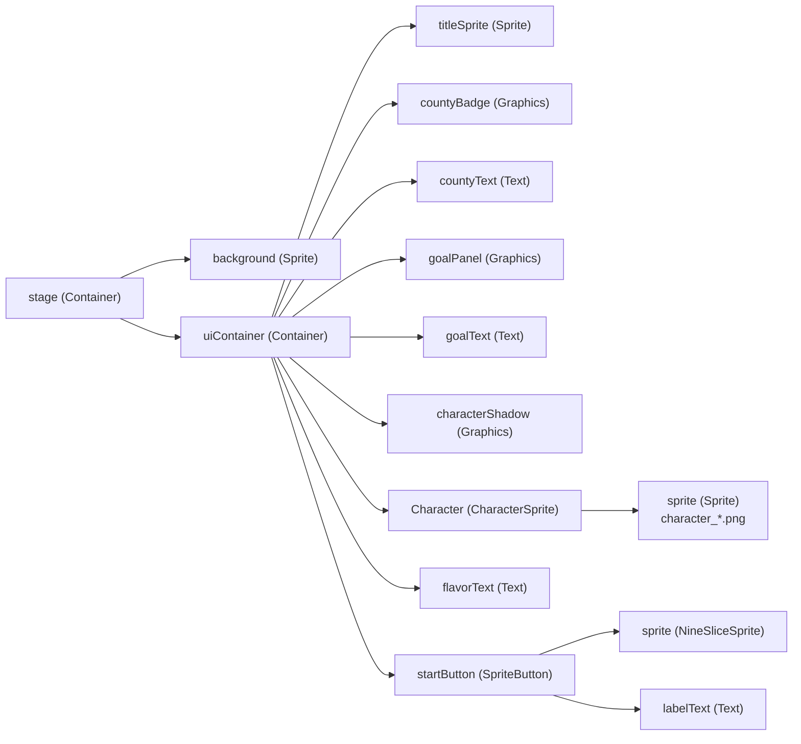

# Pixi.js Scene Graph

Display object hierarchy for each screen that uses Pixi.js. Layer order is top-to-bottom (first child = bottom layer).

See also: [architecture.md](architecture.md), [entry-point-map.md](entry-point-map.md)

---

## GameScreen

### Layer Order (bottom → top)

1. `background` — blurred Sprite
2. `CityLinesGame` — grid, exits, road tiles, VFX, decorations, landmarks, tutorial hand
3. `chapterLabel` — Text (e.g. "1 / 10")
4. `ProgressBar` — Graphics layers + Text
5. `CluePopup` — avatar circle + dialogue (mid-level clues)
6. `darkOverlay` — semi-transparent Graphics (modal backdrop)
7. `companionGroup` — character sprite + dialogue box (chapter-end overlay)

---

## StartScreen

---

## Component Reference

| Component | Extends | File |
|-----------|---------|------|
| CityLinesGame | Container | `src/game/citylines/core/CityLinesGame.ts` |
| RoadTile | Container | `src/game/citylines/core/RoadTile.ts` |
| Landmark | Container | `src/game/citylines/core/Landmark.ts` |
| Exit | Container | `src/game/citylines/core/Exit.ts` |
| TutorialHand | Container | `src/game/citylines/core/TutorialHand.ts` |
| DecorationSystem | — | `src/game/citylines/systems/DecorationSystem.ts` |
| ProgressBar | Container | `src/game/shared/components/ProgressBar.ts` |
| AvatarPopup | Container | `src/game/shared/components/AvatarPopup.ts` |
| DialogueBox | Container | `src/game/shared/components/DialogueBox.ts` |
| CompanionCharacter | Container | `src/game/citylines/ui/companion/CompanionCharacter.ts` |
| CharacterSprite | Container | `src/game/shared/components/CharacterSprite.ts` |
| SpriteButton | Container | `src/game/shared/components/SpriteButton.ts` |
