# Architecture Deep Dive

A comprehensive guide to the 3-tier architecture: **core** (reusable platform), **modules** (shared building blocks), and **game** (specific implementation).

---

## Table of Contents

1. [Overview](#overview)
2. [Technology Stack](#technology-stack)
3. [Architecture Diagram](#architecture-diagram)
4. [Directory Structure](#directory-structure)
5. [Core (Reusable Platform)](#core-reusable-platform)
6. [Modules (Shared Building Blocks)](#modules-shared-building-blocks)
7. [Game (CityLines Implementation)](#game-citylines-implementation)
8. [Integration Across Tiers](#integration-across-tiers)
9. [Systems Architecture](#systems-architecture)
10. [Key Files Reference](#key-files-reference)

---

## Overview

The project follows a **3-tier architecture** with strict dependency rules:

```
src/
├── core/        # Reusable platform - can power ANY game
├── modules/     # Shared building blocks - visual primitives, prefabs, logic
└── game/        # CityLines-specific implementation
```

### Design Philosophy

| Core | Modules | Game |
|------|---------|------|
| Generic platform | Reusable components | Game-specific |
| Provides systems and hooks | Visual and logic building blocks | Consumes systems, modules, hooks |
| Agnostic to game logic | Agnostic to game logic | Implements game logic |
| Defines interfaces | Extends interfaces with defaults | Implements interfaces |
| Zero deps on modules or game | Can import core only | Can import core + modules |

### Dependency Rules

```
core/    --> no deps on modules or game
modules/ --> can import core only
game/    --> can import core + modules
```

These rules are enforced by convention. Code in `core/` must never reference `modules/` or `game/`. Code in `modules/` must never reference `game/`.

---

## Complete Architecture Diagram

                      Solid.js  Pixi.js v8  GSAP  Howler  Tweakpane  Sentry
                         │         │          │      │        │         │
                         └─────────┴──────────┴──────┴────────┴─────────┘
                                              │
                                              ▼
                                    ┌─────────────────┐
                                    │     app.tsx      │
                                    └────────┬────────┘
                                             │
        ┌────────────────────────────────────┼────────────────────────────────────┐
        ▼                                    ▼                                    ▼
┌─────────────────────────┐  ┌─────────────────────────────┐  ┌────────────────────────────┐
│  CORE  (src/core/)      │  │  MODULES  (src/modules/)    │  │  GAME  (src/game/)         │
│  Framework shell         │  │  Reusable building blocks   │  │  Game-specific code        │
│  DO NOT EDIT             │  │                             │  │                            │
│                         │  │  Primitives:                │  │  Config:                   │
│  Providers:             │  │    sprite-button            │  │    identity, manifest,     │
│    GlobalBoundary       │  │    dialogue-box             │  │    config, state, tuning   │
│    TuningProvider       │  │    character-sprite         │  │                            │
│    PauseProvider        │  │    progress-bar             │  │  Setup:                    │
│    ManifestProvider     │  │                             │  │    AnalyticsProvider       │
│    AssetProvider        │  │  Logic:                     │  │    FeatureFlagProvider     │
│    ScreenProvider       │  │    level-completion         │  │                            │
│    AudioProvider        │  │    progress (factory)       │  │  Screens:                  │
│                         │  │    catalog (factory)        │  │    Loading → Start →       │
│  Systems:               │  │    loader (factory)         │  │    Game → Results          │
│    Assets (loaders)     │  │                             │  │                            │
│    Screens (manager)    │  │  Prefabs:                   │  │  Audio:                    │
│    Tuning (state)       │  │    avatar-popup             │  │    GameAudioManager        │
│    Audio (base manager) │  │                             │  │                            │
│    Errors (boundaries)  │  │  Each module has:           │  │  Game Logic:               │
│    Pause (state)        │  │    index.ts (public API)    │  │    citylines/              │
│    VFX (particles)      │  │    defaults.ts              │  │    dailydispatch/          │
│                         │  │    tuning.ts                │  │                            │
│  UI:                    │  │    renderers/pixi.ts        │  │  Services:                 │
│    Button, Spinner,     │  │                             │  │    progress, catalog,      │
│    MobileViewport,      │  │                             │  │    loader (configured      │
│    ViewportToggle,      │  │                             │  │    from module factories)  │
│    PauseOverlay, Logo   │  │                             │  │                            │
│                         │  │                             │  │                            │
│  Dev:                   │  │                             │  │                            │
│    TuningPanel          │  │                             │  │                            │
│    (Tweakpane)          │  │                             │  │                            │
└─────────────────────────┘  └─────────────────────────────┘  └────────────────────────────┘
         ▲                              ▲         │                    │         │
         │                              │         │                    │         │
         │           can import ────────┘         │                    │         │
         │                                         │   can import ─────┘         │
         │              can import ────────────────┘                             │
         │                                              can import ──────────────┘
         │
         └── ZERO dependencies on modules/ or game/
```

---

## Provider Hierarchy

The application uses Solid.js context providers for dependency injection. The provider stack in `app.tsx` wraps from outside in:

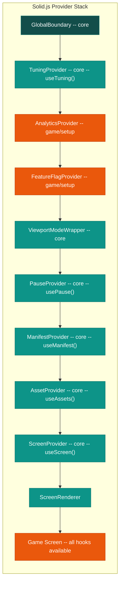

Note that `AnalyticsProvider` and `FeatureFlagProvider` live in `game/setup/` (orange), not in core. They are game-specific providers injected into the core provider stack. `ManifestProvider` now accepts props (`manifest`, `defaultGameData`, `serverStorageUrl`) instead of importing directly from game code, keeping the dependency arrow pointing downward.

### Hook Availability

| Hook | Description | Tier | Available In |
|------|-------------|------|--------------|
| `useTuning<S,G>()` | Typed config access | Core | All components below TuningProvider |
| `useManifest()` | Game data and manifest | Core | Below ManifestProvider |
| `useAssets()` | Asset coordinator | Core | Below AssetProvider |
| `useScreen()` | Navigation | Core | Below ScreenProvider |
| `usePause()` | Pause state | Core | Below PauseProvider |
| `useAudio()` | Volume controls | Core | Below AudioProvider |
| `useAnalytics()` | Event tracking | Game | Below AnalyticsProvider |
| `useFeatureFlags()` | Feature flags | Game | Below FeatureFlagProvider |

---

## Directory Structure

### Core Structure
```
src/core/
├── config.ts                # Engine selection (pixi/phaser/three)
├── index.ts                 # Public API exports
├── analytics/               # Shared analytics schemas and events
├── config/                  # Environment, viewport constraints
├── dev/                     # Development tools (Tweakpane, TuningPanel)
│   ├── TuningPanel.tsx      # Color-coded panel (cyan/green/orange sections)
│   ├── tuningRegistry.ts    # Registry for module/game tuning bindings
│   └── bindings.ts          # Core tuning bindings
├── lib/                     # External integrations (Sentry, PostHog)
├── systems/                 # Core engine systems
│   ├── assets/              # Asset loading and management
│   ├── audio/               # Audio state and playback
│   ├── errors/              # Error handling and boundaries
│   ├── manifest/            # ManifestProvider (props-based)
│   ├── pause/               # Pause state management
│   ├── screens/             # Screen navigation system
│   ├── tuning/              # Configuration management
│   └── vfx/                 # Particle and visual effects
├── ui/                      # Reusable UI components
│   ├── Button.tsx
│   ├── Logo.tsx
│   ├── MobileViewport.tsx
│   ├── PauseOverlay.tsx
│   ├── ProgressBar.tsx
│   ├── Spinner.tsx
│   └── ViewportToggle.tsx   # (moved from game/shared)
└── utils/                   # Utilities (storage, SettingsMenu)
```

### Modules Structure
```
src/modules/
├── primitives/                     # Low-level visual components
│   ├── sprite-button/
│   │   ├── renderers/pixi.ts       # Pixi.js renderer
│   │   ├── renderers/phaser.ts     # Phaser renderer
│   │   ├── renderers/three.ts      # Three.js renderer
│   │   ├── defaults.ts             # Default config values
│   │   ├── tuning.ts               # Tuning bindings
│   │   └── index.ts                # Public exports
│   ├── progress-bar/
│   │   ├── renderers/pixi.ts
│   │   ├── defaults.ts
│   │   ├── tuning.ts
│   │   └── index.ts
│   ├── dialogue-box/
│   │   ├── renderers/pixi.ts
│   │   ├── defaults.ts
│   │   ├── tuning.ts
│   │   └── index.ts
│   └── character-sprite/
│       ├── renderers/pixi.ts
│       ├── defaults.ts
│       ├── tuning.ts
│       └── index.ts
├── prefabs/                        # Higher-level composed components
│   └── avatar-popup/
│       ├── renderers/pixi.ts
│       ├── defaults.ts
│       ├── tuning.ts
│       └── index.ts
└── logic/                          # Headless logic modules (factory pattern)
    ├── progress/index.ts           # createProgressService()
    ├── catalog/index.ts            # createCatalogService()
    ├── loader/index.ts             # createContentLoader()
    └── level-completion/
        ├── LevelCompletionController.ts
        ├── defaults.ts
        ├── tuning.ts
        └── index.ts
```

### Game Structure
```
src/game/
├── config/                  # Game identity, fonts, environment
├── state.ts                 # Game state (score, health, level)
├── setup/                   # Game-specific providers
│   ├── AnalyticsContext.tsx  # AnalyticsProvider (game-specific)
│   └── FeatureFlagContext.tsx # FeatureFlagProvider (game-specific)
├── tuning/                  # Game-specific tuning config
├── audio/                   # GameAudioManager
├── screens/                 # Game screens (use core hooks)
├── services/                # Game services (progress, etc.)
├── analytics/               # Game-specific analytics events
└── citylines/               # Core game logic
    ├── core/                # Game engine classes
    ├── types/               # Type definitions
    ├── systems/             # Game-specific systems
    ├── services/            # Business logic services
    ├── controllers/         # Game controllers
    ├── ui/                  # Game UI (Companion, etc.)
    ├── data/                # Static game data
    └── animations/          # Game animations
```

---

## Core (Reusable Platform)

### What Core Provides

Core is the **complete game development platform** that handles all infrastructure so games can focus on gameplay. It has zero dependencies on `modules/` or `game/`.

### Asset System

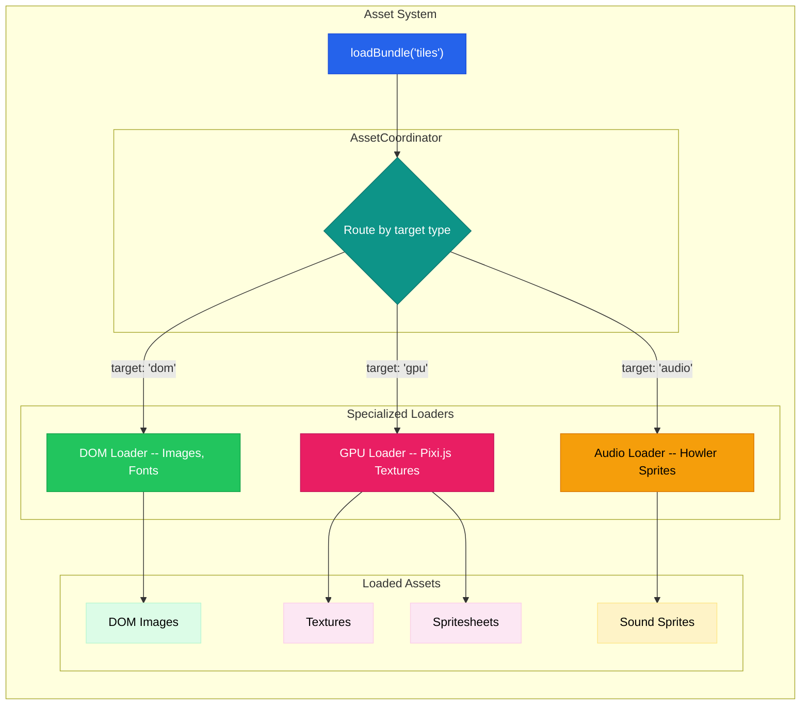

**Key Files**:
- `core/systems/assets/coordinator.ts` - Routes assets by type (dom/gpu/audio)
- `core/systems/assets/loaders/dom.ts` - Handles DOM-based assets
- `core/systems/assets/loaders/gpu/pixi.ts` - Handles Pixi.js rendering
- `core/systems/assets/loaders/audio.ts` - Handles Howler.js audio sprites

**Hook**: `useAssets()` - Access loaded assets from any component

### Screen System

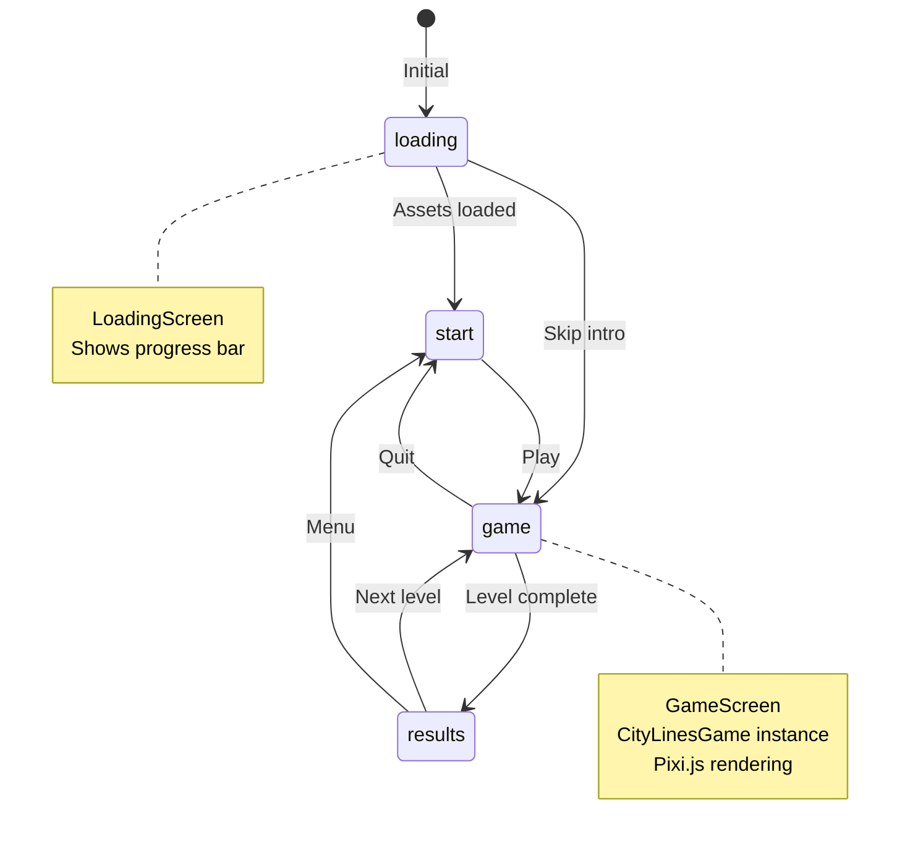

**Features**:
- State machine for screen flow
- Configurable transitions (fade, slide, none)
- History tracking for back navigation
- Data passing between screens

**Usage**:
```typescript
const screen = useScreen();
screen.goto('game', { level: 1 });  // Navigate with data
screen.back();                       // Return to previous
```

### Manifest System

The `ManifestProvider` accepts props rather than importing from game code, keeping the dependency arrow clean:

```typescript
<ManifestProvider
  manifest={manifest}
  defaultGameData={defaultGameData}
  serverStorageUrl={gameConfig.serverStorageUrl}
>
```

**Data source resolution** (priority order):
1. **PostMessage injection** (highest) - For embed mode, parent context pushes data
2. **CDN fetch** - Server storage URL fetches remote game data
3. **Local defaults** (lowest) - Props passed from game config

**Hook**: `useManifest()` - Access manifest and game data from any component

### Tuning System

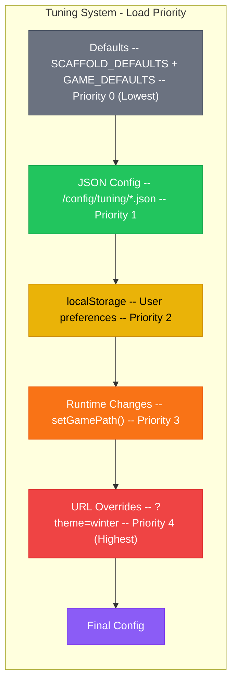

**Hook**: `useTuning<ScaffoldTuning, GameTuning>()` - Typed access to both configs

#### Tuning Panel Color Sections

The dev tuning panel uses color-coded sections to show which tier owns each value:

| Color | Section | Tier |
|-------|---------|------|
| **Cyan** | Core settings | `core/` |
| **Green** | Module settings | `modules/` |
| **Orange** | Game settings | `game/` |

### Error System

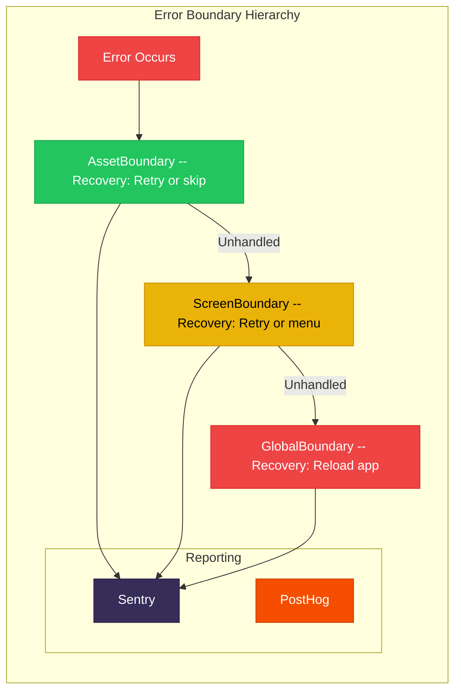

### Other Core Systems

| System | Purpose | Hook |
|--------|---------|------|
| **Pause** | Spacebar toggle, pause state | `usePause()` |
| **Audio** | Master/Music/SFX volumes, base manager | `useAudio()` |
| **VFX** | Particle runtime and visual effects | - |
| **Dev Tools** | TuningPanel (color-coded), TuningRegistry | Toggle with `` ` `` |

---

## Modules (Shared Building Blocks)

### What Modules Provide

Modules are **reusable building blocks** that sit between core and game. They can import from `core/` but never from `game/`. Modules fall into three categories:

### Visual Modules: Primitives

Low-level visual components with a consistent internal structure:

```
module-name/
├── renderers/pixi.ts    # Pixi.js renderer (primary)
├── renderers/phaser.ts  # Phaser renderer (optional)
├── renderers/three.ts   # Three.js renderer (optional)
├── defaults.ts          # Default configuration values
├── tuning.ts            # Tuning panel bindings (green section)
└── index.ts             # Public exports
```

| Primitive | Description | Renderers |
|-----------|-------------|-----------|
| `sprite-button` | Interactive sprite-based button | Pixi, Phaser, Three |
| `progress-bar` | Animated progress indicator | Pixi |
| `dialogue-box` | Text display with typewriter effect | Pixi |
| `character-sprite` | Animated character with states | Pixi |

### Visual Modules: Prefabs

Higher-level composed components built from primitives:

| Prefab | Description | Renderers |
|--------|-------------|-----------|
| `avatar-popup` | Character avatar with popup animation | Pixi |

### Logic Modules

Headless modules that provide behavior without rendering. Logic modules use the **factory pattern** -- they export a `create*()` function that games call with their own configuration:

| Module | Factory | Purpose |
|--------|---------|---------|
| `progress` | `createProgressService<T>()` | Versioned localStorage persistence |
| `catalog` | `createCatalogService<T>()` | Ordered content navigation |
| `loader` | `createContentLoader<S,T>()` | Typed fetch + transform pipeline |
| `level-completion` | `createLevelCompletionController()` | Level completion orchestration |

**Example - Progress factory**:
```typescript
import { createProgressService } from '~/modules/logic/progress';

const progress = createProgressService<MyProgress>({
  key: 'mygame_progress',
  version: 1,
  defaults: { version: 1, score: 0, level: 1 },
});

progress.load();
progress.save({ ...data });
progress.clear();
```

**Example - Catalog factory**:
```typescript
import { createCatalogService } from '~/modules/logic/catalog';

const catalog = createCatalogService<ChapterEntry>({
  fetchIndex: () => fetch('/api/chapters').then(r => r.json()),
  fallbackEntries: [{ id: 'fallback', url: 'default.json' }],
});

await catalog.init();
catalog.current();
catalog.next();
```

---

## Game (CityLines Implementation)

### What the Game Provides

The game implements **all game-specific logic** using core systems and module building blocks.

### Game Configuration Files

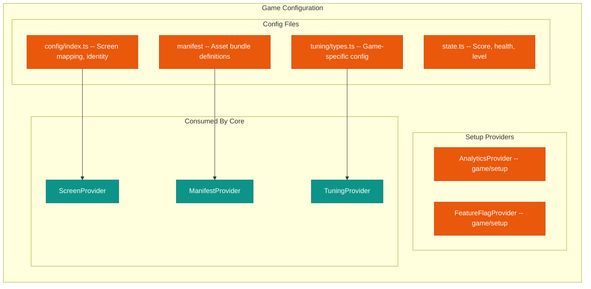

### Game Setup Providers

`AnalyticsProvider` and `FeatureFlagProvider` live in `game/setup/`, not in core. They are game-specific providers that plug into the core provider stack via `app.tsx`:

```typescript
// app.tsx provider stack (simplified)
<GlobalBoundary>
  <TuningProvider>
    <AnalyticsProvider>        {/* game/setup/ */}
      <FeatureFlagProvider>    {/* game/setup/ */}
        <ViewportModeWrapper>
          <PauseProvider>
            <ManifestProvider manifest={manifest} defaultGameData={defaultGameData} serverStorageUrl={...}>
              <AssetProvider>
                <ScreenProvider>
                  <ScreenRenderer />
                </ScreenProvider>
              </AssetProvider>
            </ManifestProvider>
          </PauseProvider>
        </ViewportModeWrapper>
      </FeatureFlagProvider>
    </AnalyticsProvider>
  </TuningProvider>
</GlobalBoundary>
```

### Core Game Classes

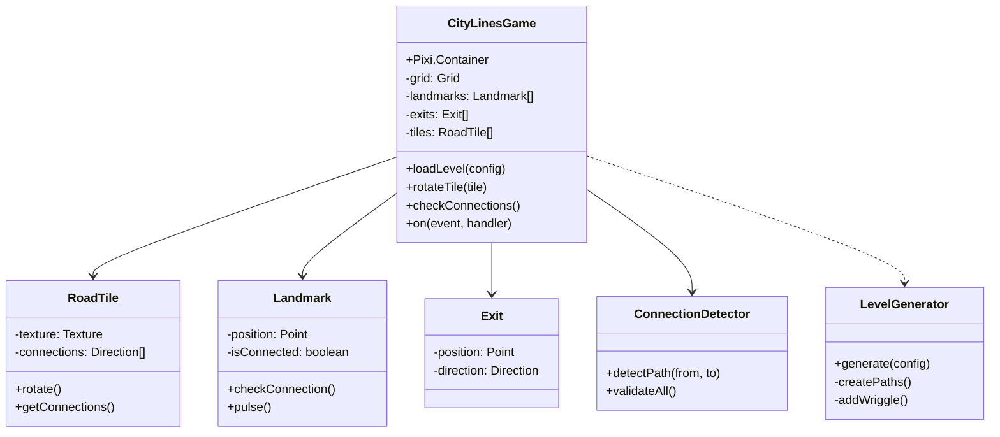

### Game Screen Flow

```typescript
// GameScreen.tsx - How game uses core + modules
const GameScreen = () => {
  // 1. Access core systems via Solid.js hooks
  const assets = useAssets();
  const tuning = useTuning<ScaffoldTuning, CityLinesTuning>();
  const screen = useScreen();

  // 2. Create Pixi application using core's GPU loader
  const app = assets.getPixiApp();

  // 3. Instantiate game with tuning config
  const game = new CityLinesGame({
    tuning: tuning.game,
    assets: assets,
  });

  // 4. Handle game events
  game.on('levelComplete', (data) => {
    screen.goto('results', data);
  });
};
```

---

## Integration Across Tiers

### Data Flow

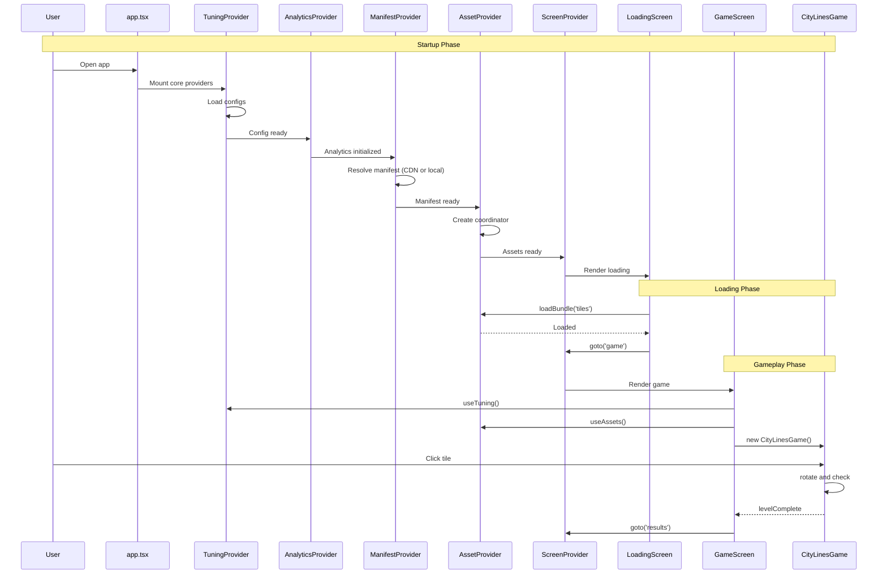

### Integration Points

| Aspect | Core Provides | Modules Provide | Game Provides |
|--------|---------------|-----------------|---------------|
| **Assets** | Coordinator, loaders | - | Manifest definition |
| **Screens** | Manager, transitions | - | Screen components |
| **Config** | Loader, fallback chain | Tuning bindings (green) | Tuning schema + defaults (orange) |
| **Audio** | State management, base manager | - | Sound definitions, playback |
| **Errors** | Boundaries, reporting | - | Wrapped components |
| **UI** | Button, Spinner, Viewport | SpriteButton, ProgressBar, DialogueBox, CharacterSprite, AvatarPopup | Game-specific UI |
| **Logic** | Storage utils | Progress, Catalog, Loader, LevelCompletion | Game services using factories |
| **Dev Tools** | TuningPanel (cyan section) | Tuning bindings (green section) | Tuning bindings (orange section) |
| **Analytics** | Analytics library, schemas | - | AnalyticsProvider, game events |
| **Feature Flags** | - | - | FeatureFlagProvider |

---

## Systems Architecture

### What is a "System"?

A system is a **self-contained module** that:
1. Manages its own state (using **Solid.js signals**)
2. Exposes a context provider
3. Provides hooks for component access
4. Has no dependencies on game logic

### System Structure Pattern

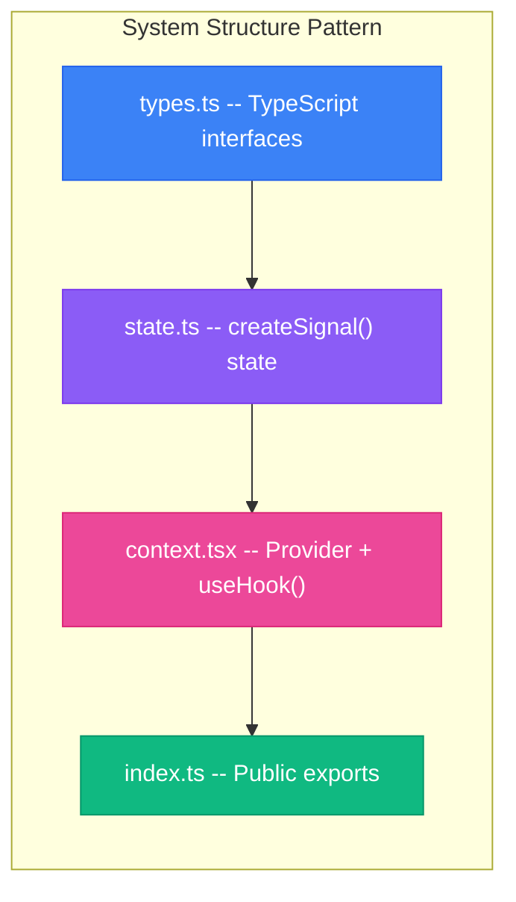

### Module Structure Pattern (Visual)

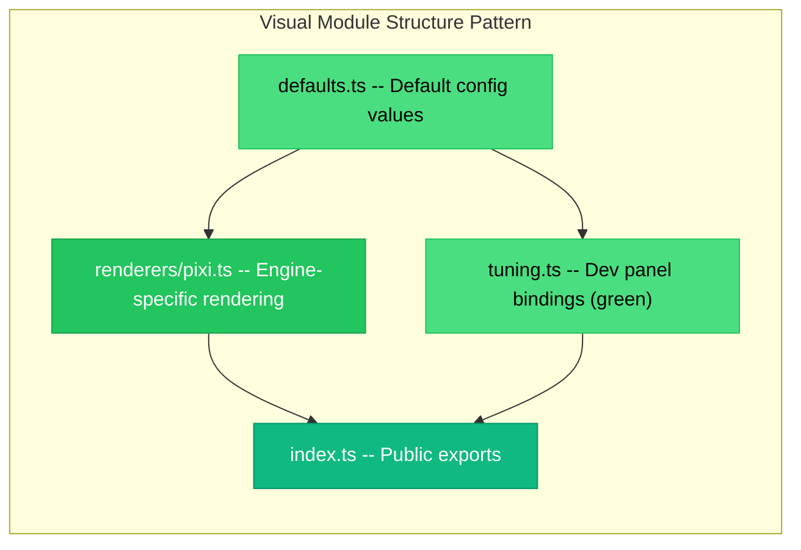

### Module Structure Pattern (Logic)

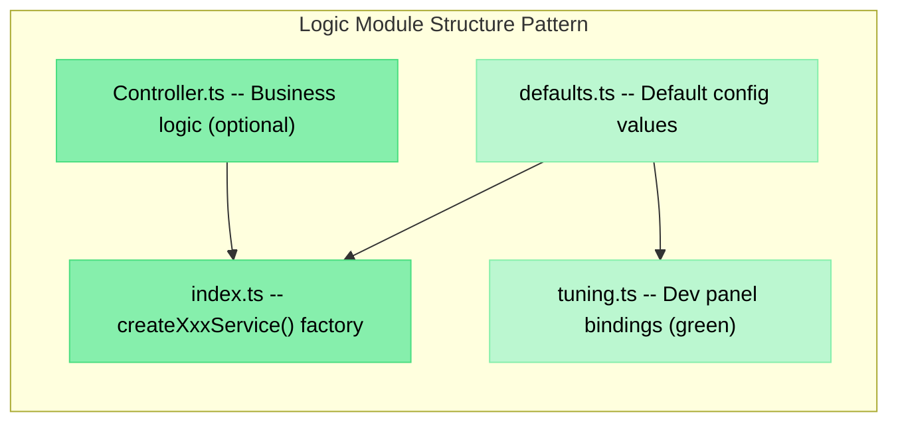

### Core Systems Summary

| System | State | Hook | Purpose |
|--------|-------|------|---------|
| Assets | coordinator | `useAssets()` | Load/manage assets |
| Screens | manager | `useScreen()` | Navigation |
| Tuning | config | `useTuning()` | Configuration |
| Manifest | manifest, gameData | `useManifest()` | Game data resolution |
| Pause | paused signal | `usePause()` | Pause state |
| Audio | volumes | `useAudio()` | Audio settings |
| Errors | - | boundaries | Error handling |
| VFX | - | - | Particle effects |

---

## Key Files Reference

### Core Entry Points

| File | Purpose |
|------|---------|
| `core/config.ts` | Engine selection (pixi/phaser/three) |
| `core/index.ts` | Public API -- what modules and games can import |
| `core/systems/*/context.tsx` | Provider + hooks for each system |
| `core/systems/manifest/context.tsx` | ManifestProvider (props-based, no game imports) |
| `core/ui/ViewportToggle.tsx` | Viewport mode toggle (dev only) |
| `core/dev/TuningPanel.tsx` | Color-coded tuning panel |
| `core/dev/tuningRegistry.ts` | Registry for module/game tuning bindings |

### Module Entry Points

| File | Purpose |
|------|---------|
| `modules/primitives/sprite-button/index.ts` | SpriteButton (multi-renderer) |
| `modules/primitives/progress-bar/index.ts` | ProgressBar (Pixi) |
| `modules/primitives/dialogue-box/index.ts` | DialogueBox (Pixi) |
| `modules/primitives/character-sprite/index.ts` | CharacterSprite (Pixi) |
| `modules/prefabs/avatar-popup/index.ts` | AvatarPopup (Pixi) |
| `modules/logic/progress/index.ts` | `createProgressService()` factory |
| `modules/logic/catalog/index.ts` | `createCatalogService()` factory |
| `modules/logic/loader/index.ts` | `createContentLoader()` factory |
| `modules/logic/level-completion/index.ts` | `createLevelCompletionController()` factory |

### Game Entry Points

| File | Purpose |
|------|---------|
| `game/config/index.ts` | Screen component mapping, identity, environment |
| `game/state.ts` | Global game state (Solid.js root) |
| `game/tuning/` | Game config schema + defaults |
| `game/setup/AnalyticsContext.tsx` | Game-specific AnalyticsProvider |
| `game/setup/FeatureFlagContext.tsx` | Game-specific FeatureFlagProvider |

### Integration Point

| File | Purpose |
|------|---------|
| `app.tsx` | Root -- wires core + game setup + core providers together |

---

## Benefits of This Architecture

### For Development
- **Clear boundaries** -- Know where to put new code (core vs modules vs game)
- **Strict dependency rules** -- core has no deps, modules depend on core only, game depends on both
- **Reusability** -- Core works for any game; modules are shared across games
- **Testability** -- Each tier is isolated and independently testable
- **Type safety** -- Generics ensure correct typing across tier boundaries

### For Teams
- **Parallel work** -- Core, modules, and game can evolve independently
- **Onboarding** -- 3-tier structure with clear rules is easy to learn
- **Code reviews** -- Changes are localized to the appropriate tier
- **Shared components** -- Modules prevent duplication across game projects

### For the Future
- **New games** -- Implement game layer against core + pick modules you need
- **New modules** -- Add shared components without touching core or game
- **Upgrades** -- Core improvements benefit all games automatically
- **Engine swap** -- Change from Pixi to Three.js via config + renderer files
- **Module portability** -- Each module has `renderers/` for multi-engine support

---

## Quick Reference: Adding New Features

### Adding a New Core System

1. Create `core/systems/mySystem/`
2. Define types in `types.ts`
3. Create state with `createSignal()` in `state.ts`
4. Create provider + hook in `context.tsx`
5. Export from `core/index.ts`
6. Add provider to `app.tsx` stack

### Adding a New Visual Module

1. Create `modules/primitives/my-component/` (or `modules/prefabs/`)
2. Add `defaults.ts` with default config values
3. Add `renderers/pixi.ts` with the Pixi.js renderer
4. Add `tuning.ts` with dev panel bindings (green section)
5. Export from `index.ts`
6. Register tuning bindings via `core/dev/tuningRegistry.ts`

### Adding a New Logic Module

1. Create `modules/logic/my-service/`
2. Export a `createMyService<T>()` factory function from `index.ts`
3. Add `defaults.ts` if configurable
4. Add `tuning.ts` if tunable at runtime
5. Games call the factory with their own types and config

### Adding Game-Specific Logic

1. Add to `game/citylines/` (core logic) or `game/screens/` (UI)
2. Use core hooks for assets, screens, tuning, manifest
3. Use module factories for progress, catalog, loader, level completion
4. Use module primitives/prefabs for visual components
5. Extend game tuning if new config is needed
6. Add to manifest if new assets are needed

### Adding Tunable Values

1. **Core tuning**: Add to `core/systems/tuning/types.ts` with default (cyan section)
2. **Module tuning**: Add to `modules/*/tuning.ts` with default (green section)
3. **Game tuning**: Add to `game/tuning/types.ts` with default (orange section)
4. Access via `useTuning<ScaffoldTuning, GameTuning>()`
5. Optionally register dev bindings for the TuningPanel UI
