# Architecture Deep Dive

> **Comprehensive technical reference for the 3-tier game framework**

---

## Executive Summary

This document provides an in-depth analysis of the 3-tier architecture -- a reusable game development framework that cleanly separates engine concerns from reusable modules and game-specific logic. The CityLines and DailyDispatch games serve as reference implementations.

**Key Metrics:**
- **3 architectural tiers** (Core, Modules, Game)
- **7 core systems** (Assets, Screens, Tuning, Pause, Audio, Errors, Manifest)
- **3 module categories** (Primitives, Logic, Prefabs)
- **Strict dependency direction** -- each tier only imports from tiers below it
- **Zero game logic** in core or module code
- **100% reusable** for new game projects via forking

---

## Table of Contents

1. [High-Level Architecture](#1-high-level-architecture)
2. [Provider Hierarchy](#2-provider-hierarchy)
3. [Asset System Deep Dive](#3-asset-system-deep-dive)
4. [Screen System Deep Dive](#4-screen-system-deep-dive)
5. [Tuning System Deep Dive](#5-tuning-system-deep-dive)
6. [Error Handling System](#6-error-handling-system)
7. [Modules Layer](#7-modules-layer)
8. [Game Layer Integration](#8-game-layer-integration)
9. [Data Flow Analysis](#9-data-flow-analysis)
10. [File Dependency Map](#10-file-dependency-map)
11. [Development Tools](#11-development-tools)

---

## 1. High-Level Architecture

### 1.1 Three-Tier Layer Separation

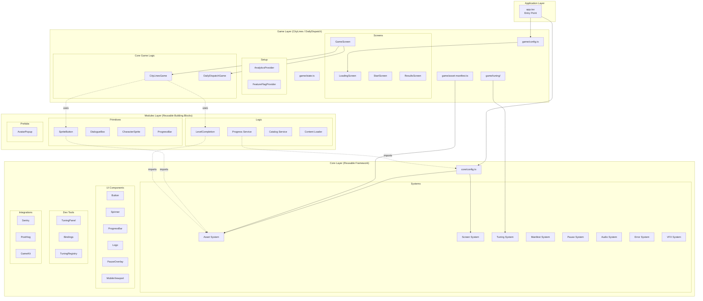
```mermaid
graph TB
    subgraph "Application Layer"
        APP[app.tsx<br/>Entry Point]
    end

    subgraph "Core Layer (Reusable Framework)"
        direction TB
        SC[core/config.ts]

        subgraph "Systems"
            ASSETS[Asset System]
            SCREENS[Screen System]
            TUNING[Tuning System]
            MANIFEST[Manifest System]
            PAUSE[Pause System]
            AUDIO[Audio System]
            ERRORS[Error System]
            VFX[VFX System]
        end

        subgraph "UI Components"
            BTN[Button]
            SPIN[Spinner]
            PROG[ProgressBar]
            LOGO[Logo]
            PAUSE_UI[PauseOverlay]
            MVP[MobileViewport]
        end

        subgraph "Dev Tools"
            TWEAK[TuningPanel]
            BIND[Bindings]
            REG[TuningRegistry]
        end

        subgraph "Integrations"
            SENTRY_LIB[Sentry]
            PH_LIB[PostHog]
            GK_LIB[GameKit]
        end
    end

    subgraph "Modules Layer (Reusable Building Blocks)"
        direction TB

        subgraph "Primitives"
            SBTN[SpriteButton]
            DBOX[DialogueBox]
            CSPRITE[CharacterSprite]
            PBAR[ProgressBar]
        end

        subgraph "Logic"
            LCOMP[LevelCompletion]
            LPROG[Progress Service]
            LCAT[Catalog Service]
            LLOAD[Content Loader]
        end

        subgraph "Prefabs"
            AVPOP[AvatarPopup]
        end
    end

    subgraph "Game Layer (CityLines / DailyDispatch)"
        direction TB
        GC[game/config.ts]
        GM[game/asset-manifest.ts]
        GS[game/state.ts]
        GT[game/tuning/]

        subgraph "Setup"
            ANALYTICS[AnalyticsProvider]
            FF[FeatureFlagProvider]
        end

        subgraph "Screens"
            LOAD[LoadingScreen]
            START[StartScreen]
            GAME[GameScreen]
            RESULTS[ResultsScreen]
        end

        subgraph "Core Game Logic"
            CLG[CityLinesGame]
            DDG[DailyDispatchGame]
        end
    end

    APP --> SC
    APP --> GC
    SC --> ASSETS
    SC --> SCREENS
    GC --> LOAD
    GM --> ASSETS
    GT --> TUNING
    GAME --> CLG
    GAME --> DDG

    SBTN -.->|imports| ASSETS
    LCOMP -.->|imports| ASSETS
    LPROG -.->|imports| SC

    CLG -.->|uses| SBTN
    CLG -.->|uses| LCOMP
```

### 1.2 Dependency Direction

The architecture enforces a strict one-way dependency rule across three tiers:

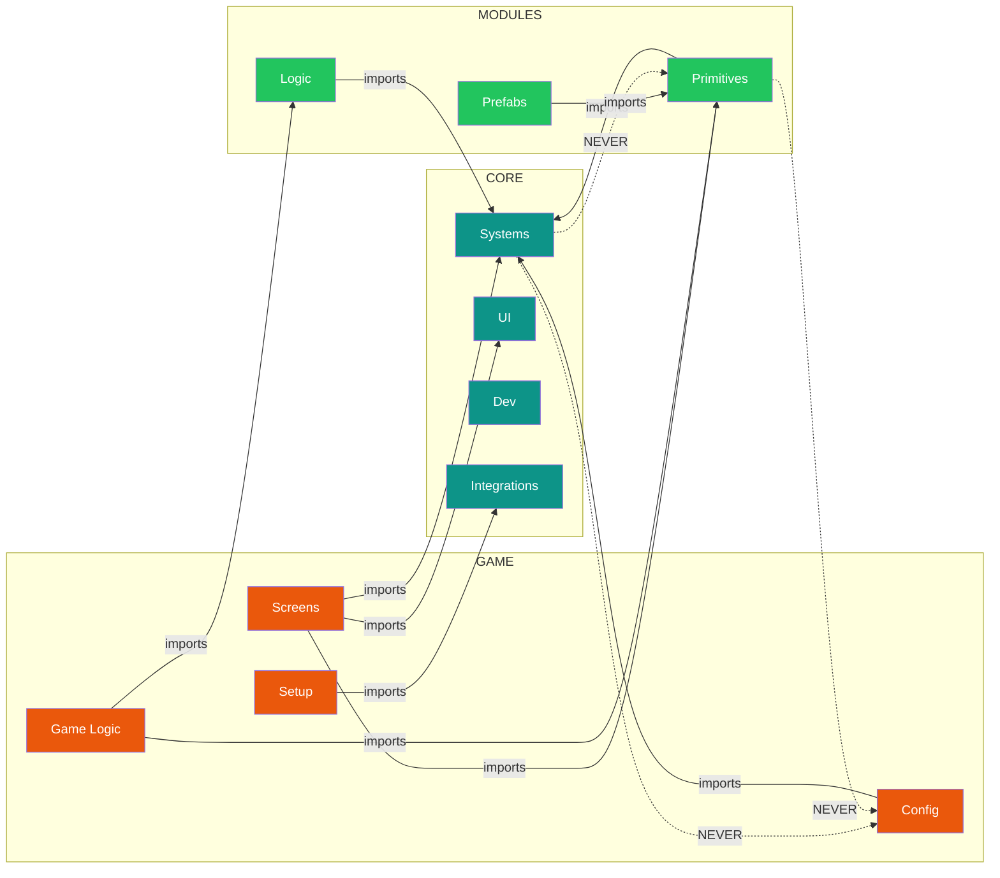
```mermaid
graph LR
    subgraph "CORE"
        C1[Systems]
        C2[UI]
        C3[Dev]
        C4[Integrations]
    end

    subgraph "MODULES"
        M1[Primitives]
        M2[Logic]
        M3[Prefabs]
    end

    subgraph "GAME"
        G1[Config]
        G2[Screens]
        G3[Game Logic]
        G4[Setup]
    end

    M1 -->|imports| C1
    M2 -->|imports| C1
    M3 -->|imports| M1

    G1 -->|imports| C1
    G2 -->|imports| C1
    G2 -->|imports| C2
    G2 -->|imports| M1
    G3 -->|imports| M1
    G3 -->|imports| M2
    G4 -->|imports| C4

    C1 -.->|NEVER| M1
    C1 -.->|NEVER| G1
    M1 -.->|NEVER| G1

    style C1 fill:#0d9488,color:#fff
    style C2 fill:#0d9488,color:#fff
    style C3 fill:#0d9488,color:#fff
    style C4 fill:#0d9488,color:#fff
    style M1 fill:#22c55e,color:#fff
    style M2 fill:#22c55e,color:#fff
    style M3 fill:#22c55e,color:#fff
    style G1 fill:#ea580c,color:#fff
    style G2 fill:#ea580c,color:#fff
    style G3 fill:#ea580c,color:#fff
    style G4 fill:#ea580c,color:#fff
```

**Legend:** Cyan = Core (framework), Green = Modules (reusable blocks), Orange = Game (specific)

**Dependency rules:**
| Tier | Can import from | Cannot import from |
|------|----------------|--------------------|
| Core | Nothing (zero deps on modules or game) | modules/, game/ |
| Modules | core/ only | game/ |
| Game | core/ and modules/ | -- (top of the stack) |

---

## 2. Provider Hierarchy

### 2.1 Provider Nesting Order

The application uses a strict provider nesting order where each layer can access all providers above it. The stack mixes core providers with game-specific providers:


```mermaid
graph TB
    subgraph "Provider Stack (app.tsx)"
        ROOT["&lt;App/&gt;"]
        GB["GlobalBoundary<br/><small>Catches fatal errors, renders crash UI</small>"]
        TP["TuningProvider<br/><small>Loads config, provides useTuning()</small>"]
        TPANEL["TuningPanel<br/><small>Dev-only Tweakpane UI</small>"]
        AP["AnalyticsProvider<br/><small>PostHog + session tracking (game/setup/)</small>"]
        FF["FeatureFlagProvider<br/><small>PostHog feature flags (game/setup/)</small>"]
        VMW["ViewportModeWrapper<br/><small>MobileViewport width constraints</small>"]
        PP["PauseProvider<br/><small>Pause state, provides usePause()</small>"]
        MP["ManifestProvider(props)<br/><small>Asset manifest + game data context</small>"]
        ASP["AssetProvider<br/><small>Creates coordinator, provides useAssets()</small>"]
        SP["ScreenProvider<br/><small>Screen state machine, provides useScreen()</small>"]
        SR["ScreenRenderer<br/><small>Renders current screen component</small>"]
        GS["[Game Screen]<br/><small>Has access to ALL hooks</small>"]
    end

    ROOT --> GB
    GB --> TP
    TP --> TPANEL
    TP --> AP
    AP --> FF
    FF --> VMW
    VMW --> PP
    PP --> MP
    MP --> ASP
    ASP --> SP
    SP --> SR
    SR --> GS

    style ROOT fill:#1e293b,color:#fff
    style GB fill:#0d9488,color:#fff
    style TP fill:#0d9488,color:#fff
    style TPANEL fill:#0d9488,color:#fff
    style AP fill:#ea580c,color:#fff
    style FF fill:#ea580c,color:#fff
    style VMW fill:#0d9488,color:#fff
    style PP fill:#0d9488,color:#fff
    style MP fill:#0d9488,color:#fff
    style ASP fill:#0d9488,color:#fff
    style SP fill:#0d9488,color:#fff
    style SR fill:#0d9488,color:#fff
    style GS fill:#ea580c,color:#fff
```

**Key difference from v1:** `ManifestProvider` now takes explicit props (`manifest`, `defaultGameData`, `serverStorageUrl`) and sits between `PauseProvider` and `AssetProvider`. `AnalyticsProvider` and `FeatureFlagProvider` are game-specific providers defined in `game/setup/`, not core.

### 2.2 ManifestProvider Props

```typescript
<ManifestProvider
  manifest={manifest}              // Asset manifest (bundles, CDN base)
  defaultGameData={defaultGameData} // Local fallback (chapters, levels)
  serverStorageUrl={gameConfig.serverStorageUrl} // CDN fetch URL (null to skip)
>
```

ManifestProvider resolves game data from three sources in priority order:
1. **postMessage injection** -- highest priority, for embed/parent context
2. **CDN fetch** -- from `serverStorageUrl` if not in embed mode
3. **Local defaults** -- the `defaultGameData` prop (always available)

### 2.3 Hook Availability by Layer

| Hook | TuningProvider | AnalyticsProvider | FeatureFlagProvider | ManifestProvider | AssetProvider | ScreenProvider | Game Screens |
|------|:-:|:-:|:-:|:-:|:-:|:-:|:-:|
| `useTuning()` | -- | Yes | Yes | Yes | Yes | Yes | Yes |
| `useAnalytics()` | No | -- | Yes | Yes | Yes | Yes | Yes |
| `useFeatureFlags()` | No | No | -- | Yes | Yes | Yes | Yes |
| `useManifest()` | No | No | No | -- | Yes | Yes | Yes |
| `useAssets()` | No | No | No | No | -- | Yes | Yes |
| `useScreen()` | No | No | No | No | No | -- | Yes |
| `usePause()` | No | No | No | No | No | No | Yes |
| `useAudio()` | No | No | No | No | No | No | Yes |

---

## 3. Asset System Deep Dive

### 3.1 Asset Coordinator Architecture

The `AssetCoordinator` is the central hub that routes asset loading requests to specialized loaders based on bundle target:

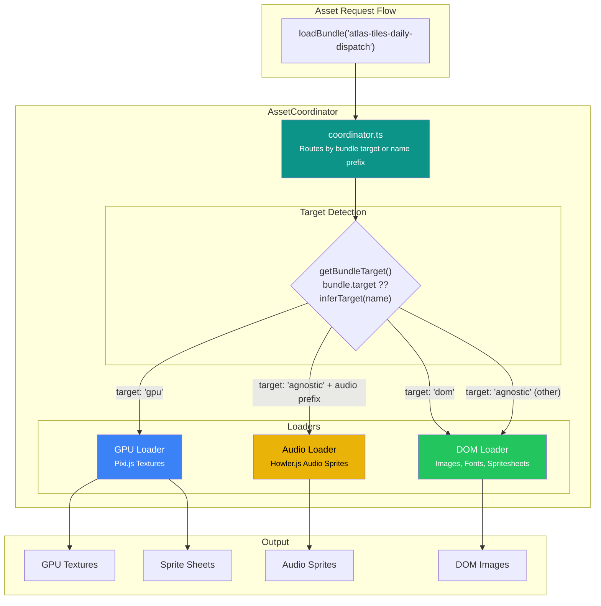
```mermaid
graph TB
    subgraph "Asset Request Flow"
        REQ["loadBundle('atlas-tiles-daily-dispatch')"]
    end

    subgraph "AssetCoordinator"
        COORD[coordinator.ts<br/><small>Routes by bundle target or name prefix</small>]

        subgraph "Target Detection"
            DET{"getBundleTarget()<br/>bundle.target ??<br/>inferTarget(name)"}
        end

        subgraph "Loaders"
            DOM[DOM Loader<br/><small>Images, Fonts, Spritesheets</small>]
            GPU[GPU Loader<br/><small>Pixi.js Textures</small>]
            AUD[Audio Loader<br/><small>Howler.js Audio Sprites</small>]
        end
    end

    subgraph "Output"
        TEX[GPU Textures]
        SPR[Sprite Sheets]
        SND[Audio Sprites]
        IMG[DOM Images]
    end

    REQ --> COORD
    COORD --> DET
    DET -->|"target: 'gpu'"| GPU
    DET -->|"target: 'dom'"| DOM
    DET -->|"target: 'agnostic' + audio prefix"| AUD
    DET -->|"target: 'agnostic' (other)"| DOM

    GPU --> TEX
    GPU --> SPR
    AUD --> SND
    DOM --> IMG

    style COORD fill:#0d9488,color:#fff
    style GPU fill:#3b82f6,color:#fff
    style DOM fill:#22c55e,color:#fff
    style AUD fill:#eab308,color:#000
```

### 3.2 Bundle Loading Lifecycle

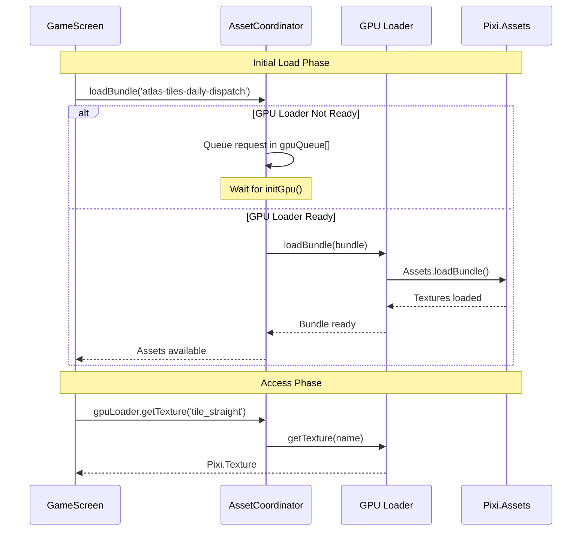
```mermaid
sequenceDiagram
    participant GS as GameScreen
    participant AC as AssetCoordinator
    participant GL as GPU Loader
    participant PI as Pixi.Assets

    Note over GS,PI: Initial Load Phase
    GS->>AC: loadBundle('atlas-tiles-daily-dispatch')

    alt GPU Loader Not Ready
        AC->>AC: Queue request in gpuQueue[]
        Note over AC: Wait for initGpu()
    else GPU Loader Ready
        AC->>GL: loadBundle(bundle)
        GL->>PI: Assets.loadBundle()
        PI-->>GL: Textures loaded
        GL-->>AC: Bundle ready
        AC-->>GS: Assets available
    end

    Note over GS,PI: Access Phase
    GS->>AC: gpuLoader.getTexture('tile_straight')
    AC->>GL: getTexture(name)
    GL-->>GS: Pixi.Texture
```

### 3.3 Asset Target Types

| Target | Loader | Inference Rule | Example Assets |
|--------|--------|----------------|----------------|
| `dom` | DOM Loader | `boot-*` prefix | Fonts, styles |
| `gpu` | Pixi Loader | Default for unmatched names | Tile atlases, characters |
| `agnostic` | DOM or Audio | `theme-*`, `audio-*`, `data-*` prefix | Branding, SFX sprites |

Target resolution: `bundle.target ?? inferTarget(bundle.name)`. Explicit `target` overrides prefix-based inference.

### 3.4 Target Inference from Bundle Name

```typescript
function inferTarget(bundleName: string): AssetTarget {
  if (bundleName.startsWith('boot-'))   return 'dom';
  if (bundleName.startsWith('theme-'))  return 'agnostic';
  if (bundleName.startsWith('audio-'))  return 'agnostic';
  if (bundleName.startsWith('data-'))   return 'agnostic';
  return 'gpu'; // Default: sprite sheets go to Pixi
}
```

### 3.5 Manifest Structure

```typescript
// game/asset-manifest.ts
import type { Manifest } from '~/core/systems/assets';

export const manifest: Manifest = {
  cdnBase: getCdnUrl(),          // CDN root for production assets
  localBase: getLocalAssetPath(), // Fallback path if CDN fails
  bundles: [
    // THEME - Branding (agnostic, loaded first)
    { name: 'theme-branding', assets: ['atlas-branding-wolf.json'] },

    // TILES - GPU bundles (only one loaded based on tuning)
    { name: 'atlas-tiles-daily-dispatch', assets: ['atlas-tiles-daily-dispatch.json'] },
    { name: 'atlas-tiles-citylines-fall', assets: ['atlas-tiles-citylines-fall.json'] },

    // VFX - particle textures
    { name: 'vfx-rotate', assets: ['vfx-rotate.json'] },
    { name: 'vfx-blast', assets: ['vfx-blast.json'] },

    // AUDIO - Howler audio sprites
    { name: 'audio-sfx-daily-dispatch', assets: ['sfx-daily-dispatch.json'] },
    { name: 'audio-music-citylines-1', assets: ['music-citylines-1.json'] },
  ],
};
```

### 3.6 Manifest Type Definitions

```typescript
interface ManifestBundle {
  name: string;              // Bundle identifier
  assets: string[];          // Asset file paths (relative to cdnBase/localBase)
  target?: AssetTarget;      // Optional override: 'dom' | 'gpu' | 'agnostic'
}

interface Manifest {
  cdnBase: string;           // CDN root URL
  localBase?: string;        // Local fallback path
  bundles: ManifestBundle[];
}
```

### 3.7 Convenience Loading Methods

The coordinator provides named methods for common loading phases:

```typescript
coordinator.loadBoot(onProgress);     // Load all 'boot-*' bundles
coordinator.loadCore(onProgress);     // Load all 'core-*' bundles
coordinator.loadTheme(onProgress);    // Load all 'theme-*' bundles
coordinator.loadAudio(onProgress);    // Load all 'audio-*' bundles
coordinator.loadScene('game', onProgress); // Load 'scene-game' bundle

// Background loading for low-priority bundles
coordinator.startBackgroundLoading(); // Load 'fx-*' bundles in the background
```

---

## 4. Screen System Deep Dive

### 4.1 Screen State Machine

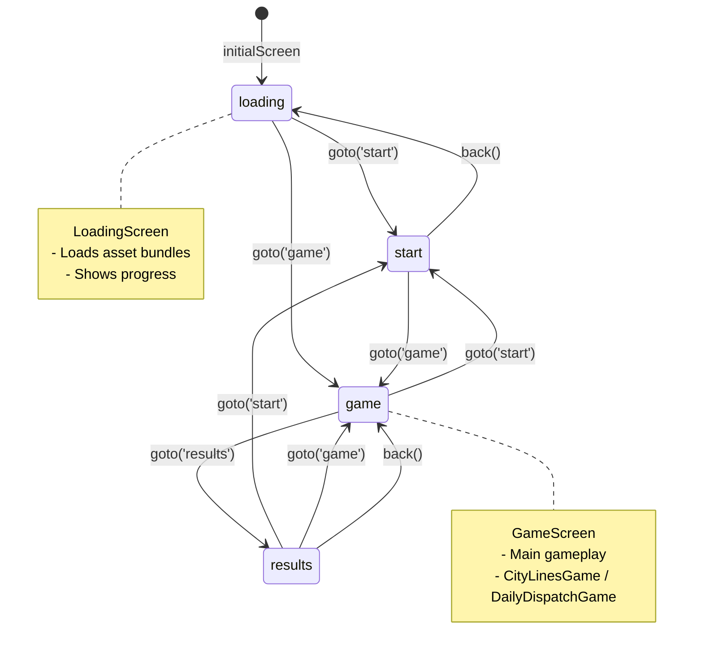
```mermaid
stateDiagram-v2
    [*] --> loading: initialScreen

    loading --> start: goto('start')
    loading --> game: goto('game')

    start --> game: goto('game')
    start --> loading: back()

    game --> results: goto('results')
    game --> start: goto('start')

    results --> start: goto('start')
    results --> game: goto('game')
    results --> game: back()

    note right of loading
        LoadingScreen
        - Loads asset bundles
        - Shows progress
    end note

    note right of game
        GameScreen
        - Main gameplay
        - CityLinesGame / DailyDispatchGame
    end note
```

### 4.2 Screen Configuration

Screens are registered in `game/config.ts` and mapped to Solid.js components:

```typescript
// game/config.ts
export const gameConfig: GameConfig = {
  screens: {
    loading: LoadingScreen,                        // Eager
    start: lazy(() => import('./screens/StartScreen')),  // Lazy
    game: lazy(() => import('./screens/GameScreen')),     // Lazy
    results: ResultsScreen,                        // Eager
  },
  initialScreen: 'loading',
  defaultViewportMode: 'small',
  serverStorageUrl: getServerStorageUrl(),
};
```

### 4.3 Transition System

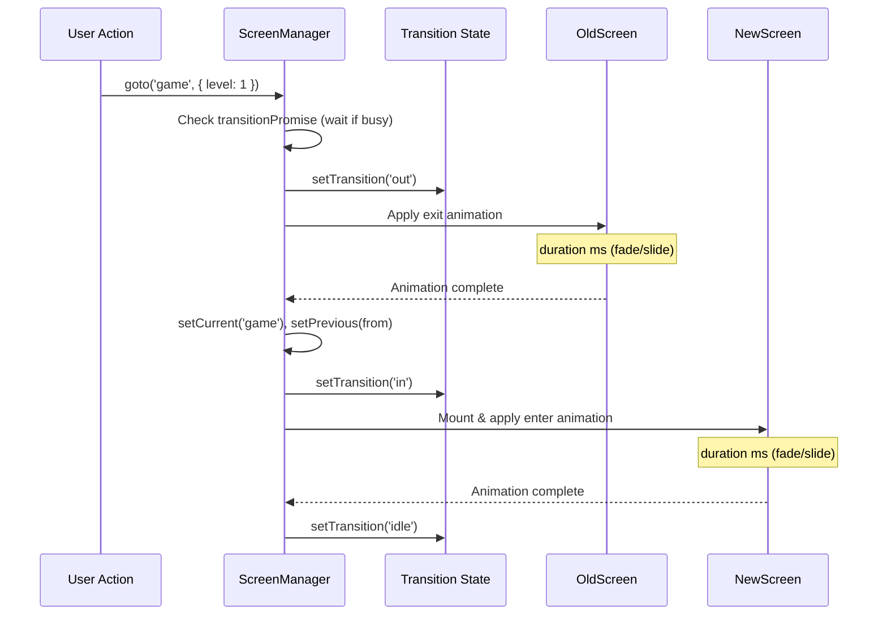
```mermaid
sequenceDiagram
    participant U as User Action
    participant SM as ScreenManager
    participant TR as Transition State
    participant OLD as OldScreen
    participant NEW as NewScreen

    U->>SM: goto('game', { level: 1 })
    SM->>SM: Check transitionPromise (wait if busy)
    SM->>TR: setTransition('out')
    SM->>OLD: Apply exit animation

    Note over OLD: duration ms (fade/slide)

    OLD-->>SM: Animation complete
    SM->>SM: setCurrent('game'), setPrevious(from)
    SM->>TR: setTransition('in')
    SM->>NEW: Mount & apply enter animation

    Note over NEW: duration ms (fade/slide)

    NEW-->>SM: Animation complete
    SM->>TR: setTransition('idle')
```

### 4.4 Transition Types

| Type | Effect | Duration | Use Case |
|------|--------|----------|----------|
| `fade` | Opacity 1 -> 0 -> 1 | 300ms (default) | Default, smooth |
| `slide` | Translate X + opacity | 300ms | Sequential screens |
| `none` | Instant swap | 0ms | Debug, fast nav |

### 4.5 Screen Manager API

```typescript
interface ScreenContext {
  // Reactive signals
  current: () => ScreenId;              // 'loading' | 'start' | 'game' | 'results'
  previous: () => ScreenId | null;
  transition: () => TransitionState;    // 'idle' | 'out' | 'in'
  data: () => Record<string, unknown>;  // Per-screen data payload

  // Navigation
  goto: (screen: ScreenId, data?: Record<string, unknown>) => Promise<void>;
  back: () => Promise<void>;
}
```

The `goto()` method is async and awaits any in-progress transition before starting a new one.

---

## 5. Tuning System Deep Dive

### 5.1 Configuration Loading Pipeline

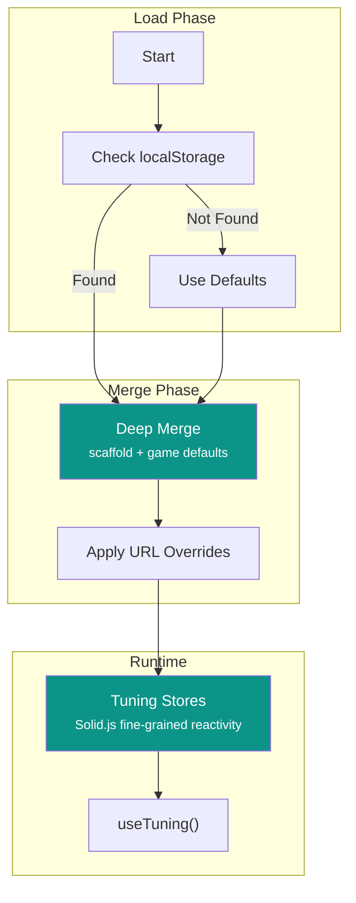
```mermaid
graph TB
    subgraph "Load Phase"
        START[Start]
        LS[Check localStorage]
        DEF[Use Defaults]
    end

    subgraph "Merge Phase"
        MERGE[Deep Merge<br/><small>scaffold + game defaults</small>]
        URL[Apply URL Overrides]
    end

    subgraph "Runtime"
        STATE[Tuning Stores<br/><small>Solid.js fine-grained reactivity</small>]
        HOOK["useTuning()"]
    end

    START --> LS
    LS -->|Found| MERGE
    LS -->|Not Found| DEF
    DEF --> MERGE
    MERGE --> URL
    URL --> STATE
    STATE --> HOOK

    style MERGE fill:#0d9488,color:#fff
    style STATE fill:#0d9488,color:#fff
```

### 5.2 Configuration Layers (Priority Order)

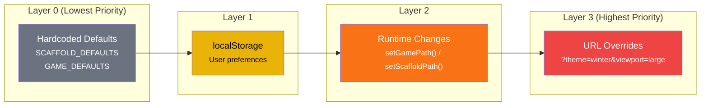
```mermaid
graph LR
    subgraph "Layer 3 (Highest Priority)"
        URL["URL Overrides<br/><small>?theme=winter&viewport=large</small>"]
    end

    subgraph "Layer 2"
        RUNTIME["Runtime Changes<br/><small>setGamePath() / setScaffoldPath()</small>"]
    end

    subgraph "Layer 1"
        LOCAL["localStorage<br/><small>User preferences</small>"]
    end

    subgraph "Layer 0 (Lowest Priority)"
        DEFAULTS["Hardcoded Defaults<br/><small>SCAFFOLD_DEFAULTS</small><br/><small>GAME_DEFAULTS</small>"]
    end

    DEFAULTS --> LOCAL
    LOCAL --> RUNTIME
    RUNTIME --> URL

    style URL fill:#ef4444,color:#fff
    style RUNTIME fill:#f97316,color:#fff
    style LOCAL fill:#eab308,color:#000
    style DEFAULTS fill:#6b7280,color:#fff
```

URL overrides are applied after load and are not persisted to localStorage (session-only).

### 5.3 Tuning Type Structure

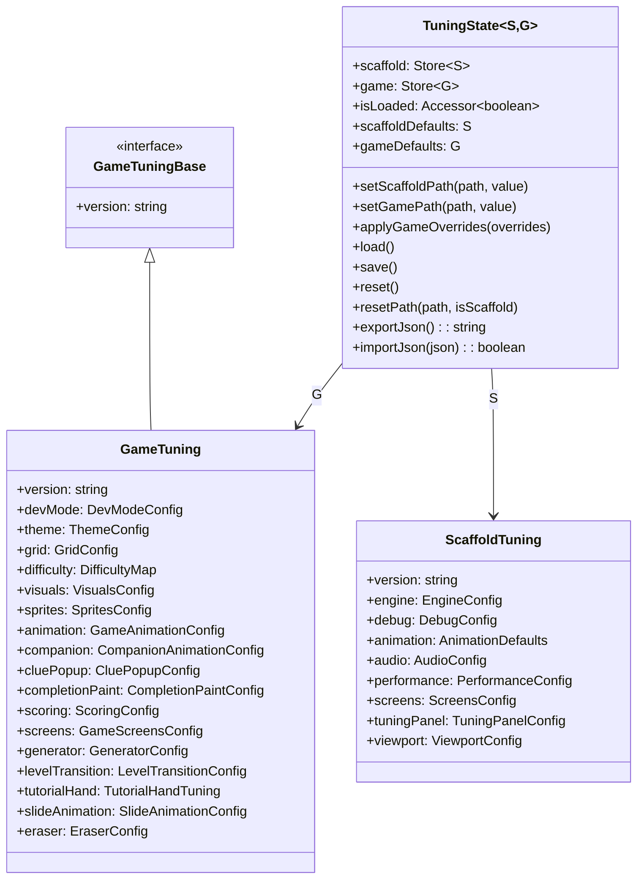
```mermaid
classDiagram
    class ScaffoldTuning {
        +version: string
        +engine: EngineConfig
        +debug: DebugConfig
        +animation: AnimationDefaults
        +audio: AudioConfig
        +performance: PerformanceConfig
        +screens: ScreensConfig
        +tuningPanel: TuningPanelConfig
        +viewport: ViewportConfig
    }

    class GameTuningBase {
        <<interface>>
        +version: string
    }

    class GameTuning {
        +version: string
        +devMode: DevModeConfig
        +theme: ThemeConfig
        +grid: GridConfig
        +difficulty: DifficultyMap
        +visuals: VisualsConfig
        +sprites: SpritesConfig
        +animation: GameAnimationConfig
        +companion: CompanionAnimationConfig
        +cluePopup: CluePopupConfig
        +completionPaint: CompletionPaintConfig
        +scoring: ScoringConfig
        +screens: GameScreensConfig
        +generator: GeneratorConfig
        +levelTransition: LevelTransitionConfig
        +tutorialHand: TutorialHandTuning
        +slideAnimation: SlideAnimationConfig
        +eraser: EraserConfig
    }

    GameTuningBase <|-- GameTuning

    class TuningState~S,G~ {
        +scaffold: Store~S~
        +game: Store~G~
        +isLoaded: Accessor~boolean~
        +scaffoldDefaults: S
        +gameDefaults: G
        +setScaffoldPath(path, value)
        +setGamePath(path, value)
        +applyGameOverrides(overrides)
        +load()
        +save()
        +reset()
        +resetPath(path, isScaffold)
        +exportJson(): string
        +importJson(json): boolean
    }

    TuningState --> ScaffoldTuning : S
    TuningState --> GameTuning : G
```

### 5.4 Core Tuning Schema (ScaffoldTuning)

```typescript
interface ScaffoldTuning {
  version: string;
  engine: {
    targetFps: number;          // Default: 60
    antialias: boolean;         // Default: true
    backgroundAlpha: number;    // Default: 1.0
    resolution: number;         // Default: 1
  };
  debug: {
    showFps: boolean;           // Default: false
    showHitboxes: boolean;      // Default: false
    logLevel: 'debug' | 'info' | 'warn' | 'error' | 'none'; // Default: 'warn'
  };
  animation: {
    defaultDuration: number;    // Default: 300ms
    defaultEasing: string;      // Default: 'power2.out'
    transitionDuration: number; // Default: 300ms
    transitionType: 'fade' | 'slide' | 'none'; // Default: 'fade'
  };
  audio: {
    masterVolume: number;       // Default: 0.5
    musicVolume: number;        // Default: 0.8
    sfxVolume: number;          // Default: 1.0
    fadeInDuration: number;     // Default: 500ms
    fadeOutDuration: number;    // Default: 300ms
  };
  performance: {
    maxParticles: number;       // Default: 1000
    spritePoolSize: number;     // Default: 100
    enableCulling: boolean;     // Default: true
  };
  screens: {
    loadingMinDuration: number; // Default: 500ms
    loadingFadeOut: number;     // Default: 300ms
  };
  tuningPanel: {
    position: 'left' | 'center' | 'right'; // Default: 'left'
  };
  viewport: {
    mode: 'small' | 'large' | 'none'; // Default: 'small'
  };
}
```

### 5.5 Game Tuning Schema (CityLines/DailyDispatch)

```typescript
interface GameTuning extends GameTuningBase {
  devMode: {
    skipStartScreen: boolean;   // Default: false
  };
  theme: {
    tileTheme: 'regular' | 'fall' | 'winter'; // Default: 'regular'
  };
  grid: {
    tileSize: number;           // Default: 96
    defaultGridSize: number;    // Default: 4
    padding: number;            // Default: 20
    cellGap: number;            // Default: 0
    nineSlice: NineSliceConfig;
    tileRotateDuration: number; // Default: 600ms
    tileRotateEasing: string;   // Default: 'elastic.out(1, 0.5)'
    vfx: TileVfxConfig;
  };
  difficulty: {
    easy: DifficultyConfig;
    medium: DifficultyConfig;
    hard: DifficultyConfig;
  };
  visuals: {
    backgroundColor: string;    // Default: '#58A23B'
  };
  sprites: SpritesConfig;
  animation: GameAnimationConfig;
  companion: CompanionAnimationConfig;
  cluePopup: CluePopupConfig;
  completionPaint: CompletionPaintConfig;
  scoring: ScoringConfig;
  screens: GameScreensConfig;
  generator: GeneratorConfig;
  levelTransition: LevelTransitionConfig;
  tutorialHand: TutorialHandTuning;
  slideAnimation: SlideAnimationConfig;
  eraser: EraserConfig;
}
```

### 5.6 Tuning State API

```typescript
interface TuningState<S extends ScaffoldTuning, G extends GameTuningBase> {
  // Fine-grained reactive stores
  scaffold: Store<S>;       // Access: tuning.scaffold.engine.targetFps
  game: Store<G>;           // Access: tuning.game.grid.tileSize

  // Load state
  isLoaded: Accessor<boolean>;
  loadError: Accessor<string | null>;
  source: Accessor<{ scaffold: TuningSource; game: TuningSource }>;

  // Default values (for reset)
  scaffoldDefaults: S;
  gameDefaults: G;

  // Mutators
  setScaffoldPath: (path: string, value: unknown) => void;
  setGamePath: (path: string, value: unknown) => void;
  applyGameOverrides: (overrides: Record<string, unknown>) => void; // No localStorage save

  // Actions
  load: () => Promise<void>;
  save: () => void;
  reset: () => void;
  resetPath: (path: string, isScaffold: boolean) => void;
  exportJson: () => string;
  importJson: (json: string) => boolean;
}
```

---

## 6. Error Handling System

### 6.1 Error Boundary Hierarchy

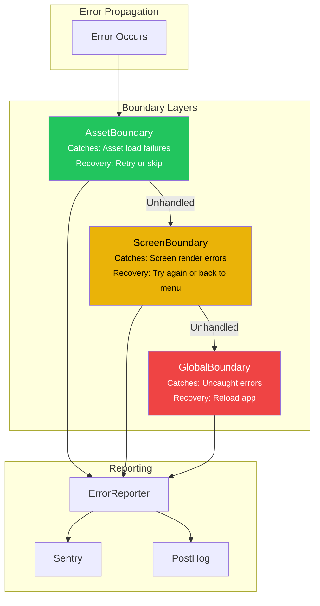
```mermaid
graph TB
    subgraph "Error Propagation"
        ERR[Error Occurs]
    end

    subgraph "Boundary Layers"
        ASSET["AssetBoundary<br/><small>Catches: Asset load failures</small><br/><small>Recovery: Retry or skip</small>"]
        SCREEN["ScreenBoundary<br/><small>Catches: Screen render errors</small><br/><small>Recovery: Try again or back to menu</small>"]
        GLOBAL["GlobalBoundary<br/><small>Catches: Uncaught errors</small><br/><small>Recovery: Reload app</small>"]
    end

    subgraph "Reporting"
        REPORTER[ErrorReporter]
        SENTRY[Sentry]
        POSTHOG[PostHog]
    end

    ERR --> ASSET
    ASSET -->|Unhandled| SCREEN
    SCREEN -->|Unhandled| GLOBAL

    ASSET --> REPORTER
    SCREEN --> REPORTER
    GLOBAL --> REPORTER

    REPORTER --> SENTRY
    REPORTER --> POSTHOG

    style ASSET fill:#22c55e,color:#fff
    style SCREEN fill:#eab308,color:#000
    style GLOBAL fill:#ef4444,color:#fff
```

### 6.2 Error Severity Levels

| Level | Boundary | User Impact | Recovery Action |
|-------|----------|-------------|-----------------|
| `warning` | AssetBoundary | Degraded experience | Retry or skip asset |
| `error` | ScreenBoundary | Screen unusable | Try again or navigate away |
| `fatal` | GlobalBoundary | App unusable | Full reload required |

### 6.3 Error Reporter Flow

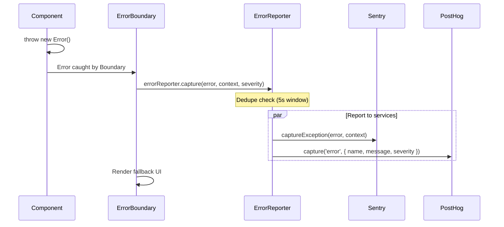
```mermaid
sequenceDiagram
    participant C as Component
    participant EB as ErrorBoundary
    participant ER as ErrorReporter
    participant S as Sentry
    participant PH as PostHog

    C->>C: throw new Error()
    C->>EB: Error caught by Boundary
    EB->>ER: errorReporter.capture(error, context, severity)

    Note over ER: Dedupe check (5s window)

    par Report to services
        ER->>S: captureException(error, context)
        ER->>PH: capture('error', { name, message, severity })
    end

    EB->>EB: Render fallback UI
```

### 6.4 Error Reporter API

```typescript
interface ErrorReporter {
  capture(error: Error, context?: Partial<ErrorContext>, severity?: ErrorSeverity): void;
  setUser(userId: string): void;
  setScreen(screen: string): void;
  addBreadcrumb(message: string, data?: Record<string, unknown>): void;
}
```

The reporter deduplicates rapid-fire errors (same `name:message` key within 5 seconds), automatically enriches context with current screen, user ID, and session ID, and dual-reports to both Sentry (stack traces) and PostHog (product analytics).

### 6.5 Global Error Handlers

```typescript
// Registered in app.tsx onMount
setupGlobalErrorHandlers();

// Catches:
// - window 'error' events -> severity: 'fatal'
// - window 'unhandledrejection' events -> severity: 'error'
```

---

## 7. Modules Layer

The modules layer sits between core and game, providing reusable building blocks that depend only on core systems.

### 7.1 Module Categories

```mermaid
graph TB
    subgraph "modules/"
        subgraph "primitives/ (Single-Purpose Visual)"
            SB[sprite-button/<br/><small>Pressable sprite with hover/press</small>]
            DB[dialogue-box/<br/><small>9-slice speech bubble</small>]
            CS[character-sprite/<br/><small>Animated from texture atlas</small>]
            PB[progress-bar/<br/><small>Segmented with milestones</small>]
        end

        subgraph "logic/ (Pure Logic, No Rendering)"
            LC[level-completion/<br/><small>playing -> completing -> complete</small>]
            PR[progress/<br/><small>createProgressService()</small>]
            CA[catalog/<br/><small>createCatalogService()</small>]
            LD[loader/<br/><small>createContentLoader()</small>]
        end

        subgraph "prefabs/ (Assembled Components)"
            AP[avatar-popup/<br/><small>Avatar + dialogue + show/dismiss</small>]
        end
    end

    AP -.->|assembles| CS
    AP -.->|assembles| DB

    style SB fill:#22c55e,color:#fff
    style DB fill:#22c55e,color:#fff
    style CS fill:#22c55e,color:#fff
    style PB fill:#22c55e,color:#fff
    style LC fill:#22c55e,color:#fff
    style PR fill:#22c55e,color:#fff
    style CA fill:#22c55e,color:#fff
    style LD fill:#22c55e,color:#fff
    style AP fill:#22c55e,color:#fff
```

### 7.2 Module Standard Structure

Every module follows a consistent shape:

**Visual modules (primitives, prefabs):**
```
modules/<category>/<module-name>/
  index.ts          <- Public API (barrel export)
  defaults.ts       <- Extracted magic numbers
  tuning.ts         <- Panel schema for Tweakpane
  renderers/
    pixi.ts         <- Pixi.js implementation (primary)
    phaser.ts       <- Phaser implementation (optional)
    three.ts        <- Three.js implementation (optional)
```

**Logic modules:**
```
modules/logic/<module-name>/
  index.ts          <- Factory function + types + public API
  defaults.ts       <- Default config values (if applicable)
  tuning.ts         <- Panel schema for Tweakpane (if applicable)
```

### 7.3 Module Defaults Pattern

Each module exports a `DEFAULTS` constant with all configurable values extracted from code:

```typescript
// modules/primitives/sprite-button/defaults.ts
export const SPRITE_BUTTON_DEFAULTS = {
  pressScale: 0.95,
  hoverScale: 1.05,
  pressDuration: 0.1,
  hoverDuration: 0.2,
  exitScale: 0.9,
  exitDuration: 0.25,
  disabledAlpha: 0.5,
  ease: 'power2.out',
  labelFontSize: 18,
  labelFontWeight: 'bold' as const,
  labelFill: 0x000000,
};
```

### 7.4 Module Tuning Schema Pattern

Each module exports a tuning descriptor for automatic Tweakpane integration:

```typescript
// modules/primitives/sprite-button/tuning.ts
export const spriteButtonTuning = {
  name: 'Sprite Button',
  defaults: SPRITE_BUTTON_DEFAULTS,
  schema: {
    hoverScale:    { type: 'number', min: 1.0, max: 1.3, step: 0.01 },
    pressScale:    { type: 'number', min: 0.7, max: 1.0, step: 0.01 },
    pressDuration: { type: 'number', min: 0,   max: 0.5, step: 0.01 },
    hoverDuration: { type: 'number', min: 0,   max: 0.5, step: 0.01 },
    disabledAlpha: { type: 'number', min: 0,   max: 1,   step: 0.05 },
    ease:          { type: 'string' },
  },
} as const;
```

### 7.5 Logic Module Factory Pattern

Logic modules export factory functions that games configure with their own types:

**Progress Service:**
```typescript
// modules/logic/progress/index.ts
const progress = createProgressService<MyProgress>({
  key: 'mygame_progress',
  version: 1,
  defaults: { version: 1, score: 0, level: 1 },
});
progress.load();
progress.save({ ...data });
progress.clear();
```

**Catalog Service:**
```typescript
// modules/logic/catalog/index.ts
const catalog = createCatalogService<ChapterEntry>({
  fetchIndex: () => fetch('/api/chapters').then(r => r.json()),
  fallbackEntries: [{ id: 'fallback', url: 'default.json' }],
});
await catalog.init();
catalog.current();
catalog.next();
```

**Content Loader:**
```typescript
// modules/logic/loader/index.ts
const loader = createContentLoader<ChapterRef, LevelManifest>({
  fetch: (url) => fetch(url).then(r => r.json()),
  transform: (raw) => convertToLevelManifest(raw),
});
const level = await loader.load('/api/chapters/1');
```

### 7.6 Module Dependency Rule

```
modules/primitives/* -> imports from ~/core/ only
modules/logic/*      -> imports from ~/core/ only
modules/prefabs/*    -> imports from ~/core/ and ~/modules/primitives/
```

Modules never import from `game/` or from other modules in the same category (no lateral deps between primitives).

### 7.7 Where to Put New Modules

| If the component is... | Put it in... |
|------------------------|-------------|
| Single-purpose visual (one Pixi container) | `modules/primitives/` |
| Pure logic, no rendering | `modules/logic/` |
| Assembles multiple primitives | `modules/prefabs/` |
| Game-specific, not reusable | `game/<your-game>/` -- not a module |

---

## 8. Game Layer Integration

### 8.1 Game Config Contract

The game provides configuration that core consumes via props and the provider stack:

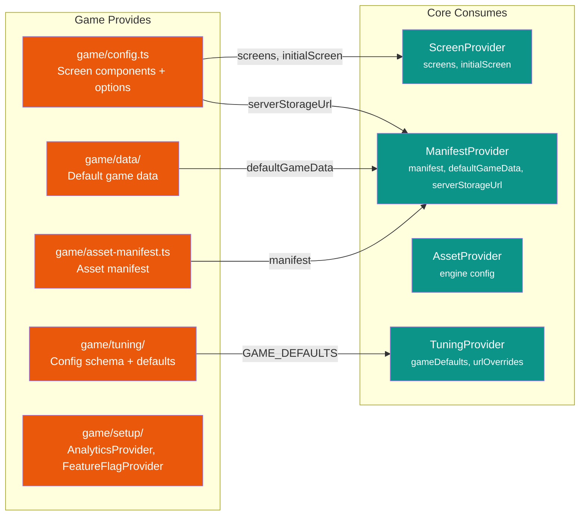
```mermaid
graph LR
    subgraph "Game Provides"
        GC["game/config.ts<br/>Screen components + options"]
        GM["game/asset-manifest.ts<br/>Asset manifest"]
        GT["game/tuning/<br/>Config schema + defaults"]
        GD["game/data/<br/>Default game data"]
        GA["game/setup/<br/>AnalyticsProvider, FeatureFlagProvider"]
    end

    subgraph "Core Consumes"
        SP["ScreenProvider<br/><small>screens, initialScreen</small>"]
        MP["ManifestProvider<br/><small>manifest, defaultGameData, serverStorageUrl</small>"]
        ASP["AssetProvider<br/><small>engine config</small>"]
        TP["TuningProvider<br/><small>gameDefaults, urlOverrides</small>"]
    end

    GC -->|screens, initialScreen| SP
    GM -->|manifest| MP
    GD -->|defaultGameData| MP
    GC -->|serverStorageUrl| MP
    GT -->|GAME_DEFAULTS| TP

    style GC fill:#ea580c,color:#fff
    style GM fill:#ea580c,color:#fff
    style GT fill:#ea580c,color:#fff
    style GD fill:#ea580c,color:#fff
    style GA fill:#ea580c,color:#fff
    style SP fill:#0d9488,color:#fff
    style MP fill:#0d9488,color:#fff
    style ASP fill:#0d9488,color:#fff
    style TP fill:#0d9488,color:#fff
```

### 8.2 Game Screen Anatomy

```typescript
// game/screens/GameScreen.tsx
const GameScreen: Component = () => {
  // 1. Access core systems via hooks
  const assets = useAssets();
  const tuning = useTuning<ScaffoldTuning, GameTuning>();
  const screen = useScreen();
  const pause = usePause();

  // 2. Access game-specific providers
  const analytics = useAnalytics();
  const { flags } = useFeatureFlags();
  const manifest = useManifest();

  // 3. Access modules (logic services)
  const gameData = manifest.getGameData();

  // 4. Create game instance with tuning
  const game = new CityLinesGame({
    tuning: tuning.game,
    assets: assets,
  });

  // 5. Handle game events
  game.on('levelComplete', (data) => {
    analytics.trackLevelComplete(data);
    screen.goto('results', data);
  });

  // 6. Render Pixi canvas
  return <div ref={container} />;
};
```

### 8.3 Game Services Architecture

Game services compose module logic factories with game-specific configuration:

```typescript
// game/services/progress.ts
import { createProgressService } from '~/modules/logic/progress';

const progressService = createProgressService<GameProgress>({
  key: 'citylines_progress',
  version: 2,
  defaults: { version: 2, chapter: 0, level: 0, score: 0 },
});

// game/services/chapterCatalog.ts
import { createCatalogService } from '~/modules/logic/catalog';

const chapterCatalog = createCatalogService<ChapterEntry>({
  fetchIndex: () => fetch(getGamesIndexUrl()).then(r => r.json()),
  fallbackEntries: fallbackChapters,
});

// game/services/chapterLoader.ts
import { createContentLoader } from '~/modules/logic/loader';

const chapterLoader = createContentLoader<RawChapter, GameChapter>({
  fetch: (url) => fetch(url).then(r => r.json()),
  transform: (raw) => normalizeChapter(raw),
});
```

### 8.4 CityLinesGame Class Structure

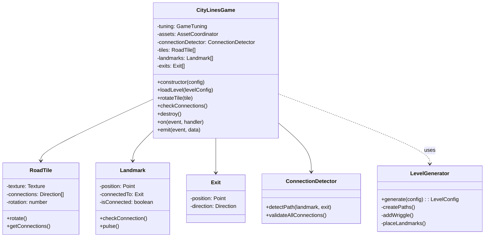
```mermaid
classDiagram
    class CityLinesGame {
        -tuning: GameTuning
        -assets: AssetCoordinator
        -connectionDetector: ConnectionDetector
        -tiles: RoadTile[]
        -landmarks: Landmark[]
        -exits: Exit[]

        +constructor(config)
        +loadLevel(levelConfig)
        +rotateTile(tile)
        +checkConnections()
        +destroy()

        +on(event, handler)
        +emit(event, data)
    }

    class RoadTile {
        -texture: Texture
        -connections: Direction[]
        -rotation: number

        +rotate()
        +getConnections()
    }

    class Landmark {
        -position: Point
        -connectedTo: Exit
        -isConnected: boolean

        +checkConnection()
        +pulse()
    }

    class Exit {
        -position: Point
        -direction: Direction
    }

    class ConnectionDetector {
        +detectPath(landmark, exit)
        +validateAllConnections()
    }

    class LevelGenerator {
        +generate(config): LevelConfig
        -createPaths()
        -addWriggle()
        -placeLandmarks()
    }

    CityLinesGame --> RoadTile
    CityLinesGame --> Landmark
    CityLinesGame --> Exit
    CityLinesGame --> ConnectionDetector
    CityLinesGame ..> LevelGenerator : uses
```

### 8.5 Game Setup Providers

The game layer defines its own providers for cross-cutting concerns that are game-specific:

**AnalyticsProvider** (`game/setup/AnalyticsContext.tsx`):
- Initializes PostHog
- Creates session trackers (start, pause, resume, end)
- Creates game-specific trackers (level, chapter, cutscene, landmark)
- Connects Sentry to PostHog for error correlation
- Manages survey trigger logic

**FeatureFlagProvider** (`game/setup/FeatureFlagContext.tsx`):
- Reads feature flags from PostHog SDK
- Falls back to localStorage cache, then hardcoded defaults
- Validates flag values with type guards
- Unblocks UI after timeout (2s) even if PostHog is slow

---

## 9. Data Flow Analysis

### 9.1 Complete Request Flow

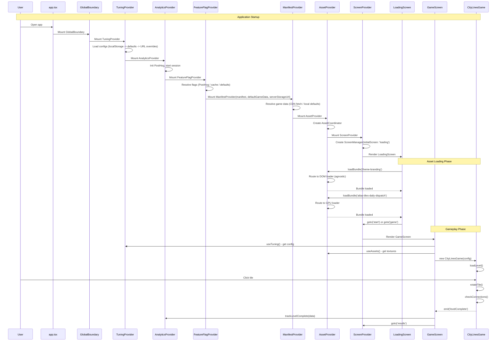
```mermaid
sequenceDiagram
    participant U as User
    participant APP as app.tsx
    participant GB as GlobalBoundary
    participant TP as TuningProvider
    participant AP as AnalyticsProvider
    participant FF as FeatureFlagProvider
    participant MP as ManifestProvider
    participant ASP as AssetProvider
    participant SP as ScreenProvider
    participant LS as LoadingScreen
    participant GS as GameScreen
    participant CLG as CityLinesGame

    Note over U,CLG: Application Startup

    U->>APP: Open app
    APP->>GB: Mount GlobalBoundary
    GB->>TP: Mount TuningProvider
    TP->>TP: Load configs (localStorage -> defaults -> URL overrides)
    TP->>AP: Mount AnalyticsProvider
    AP->>AP: Init PostHog, start session
    AP->>FF: Mount FeatureFlagProvider
    FF->>FF: Resolve flags (PostHog / cache / defaults)
    FF->>MP: Mount ManifestProvider(manifest, defaultGameData, serverStorageUrl)
    MP->>MP: Resolve game data (CDN fetch / local defaults)
    MP->>ASP: Mount AssetProvider
    ASP->>ASP: Create AssetCoordinator
    ASP->>SP: Mount ScreenProvider
    SP->>SP: Create ScreenManager(initialScreen: 'loading')
    SP->>LS: Render LoadingScreen

    Note over LS,CLG: Asset Loading Phase

    LS->>ASP: loadBundle('theme-branding')
    ASP->>ASP: Route to DOM loader (agnostic)
    ASP-->>LS: Bundle loaded
    LS->>ASP: loadBundle('atlas-tiles-daily-dispatch')
    ASP->>ASP: Route to GPU loader
    ASP-->>LS: Bundle loaded
    LS->>SP: goto('start') or goto('game')

    Note over GS,CLG: Gameplay Phase

    SP->>GS: Render GameScreen
    GS->>TP: useTuning() - get config
    GS->>ASP: useAssets() - get textures
    GS->>CLG: new CityLinesGame(config)
    CLG->>CLG: loadLevel()

    U->>CLG: Click tile
    CLG->>CLG: rotateTile()
    CLG->>CLG: checkConnections()
    CLG-->>GS: emit('levelComplete')
    GS->>AP: trackLevelComplete(data)
    GS->>SP: goto('results')
```

### 9.2 Tuning Update Flow

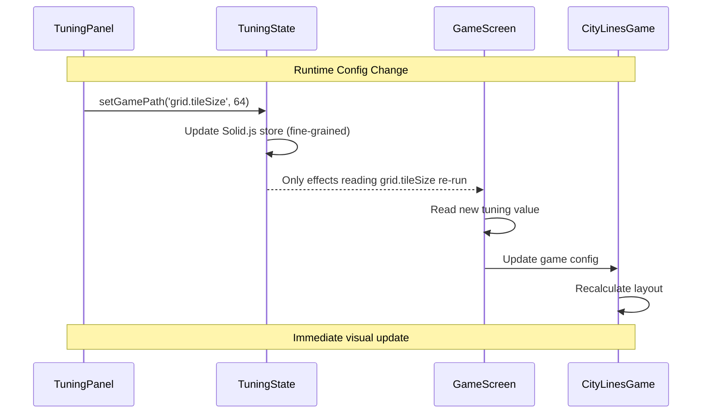
```mermaid
sequenceDiagram
    participant DP as TuningPanel
    participant TS as TuningState
    participant GS as GameScreen
    participant CLG as CityLinesGame

    Note over DP,CLG: Runtime Config Change

    DP->>TS: setGamePath('grid.tileSize', 64)
    TS->>TS: Update Solid.js store (fine-grained)
    TS-->>GS: Only effects reading grid.tileSize re-run
    GS->>GS: Read new tuning value
    GS->>CLG: Update game config
    CLG->>CLG: Recalculate layout

    Note over DP,CLG: Immediate visual update
```

### 9.3 Manifest Data Resolution Flow

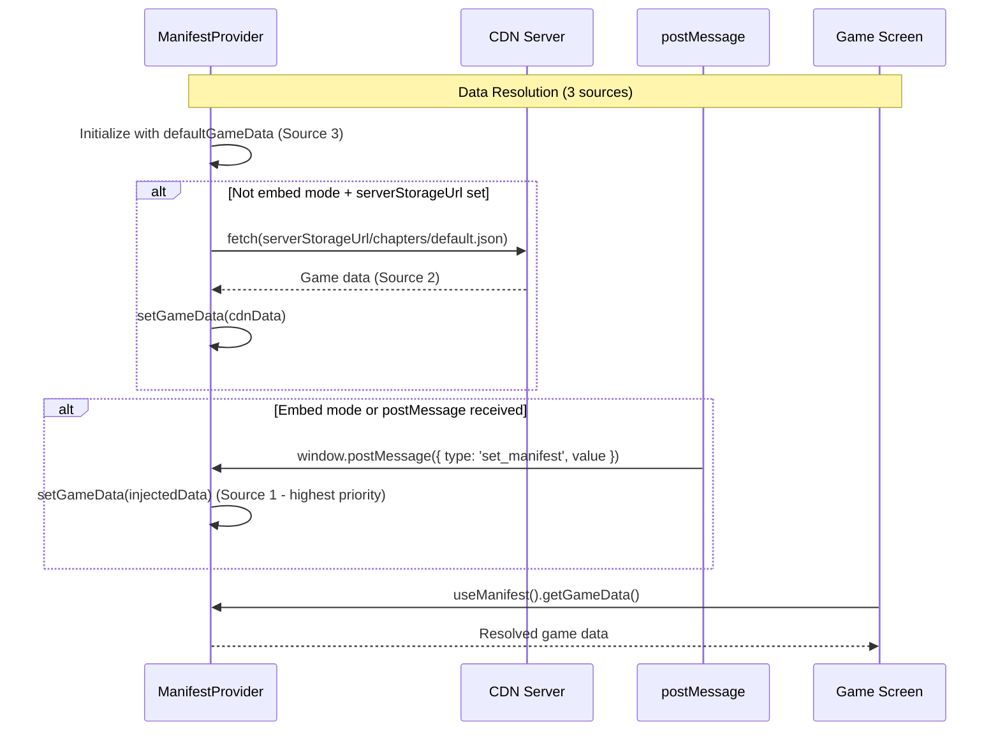
```mermaid
sequenceDiagram
    participant MP as ManifestProvider
    participant CDN as CDN Server
    participant PM as postMessage
    participant GS as Game Screen

    Note over MP,GS: Data Resolution (3 sources)

    MP->>MP: Initialize with defaultGameData (Source 3)

    alt Not embed mode + serverStorageUrl set
        MP->>CDN: fetch(serverStorageUrl/chapters/default.json)
        CDN-->>MP: Game data (Source 2)
        MP->>MP: setGameData(cdnData)
    end

    alt Embed mode or postMessage received
        PM->>MP: window.postMessage({ type: 'set_manifest', value })
        MP->>MP: setGameData(injectedData) (Source 1 - highest priority)
    end

    GS->>MP: useManifest().getGameData()
    MP-->>GS: Resolved game data
```

---

## 10. File Dependency Map

### 10.1 Core Internal Dependencies

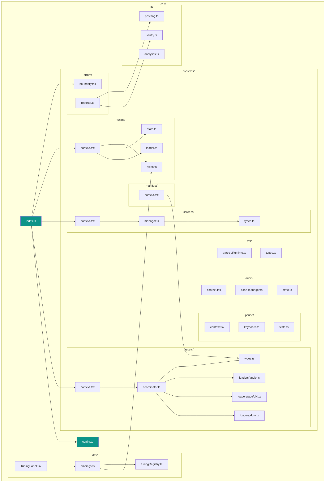
```mermaid
graph TB
    subgraph "core/"
        CONFIG[config.ts]
        INDEX[index.ts]

        subgraph "systems/"
            subgraph "assets/"
                AC[coordinator.ts]
                AD[loaders/dom.ts]
                AG[loaders/gpu/pixi.ts]
                AA[loaders/audio.ts]
                ACX[context.tsx]
                AT[types.ts]
            end

            subgraph "screens/"
                SM[manager.ts]
                SCX[context.tsx]
                STY[types.ts]
            end

            subgraph "tuning/"
                TL[loader.ts]
                TST[state.ts]
                TT[types.ts]
                TCX[context.tsx]
            end

            subgraph "manifest/"
                MCX[context.tsx]
            end

            subgraph "pause/"
                PCX[context.tsx]
                PKB[keyboard.ts]
                PST[state.ts]
            end

            subgraph "audio/"
                AUDCX[context.tsx]
                AUDBM[base-manager.ts]
                AUDST[state.ts]
            end

            subgraph "errors/"
                EB[boundary.tsx]
                ER[reporter.ts]
            end

            subgraph "vfx/"
                VFX_RT[particleRuntime.ts]
                VFX_T[types.ts]
            end
        end

        subgraph "dev/"
            TP[TuningPanel.tsx]
            TB[bindings.ts]
            TR[tuningRegistry.ts]
        end

        subgraph "lib/"
            SENTRY[sentry.ts]
            POSTHOG[posthog.ts]
            ANALYTICS_LIB[analytics.ts]
        end
    end

    INDEX --> CONFIG
    INDEX --> ACX
    INDEX --> SCX
    INDEX --> TCX
    INDEX --> EB

    AC --> AD
    AC --> AG
    AC --> AA
    AC --> AT
    ACX --> AC

    SCX --> SM
    SM --> STY

    TCX --> TL
    TCX --> TST
    TCX --> TT

    MCX --> AT

    TP --> TB
    TB --> TT
    TB --> TR

    ER --> SENTRY
    ER --> POSTHOG

    style CONFIG fill:#0d9488,color:#fff
    style INDEX fill:#0d9488,color:#fff
```

### 10.2 Modules Internal Dependencies

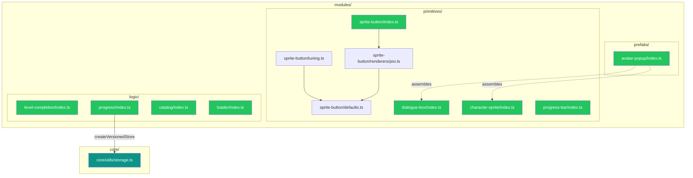
```mermaid
graph TB
    subgraph "modules/"
        subgraph "primitives/"
            SB_I[sprite-button/index.ts]
            SB_D[sprite-button/defaults.ts]
            SB_T[sprite-button/tuning.ts]
            SB_P[sprite-button/renderers/pixi.ts]

            DB_I[dialogue-box/index.ts]
            CS_I[character-sprite/index.ts]
            PB_I[progress-bar/index.ts]
        end

        subgraph "logic/"
            LC_I[level-completion/index.ts]
            PR_I[progress/index.ts]
            CA_I[catalog/index.ts]
            LD_I[loader/index.ts]
        end

        subgraph "prefabs/"
            AP_I[avatar-popup/index.ts]
        end
    end

    subgraph "core/"
        CORE[core/utils/storage.ts]
    end

    SB_I --> SB_P
    SB_T --> SB_D
    SB_P --> SB_D

    PR_I -->|createVersionedStore| CORE

    AP_I -.->|assembles| CS_I
    AP_I -.->|assembles| DB_I

    style CORE fill:#0d9488,color:#fff
    style SB_I fill:#22c55e,color:#fff
    style DB_I fill:#22c55e,color:#fff
    style CS_I fill:#22c55e,color:#fff
    style PB_I fill:#22c55e,color:#fff
    style LC_I fill:#22c55e,color:#fff
    style PR_I fill:#22c55e,color:#fff
    style CA_I fill:#22c55e,color:#fff
    style LD_I fill:#22c55e,color:#fff
    style AP_I fill:#22c55e,color:#fff
```

### 10.3 Game to Core and Modules Dependencies

```mermaid
graph LR
    subgraph "game/"
        GCONFIG[config.ts]
        GMANIFEST[manifest.ts]
        GSTATE[state.ts]
        GTUNING[tuning/types.ts]
        GSETUP_A[setup/AnalyticsContext]
        GSETUP_F[setup/FeatureFlagContext]

        subgraph "screens/"
            GLS[LoadingScreen]
            GSS[StartScreen]
            GGS[GameScreen]
            GRS[ResultsScreen]
        end

        subgraph "services/"
            GPROG[progress.ts]
            GCAT[chapterCatalog.ts]
            GLOAD[chapterLoader.ts]
        end

        subgraph "citylines/"
            GCLG[CityLinesGame]
        end
    end

    subgraph "core/"
        CINDEX[core/index.ts exports]
        CLIB[core/lib/analytics.ts]
        CEVENTS[core/analytics/events.ts]
    end

    subgraph "modules/"
        MPROG[modules/logic/progress]
        MCAT[modules/logic/catalog]
        MLOAD[modules/logic/loader]
        MSBTN[modules/primitives/sprite-button]
        MPBAR[modules/primitives/progress-bar]
    end

    GCONFIG -->|imports| CINDEX
    GTUNING -->|extends GameTuningBase| CINDEX
    GLS -->|useAssets, useScreen| CINDEX
    GSS -->|useScreen| CINDEX
    GGS -->|useAssets, useTuning, useScreen, usePause| CINDEX
    GRS -->|useScreen| CINDEX

    GSETUP_A -->|core analytics lib| CLIB
    GSETUP_A -->|event schemas| CEVENTS
    GSETUP_F -->|PostHog type| CLIB

    GPROG -->|createProgressService| MPROG
    GCAT -->|createCatalogService| MCAT
    GLOAD -->|createContentLoader| MLOAD

    GCLG -->|SpriteButton| MSBTN
    GCLG -->|ProgressBar| MPBAR

    style CINDEX fill:#0d9488,color:#fff
    style CLIB fill:#0d9488,color:#fff
    style CEVENTS fill:#0d9488,color:#fff
    style MPROG fill:#22c55e,color:#fff
    style MCAT fill:#22c55e,color:#fff
    style MLOAD fill:#22c55e,color:#fff
    style MSBTN fill:#22c55e,color:#fff
    style MPBAR fill:#22c55e,color:#fff
    style GCONFIG fill:#ea580c,color:#fff
    style GMANIFEST fill:#ea580c,color:#fff
    style GSTATE fill:#ea580c,color:#fff
    style GTUNING fill:#ea580c,color:#fff
```

---

## 11. Development Tools

### 11.1 TuningPanel Architecture

The TuningPanel uses Tweakpane to provide a live config editor with two color-coded sections:

```mermaid
graph TB
    subgraph "TuningPanel.tsx"
        TP[TuningPanel Component]
        TW[Tweakpane Instance]
    end

    subgraph "bindings.ts"
        REG[Binding Registry]
        SCAFFOLD_BIND[Core Bindings<br/><small>Cyan colored #4ecdc4</small>]
        GAME_BIND[Game Bindings<br/><small>Orange colored #ffb347</small>]
    end

    subgraph "tuningRegistry.ts"
        WIRED[Wired Values Set]
        UNWIRED[Unwired Detection<br/><small>Red styling for unused bindings</small>]
    end

    subgraph "Tuning State"
        TS[TuningState Solid stores]
    end

    TP --> TW
    TP --> REG
    REG --> SCAFFOLD_BIND
    REG --> GAME_BIND
    SCAFFOLD_BIND --> TS
    GAME_BIND --> TS

    REG --> WIRED
    WIRED --> UNWIRED

    style TP fill:#0d9488,color:#fff
    style SCAFFOLD_BIND fill:#0d9488,color:#fff
    style GAME_BIND fill:#ea580c,color:#fff
```

### 11.2 Section Color Coding

| Section | Color | Border | Purpose |
|---------|-------|--------|---------|
| Core (Scaffold) | Cyan `#4ecdc4` | Left border, bold title | Engine, debug, animation, audio, performance |
| Game | Orange `#ffb347` | Left border, bold title | Theme, grid, difficulty, scoring, etc. |

Additionally, **unwired bindings** (tuning values not read by any `createEffect`) are highlighted in red with italic labels, helping developers identify dead config.

### 11.3 Binding Auto-Generation

Bindings are generated automatically from the tuning object shape. The system:

1. Recursively walks `scaffold` and `game` tuning stores
2. Creates Tweakpane folders for nested objects
3. Infers control type from key name patterns:

| Key Pattern | Control | Range |
|-------------|---------|-------|
| `*volume`, `*alpha` | Slider | 0 -- 1 |
| `*duration`, `*delay` | Slider | 0 -- 5000 |
| `*scale` | Slider | 0.1 -- 3 |
| `*size` | Slider | 1 -- 500 |
| `tileSize` | Dropdown | 32px -- 256px |
| `gridSize`, `defaultGridSize` | Dropdown | 4x4, 5x5, 6x6 |
| `logLevel` | Dropdown | Debug, Info, Warn, Error, None |
| `transitionType` | Dropdown | Fade, Slide, None |
| `tileTheme` | Dropdown | Regular, Fall, Winter |
| `*easing` | Easing Picker | GSAP easing preview + curve SVG |
| `#hex` strings | Color picker | -- |
| Booleans | Checkbox | -- |

### 11.4 Per-Binding Features

Each binding includes:
- **Reset button** (arrow icon) that reverts to the hardcoded default value
- **Folder-level reset** that reverts all children to defaults (triggers page reload)
- **Wired/unwired indicator** -- red styling if the path is never accessed at runtime

### 11.5 Preset Controls

The Actions folder provides:
- **Save to Browser** -- persists current tuning to localStorage
- **Export JSON** -- copies full tuning state to clipboard
- **Reset to Defaults** -- clears localStorage, reloads page
- **Regenerate Level** -- calls `window.regenerateLevel()` if available

### 11.6 URL Override System

```
https://game.example.com/?theme=winter&viewport=large

URL Parameters:
+-- theme=winter     -> game.theme.tileTheme = 'winter'
+-- viewport=large   -> scaffold.viewport.mode = 'large'
```

URL overrides are applied via `applyGameOverrides()` after load and are never saved to localStorage. The viewport mode is handled separately via `getViewportModeFromUrl()`.

### 11.7 Viewport Toggle (Dev Only)

In development, a `ViewportToggle` button appears in the top-left corner allowing quick switching between viewport modes (small 430px, large 768px, none) without the tuning panel.

---

## Appendix A: Quick Reference Cards

### Core Hooks

| Hook | Returns | Use Case |
|------|---------|----------|
| `useAssets()` | AssetCoordinator | Load and access asset bundles |
| `useScreen()` | ScreenManager | Navigate between screens |
| `useTuning<S,G>()` | TuningState | Read/write runtime configuration |
| `useManifest()` | ManifestContext | Access manifest and game data |
| `usePause()` | PauseState | Check/set pause state |
| `useAudio()` | AudioState | Volume controls |
| `useScaffoldTuning()` | Store\<ScaffoldTuning\> | Shortcut for scaffold-only tuning |

### Game Hooks

| Hook | Returns | Defined In |
|------|---------|------------|
| `useAnalytics()` | AnalyticsContext | `game/setup/AnalyticsContext.tsx` |
| `useFeatureFlags()` | FeatureFlagContext | `game/setup/FeatureFlagContext.tsx` |
| `useGameData()` | GameData | `game/hooks/useGameData.ts` |

### File Locations (3-Tier)

| Purpose | Core Location | Modules Location | Game Location |
|---------|---------------|------------------|---------------|
| Config | `core/config.ts` | -- | `game/config.ts` |
| Assets | `core/systems/assets/` | -- | `game/asset-manifest.ts` |
| Screens | `core/systems/screens/` | -- | `game/screens/` |
| Tuning | `core/systems/tuning/` | `*/tuning.ts` per module | `game/tuning/` |
| Manifest | `core/systems/manifest/` | -- | `game/data/` |
| State | -- | -- | `game/state.ts` |
| UI primitives | `core/ui/` | `modules/primitives/` | `game/citylines/ui/` |
| Logic services | -- | `modules/logic/` | `game/services/` |
| Game logic | -- | -- | `game/citylines/`, `game/dailydispatch/` |
| Analytics | `core/lib/analytics.ts` | -- | `game/setup/AnalyticsContext.tsx` |
| Feature flags | -- | -- | `game/setup/FeatureFlagContext.tsx` |
| Error handling | `core/systems/errors/` | -- | -- |
| Dev tools | `core/dev/` | -- | -- |

### Adding New Features Checklist

**New Core System:**
- [ ] Create `core/systems/newSystem/`
- [ ] Define types in `types.ts`
- [ ] Create state in `state.ts`
- [ ] Create provider + hook in `context.tsx`
- [ ] Create barrel export in `index.ts`
- [ ] Export from `core/index.ts`
- [ ] Add provider to `app.tsx` stack

**New Module:**
- [ ] Create `modules/<category>/<name>/`
- [ ] Create `index.ts` (public API barrel)
- [ ] Create `defaults.ts` (extracted magic numbers)
- [ ] Create `tuning.ts` (Tweakpane schema)
- [ ] For visual: create `renderers/pixi.ts`
- [ ] For logic: export factory function from `index.ts`
- [ ] Update `modules/INDEX.md`

**New Game Feature:**
- [ ] Add logic to `game/citylines/` or `game/dailydispatch/`
- [ ] Add config to `game/tuning/types.ts` + defaults
- [ ] Add assets to `game/asset-manifest.ts`
- [ ] Update screens if needed
- [ ] Wire analytics trackers in `game/analytics/trackers.ts`
- [ ] Tuning bindings auto-generate from types (no manual binding needed)

---

## Appendix B: Import Path Conventions

All imports use the `~/` alias mapped to `src/`:

```typescript
// Core imports
import { useAssets, useScreen, useTuning } from '~/core';
import { scaffoldConfig } from '~/core/config';
import type { Manifest } from '~/core/systems/assets';

// Module imports
import { SpriteButton } from '~/modules/primitives/sprite-button';
import { createProgressService } from '~/modules/logic/progress';
import { createCatalogService } from '~/modules/logic/catalog';

// Game imports (only from within game/)
import { gameConfig } from '~/game/config';
import { GAME_DEFAULTS } from '~/game/tuning';
```

**Rule:** The `~/` prefix resolves to `src/`. Core uses `~/core/`, modules use `~/modules/`, game uses `~/game/`. Cross-tier imports must follow the dependency direction: game -> modules -> core.

---

## Appendix C: Diagram Color Legend

All architectural diagrams use consistent colors:

| Color | Hex | Tier | Meaning |
|-------|-----|------|---------|
| Cyan/Teal | `#0d9488` | Core | Reusable framework systems |
| Green | `#22c55e` | Modules | Reusable building blocks |
| Orange | `#ea580c` | Game | Game-specific code |
| Blue | `#3b82f6` | -- | GPU/rendering subsystems |
| Yellow | `#eab308` | -- | Audio subsystems / warning boundaries |
| Red | `#ef4444` | -- | Fatal error boundaries |
| Gray | `#6b7280` | -- | Default/fallback values |

---

*Document generated for Architecture Deep Dive -- 3-Tier Framework v2*
