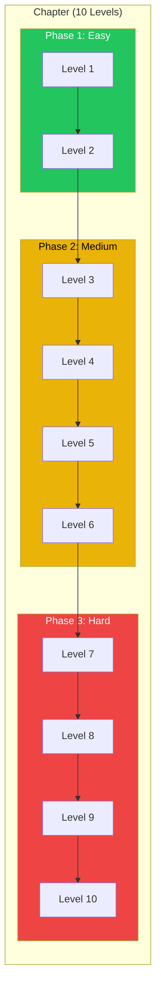
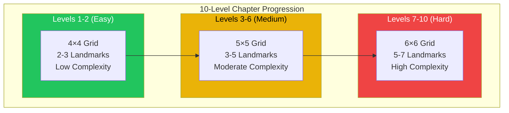
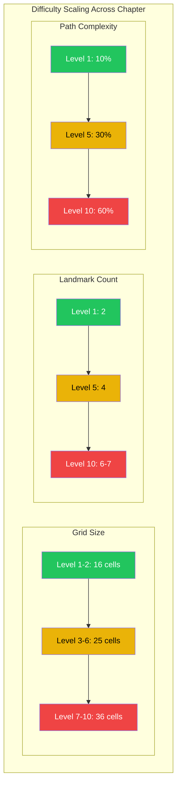
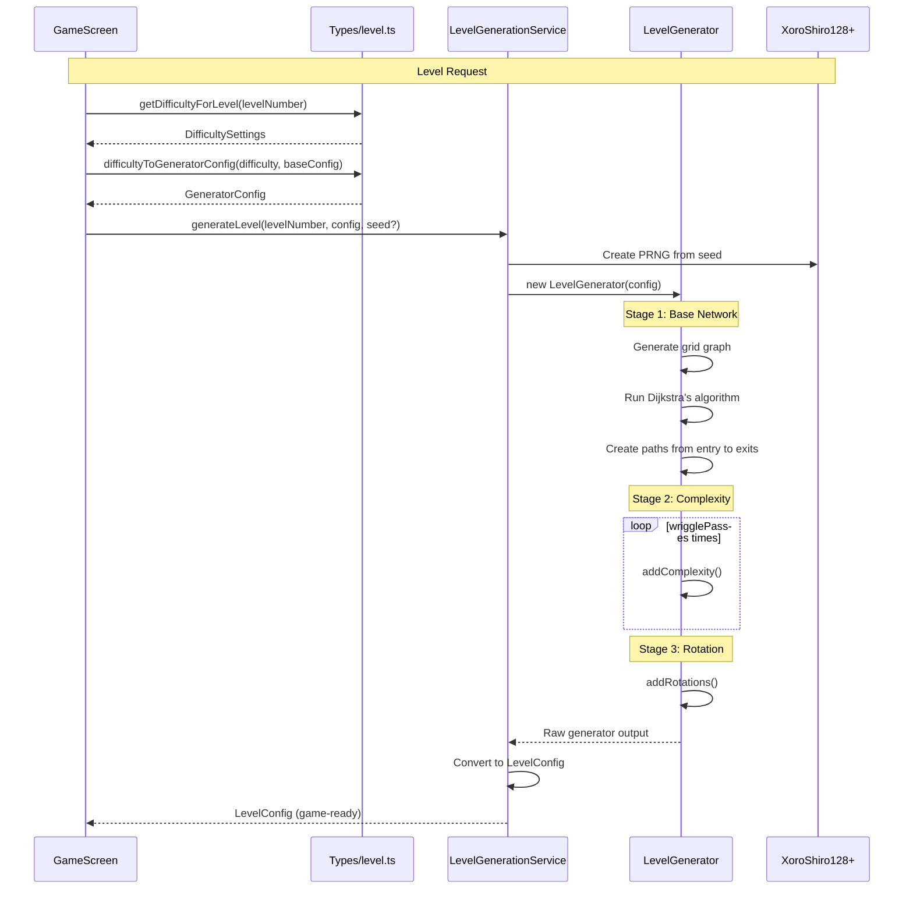
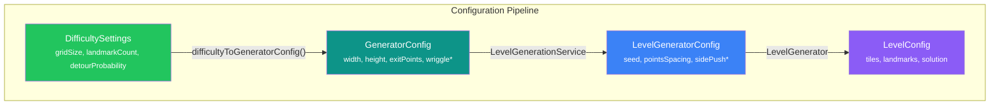
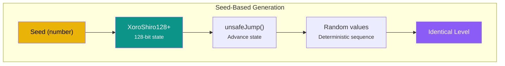

# Level Progression Generation Report

> **Comprehensive analysis of chapter generation and difficulty scaling**

---

## Table of Contents

1. [Overview](#1-overview)
2. [Chapter Structure](#2-chapter-structure)
3. [Difficulty Progression](#3-difficulty-progression)
4. [Generation Pipeline](#4-generation-pipeline)
5. [Seed-Based Reproducibility](#5-seed-based-reproducibility)
6. [Configuration Reference](#6-configuration-reference)
7. [Generation Algorithm](#7-generation-algorithm)

---

## 1. Overview

The level generation system uses **procedural generation** to create infinite, unique puzzle levels while maintaining a predictable difficulty curve across each 10-level chapter.

**Key Metrics:**

| Metric | Value |
|--------|-------|
| Levels per Chapter | 10 |
| Grid Size Range | 4×4 to 6×6 |
| Landmark Range | 2 to 7 |
| Difficulty Phases | 3 (Easy, Medium, Hard) |
| Generation Algorithm | Dijkstra's pathfinding |
| PRNG Algorithm | XoroShiro128+ |

---

## 2. Chapter Structure

### 2.1 Chapter Composition

Each chapter contains exactly **10 levels** following a three-phase progression:



### 2.2 Chapter Reset Behavior

Chapters **reset difficulty** after every 10 levels:

| Level Range | Chapter | Progression |
|-------------|---------|-------------|
| 1-10 | Chapter 1 | Easy → Hard |
| 11-20 | Chapter 2 | Easy → Hard (reset) |
| 21-30 | Chapter 3 | Easy → Hard (reset) |

**Formula:**
```typescript
const chapterLevelIndex = (levelNumber - 1) % 10;
```

---

## 3. Difficulty Progression

### 3.1 Complete Progression Table



### 3.2 Level-by-Level Specification

| Level | Grid | Landmarks (Min-Max) | Detour Prob | Min Path | Phase |
|-------|------|---------------------|-------------|----------|-------|
| 1 | 4×4 | 2-2 | 0.10 | 3 | Easy |
| 2 | 4×4 | 2-3 | 0.15 | 3 | Easy |
| 3 | 5×5 | 3-3 | 0.20 | 4 | Medium |
| 4 | 5×5 | 3-4 | 0.25 | 4 | Medium |
| 5 | 5×5 | 4-4 | 0.30 | 4 | Medium |
| 6 | 5×5 | 4-5 | 0.35 | 4 | Medium |
| 7 | 6×6 | 5-5 | 0.40 | 5 | Hard |
| 8 | 6×6 | 5-6 | 0.50 | 5 | Hard |
| 9 | 6×6 | 6-6 | 0.55 | 5 | Hard |
| 10 | 6×6 | 6-7 | 0.60 | 5 | Hard |

**Source:** [level.ts:68-89](src/game/citylines/types/level.ts#L68-L89)

### 3.3 Scaling Factors



### 3.4 Derived Wriggle Parameters

The `detourProbability` converts to wriggle parameters:

| Level | Detour Prob | Wriggle Factor | Wriggle Extent |
|-------|-------------|----------------|----------------|
| 1 | 0.10 | 0.33 | 0.37 |
| 2 | 0.15 | 0.40 | 0.41 |
| 3 | 0.20 | 0.46 | 0.44 |
| 4 | 0.25 | 0.52 | 0.48 |
| 5 | 0.30 | 0.59 | 0.51 |
| 6 | 0.35 | 0.65 | 0.55 |
| 7 | 0.40 | 0.72 | 0.58 |
| 8 | 0.50 | 0.85 | 0.65 |
| 9 | 0.55 | 0.92 | 0.69 |
| 10 | 0.60 | 0.98 | 0.72 |

**Formulas:**
```typescript
wriggleFactor = 0.2 + (detourProbability * 1.3)
wriggleExtent = 0.3 + (detourProbability * 0.7)
```

---

## 4. Generation Pipeline

### 4.1 Full Pipeline Flow



### 4.2 Configuration Conversion



---

## 5. Seed-Based Reproducibility

### 5.1 PRNG Architecture



### 5.2 Seed Usage

**File:** [LevelGenerationService.ts](src/game/citylines/services/LevelGenerationService.ts)

```typescript
static generateLevel(
  levelNumber: number,
  config: GeneratorConfig,
  seed?: number  // Optional seed
): LevelConfig {
  // Use provided seed or generate random one
  const effectiveSeed = seed ?? (Date.now() ^ (Math.random() * 0x100000000));

  const generator = new LevelGenerator({
    seed: effectiveSeed,
    // ...other config
  });

  // ...generation process
}
```

### 5.3 Section Config Integration

When a section config provides seeds:

```typescript
// From GameScreen.tsx
const levelIndex = (levelNumber - 1) % 10;
const seed = sectionConfig?.levelSeeds?.[levelIndex];

// If seed provided, level is reproducible
// If no seed, level is randomly generated
```

### 5.4 Reproducibility Guarantee

| Inputs | Output |
|--------|--------|
| Same seed + Same config | **Identical level** |
| Same seed + Different config | Different level |
| Different seed + Same config | Different level |

---

## 6. Configuration Reference

### 6.1 DifficultySettings

**File:** [level.ts:46-52](src/game/citylines/types/level.ts#L46-L52)

```typescript
interface DifficultySettings {
  gridSize: GridSize;           // 4, 5, or 6
  landmarkCount: {
    min: number;
    max: number;
  };
  detourProbability: number;    // 0.1 to 0.6
  minPathLength: number;        // 3 to 5
}
```

### 6.2 GeneratorConfig

**File:** [tuning/types.ts:152-175](src/game/tuning/types.ts#L152-L175)

| Parameter | Range | Default | Purpose |
|-----------|-------|---------|---------|
| `width` | 4-12 | 4 | Grid width |
| `height` | 4-12 | 4 | Grid height |
| `exitPoints` | 1-4 | 1 | Number of landmarks |
| `pointsSpacing` | 1-4 | 3 | Min distance between exits |
| `sidePushRadius` | 0-2 | 2 | Push exits from center |
| `sidePushFactor` | 0-2 | 1 | Push probability |
| `wriggleFactor` | 0-1 | 0.999 | Base wriggle probability |
| `wriggleDistanceMagnifier` | 0-10 | 4 | Wriggle frequency |
| `wriggleExtent` | 0-1 | 0.7 | Curve intensity |
| `wriggleExtentChaosFactor` | 0-1 | 0.8 | Randomness in curves |
| `wrigglePasses` | 1-5 | 2 | Number of complexity passes |

### 6.3 LevelConfig (Output)

**File:** [level.ts:17-43](src/game/citylines/types/level.ts#L17-L43)

```typescript
interface LevelConfig {
  gridSize: number;
  tiles: TileConfig[];
  landmarks: LandmarkConfig[];
  exits: ExitConfig[];
  startingRotations: number[];
  solutionRotations: number[];
}
```

---

## 7. Generation Algorithm

### 7.1 Three-Stage Process

```mermaid
graph TB
    subgraph ALGORITHM["Generation Algorithm"]
        subgraph STAGE1["Stage 1: Base Network"]
            S1A["Create weighted grid graph"]
            S1B["Place entry point (left edge)"]
            S1C["Place exit points (edges)"]
            S1D["Run Dijkstra's algorithm"]
            S1E["Create paths entry → exits"]
        end

        subgraph STAGE2["Stage 2: Complexity (Wriggling)"]
            S2A["Identify path segments"]
            S2B["Find breakpoints (junctions)"]
            S2C["Re-route segments with bias"]
            S2D["Repeat for wrigglePasses"]
        end

        subgraph STAGE3["Stage 3: Rotation"]
            S3A["Calculate solution rotations"]
            S3B["Scramble tile rotations"]
            S3C["Apply rotationFactor"]
        end
    end

    S1A --> S1B --> S1C --> S1D --> S1E
    S1E --> S2A --> S2B --> S2C --> S2D
    S2D --> S3A --> S3B --> S3C

    style STAGE1 fill:#22c55e,color:#fff
    style STAGE2 fill:#eab308,color:#000
    style STAGE3 fill:#ef4444,color:#fff
```



### 7.2 Crossroad Prevention

The generator prevents 4-way intersections using a penalty system:

```typescript
// From LevelGenerator.ts
if (potentialSourceNeighbors >= 4 || potentialDestNeighbors >= 4) {
  cost = 1_000_000;  // Prohibitively high cost
}
```

### 7.3 T-Junction Penalty

Adjacent T-junctions are discouraged:

```typescript
// Penalty for T-junction adjacent to existing road
if (sourceAlreadyHasTJunction || destWouldCreateAdjacentTJunction) {
  cost = 5;  // Higher than normal (1)
}
```

### 7.4 Tile Type Inference

**File:** [LevelGenerationService.ts](src/game/citylines/services/LevelGenerationService.ts)

| Connections | Tile Type | Rotation Logic |
|-------------|-----------|----------------|
| 2 (aligned) | `straight` | 0° or 90° based on axis |
| 2 (perpendicular) | `corner` | Based on which edges connect |
| 3 | `t_junction` | Based on which edge is missing |

---

## Appendix A: Visual Progression

### Grid Size Comparison

```
Level 1-2 (4×4)    Level 3-6 (5×5)    Level 7-10 (6×6)
┌──┬──┬──┬──┐      ┌──┬──┬──┬──┬──┐    ┌──┬──┬──┬──┬──┬──┐
│  │  │  │  │      │  │  │  │  │  │    │  │  │  │  │  │  │
├──┼──┼──┼──┤      ├──┼──┼──┼──┼──┤    ├──┼──┼──┼──┼──┼──┤
│  │  │  │  │      │  │  │  │  │  │    │  │  │  │  │  │  │
├──┼──┼──┼──┤      ├──┼──┼──┼──┼──┤    ├──┼──┼──┼──┼──┼──┤
│  │  │  │  │      │  │  │  │  │  │    │  │  │  │  │  │  │
├──┼──┼──┼──┤      ├──┼──┼──┼──┼──┤    ├──┼──┼──┼──┼──┼──┤
│  │  │  │  │      │  │  │  │  │  │    │  │  │  │  │  │  │
└──┴──┴──┴──┘      ├──┼──┼──┼──┼──┤    ├──┼──┼──┼──┼──┼──┤
                   │  │  │  │  │  │    │  │  │  │  │  │  │
16 cells           └──┴──┴──┴──┴──┘    ├──┼──┼──┼──┼──┼──┤
                   25 cells            │  │  │  │  │  │  │
                                       └──┴──┴──┴──┴──┴──┘
                                       36 cells
```

### Complexity Scaling

```
Low Wriggle (Level 1)     Medium Wriggle (Level 5)   High Wriggle (Level 10)
┌──────────────┐          ┌──────────────┐           ┌──────────────┐
│ ═══════════► │          │ ═══╗         │           │ ═══╗         │
│              │          │    ╚═══╗     │           │    ║ ╔═══╗   │
│              │          │        ╚═══► │           │    ╚═╝   ╚═► │
└──────────────┘          └──────────────┘           └──────────────┘
Direct path               Moderate curves            Complex path
```

---

## Appendix B: Key File References

| File | Purpose | Key Functions |
|------|---------|---------------|
| [level.ts](src/game/citylines/types/level.ts) | Difficulty definitions | `getDifficultyForLevel()`, `difficultyToGeneratorConfig()` |
| [LevelGenerator.ts](src/game/citylines/core/LevelGenerator/LevelGenerator.ts) | Core generation | `generate()`, `addComplexity()`, `addRotations()` |
| [LevelGenerationService.ts](src/game/citylines/services/LevelGenerationService.ts) | Service wrapper | `generateLevel()` |
| [XoroShiro128Plus.ts](src/game/citylines/core/LevelGenerator/XoroShiro128Plus.ts) | PRNG | `fromSeed()`, `unsafeJump()` |
| [GameScreen.tsx](src/game/screens/GameScreen.tsx) | Integration | `generateLevelWithProgression()` |

---

*Report generated for level generation system analysis*
