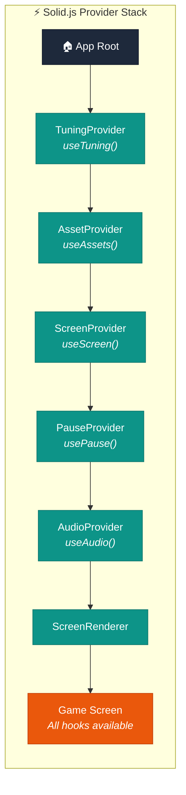
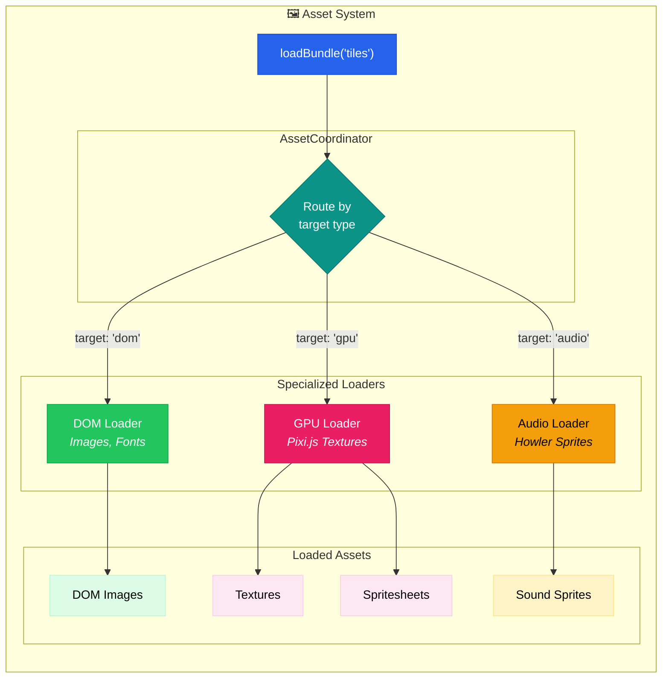
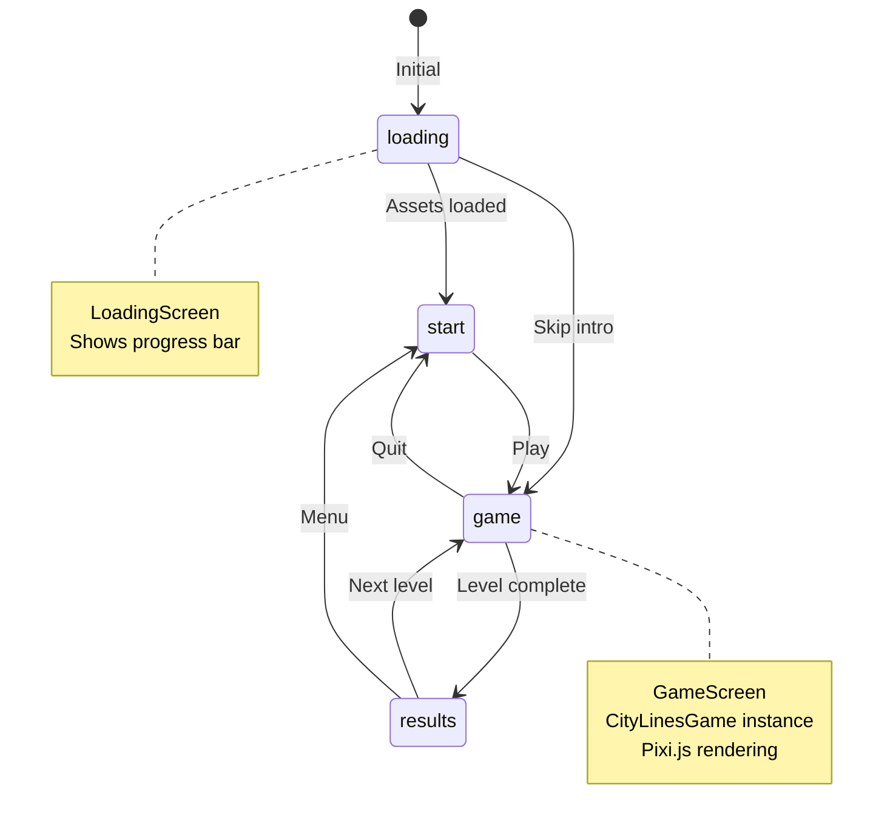
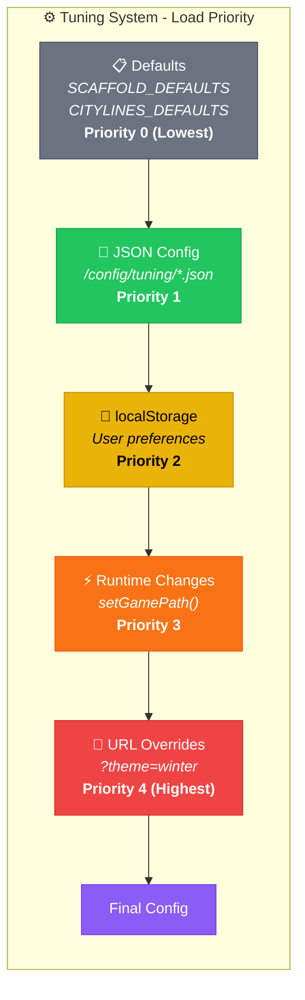
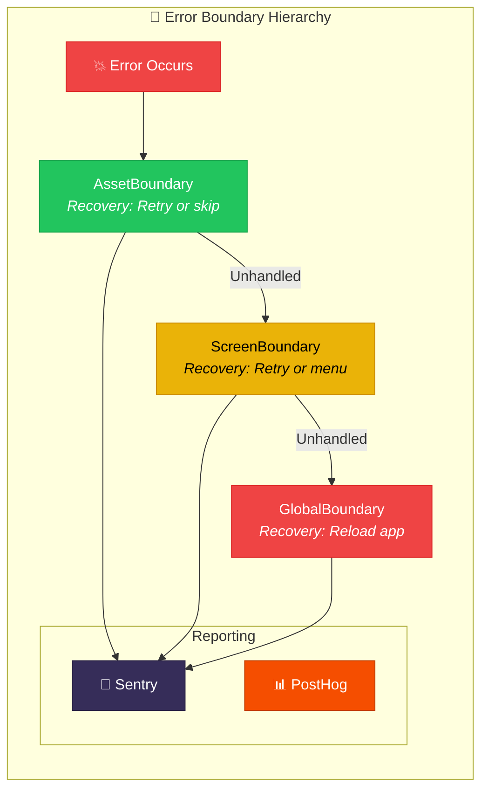
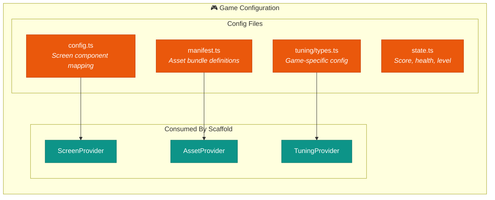
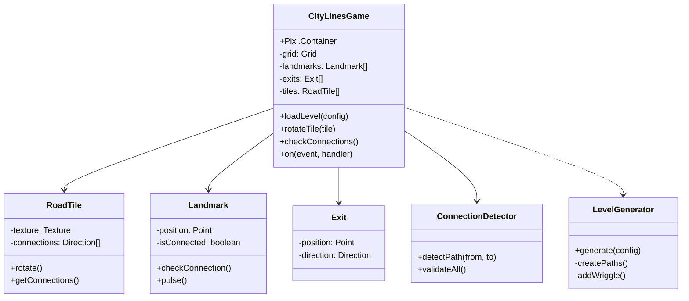
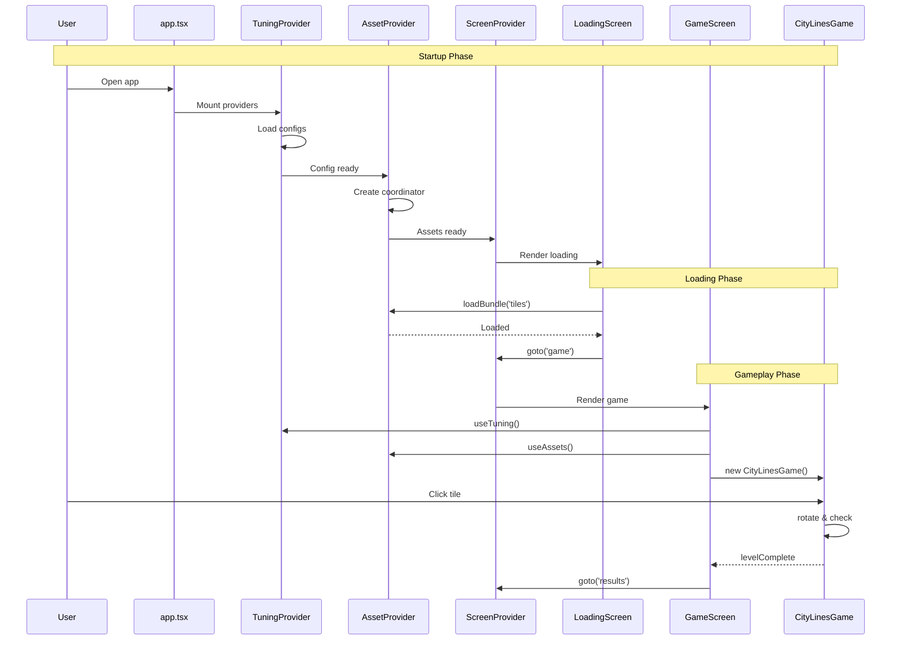
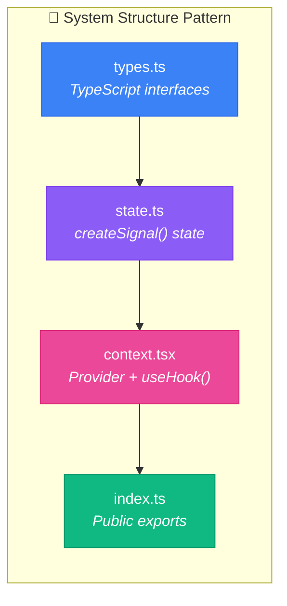

# Scaffold Architecture Deep Dive

A comprehensive guide to understanding the separation between the reusable scaffold framework and game-specific implementation.

---

## Table of Contents

1. [Overview](#overview)
2. [Technology Stack](#technology-stack)
3. [Architecture Diagram](#architecture-diagram)
4. [Directory Structure](#directory-structure)
5. [The Scaffold (Reusable Framework)](#the-scaffold-reusable-framework)
6. [The Game (CityLines Implementation)](#the-game-citylines-implementation)
7. [Scaffold-Game Integration](#scaffold-game-integration)
8. [Systems Architecture](#systems-architecture)
9. [Key Files Reference](#key-files-reference)

---

## Overview

The project follows a **clean separation between scaffold (reusable framework) and game (specific implementation)**:

```
src/
├── scaffold/     # Reusable game framework - can power ANY game
└── game/         # CityLines-specific implementation
```

### Design Philosophy

| Scaffold | Game |
|----------|------|
| Generic, reusable | Game-specific |
| Provides systems & hooks | Consumes systems & hooks |
| Agnostic to game logic | Implements game logic |
| Defines interfaces | Implements interfaces |

---

## Complete Architecture Diagram

```mermaid
graph TB
    %% =============================================
    %% TECH STACK (Top)
    %% =============================================
    subgraph TECH["🛠️ TECH STACK"]
        SOLID["⚡ Solid.js"]
        PIXI["🎮 Pixi.js v8"]
        PHASER["🕹️ Phaser"]
        THREE["🧊 Three.js"]
        GSAP["✨ GSAP"]
        HOWLER["🔊 Howler"]
        TWEAK["🎛️ Tweakpane"]
        SENTRY["🐛 Sentry"]
    end

    %% =============================================
    %% APP ENTRY
    %% =============================================
    APP["📦 app.tsx"]

    %% =============================================
    %% SCAFFOLD LAYER
    %% =============================================
    subgraph SCAFFOLD["🔧 SCAFFOLD - Reusable Platform"]

        subgraph PROVIDERS["Providers"]
            GB["GlobalBoundary"]
            TP["TuningProvider<br/><i>useTuning()</i>"]
            PP["PauseProvider<br/><i>usePause()</i>"]
            AP["AssetProvider<br/><i>useAssets()</i>"]
            SP["ScreenProvider<br/><i>useScreen()</i>"]
            AUP["AudioProvider<br/><i>useAudio()</i>"]
        end

        subgraph TUNING_SYS["Tuning System"]
            T_STATE["TuningState"]
            T_LOADER["Loader"]
            T_TYPES["ScaffoldTuning"]
        end

        subgraph ASSET_SYS["Asset System"]
            COORD["AssetCoordinator"]
            DOM_L["DomLoader"]
            GPU_L["PixiLoader"]
            GPU_PHASER["PhaserLoader"]
            GPU_THREE["ThreeLoader"]
            AUDIO_L["AudioLoader"]
        end

        subgraph SCREEN_SYS["Screen System"]
            S_MGR["ScreenManager"]
            S_TRANS["Transitions"]
        end

        subgraph OTHER_SYS["Other Systems"]
            P_STATE["PauseState"]
            A_STATE["AudioState"]
            E_BOUND["ErrorBoundaries"]
            E_REPORT["ErrorReporter"]
        end

        subgraph UI["UI Components"]
            BTN["Button"]
            SPIN["Spinner"]
            PROG["ProgressBar"]
            PAUSE_OV["PauseOverlay"]
        end

        subgraph DEV["Dev Tools"]
            PANEL["TuningPanel"]
            BIND["Bindings"]
        end
    end

    %% =============================================
    %% GAME LAYER
    %% =============================================
    subgraph GAME["🎮 GAME - CityLines"]

        subgraph GCONFIG["Config"]
            G_CONF["config.ts"]
            G_MAN["manifest.ts"]
            G_STATE["state.ts"]
            GT_TYPES["CityLinesTuning"]
        end

        subgraph SCREENS["Screens"]
            SCR_LOAD["LoadingScreen"]
            SCR_START["StartScreen"]
            SCR_GAME["GameScreen"]
            SCR_RES["ResultsScreen"]
        end

        subgraph GAUDIO["Audio"]
            GA_MGR["GameAudioManager"]
            GA_SND["SoundRegistry"]
        end

        subgraph CORE["Core Engine"]
            CLG["CityLinesGame<br/><i>Pixi.Container</i>"]

            subgraph ELEMENTS["Elements"]
                TILE["RoadTile"]
                LAND["Landmark"]
                EXIT["Exit"]
                CHAR["Character"]
            end

            subgraph LOGIC["Logic"]
                CONN["ConnectionDetector"]
                LVL_GEN["LevelGenerator"]
                COMP_CTRL["CompletionController"]
                DECO["DecorationSystem"]
            end

            subgraph GAME_UI["Game UI"]
                COMP_CHAR["Companion"]
                DIALOGUE["DialogueBox"]
                PROG_BAR["ProgressBar"]
            end
        end
    end

    %% =============================================
    %% VERTICAL FLOW - Tech to App
    %% =============================================
    SOLID --> APP
    SENTRY --> APP

    %% =============================================
    %% VERTICAL FLOW - App to Scaffold
    %% =============================================
    APP --> GB
    GB --> TP
    TP --> PP
    PP --> AP
    AP --> SP
    SP --> AUP

    %% =============================================
    %% Provider to System connections
    %% =============================================
    TP -.-> T_STATE
    AP -.-> COORD
    SP -.-> S_MGR
    PP -.-> P_STATE
    AUP -.-> A_STATE

    %% =============================================
    %% Asset System internal
    %% =============================================
    COORD --> DOM_L
    COORD --> GPU_L
    COORD --> GPU_PHASER
    COORD --> GPU_THREE
    COORD --> AUDIO_L

    %% =============================================
    %% Tech to Loaders
    %% =============================================
    PIXI -.-> GPU_L
    PHASER -.-> GPU_PHASER
    THREE -.-> GPU_THREE
    HOWLER -.-> AUDIO_L
    GSAP -.-> CLG
    TWEAK -.-> PANEL

    %% =============================================
    %% Game Config to Scaffold
    %% =============================================
    G_MAN -->|"bundles"| COORD
    GT_TYPES -->|"extends"| T_TYPES
    G_CONF -->|"screens"| S_MGR

    %% =============================================
    %% Screens use Hooks (the key integration!)
    %% =============================================
    SCR_LOAD -->|"useAssets()"| AP
    SCR_LOAD -->|"useScreen()"| SP
    SCR_START -->|"useTuning()"| TP
    SCR_GAME -->|"useAssets()"| AP
    SCR_GAME -->|"useTuning()"| TP
    SCR_GAME -->|"useAudio()"| AUP

    %% =============================================
    %% GameScreen creates game
    %% =============================================
    SCR_GAME --> CLG
    SCR_GAME --> GA_MGR
    GA_MGR --> AUDIO_L

    %% =============================================
    %% Core game internal
    %% =============================================
    CLG --> TILE
    CLG --> LAND
    CLG --> EXIT
    CLG --> CONN
    CLG --> LVL_GEN
    CLG --> COMP_CTRL
    CLG --> DECO

    %% =============================================
    %% STYLES - Tech
    %% =============================================
    style SOLID fill:#2563eb,color:#fff,stroke:#1d4ed8,stroke-width:2px
    style PIXI fill:#e91e63,color:#fff,stroke:#c2185b,stroke-width:2px
    style PHASER fill:#6366f1,color:#fff,stroke:#4f46e5,stroke-width:2px
    style THREE fill:#000,color:#fff,stroke:#333,stroke-width:2px
    style GSAP fill:#88ce02,color:#000,stroke:#6ba002,stroke-width:2px
    style HOWLER fill:#f59e0b,color:#000,stroke:#d97706,stroke-width:2px
    style TWEAK fill:#0ea5e9,color:#fff,stroke:#0284c7,stroke-width:2px
    style SENTRY fill:#362d59,color:#fff,stroke:#2a2245,stroke-width:2px

    %% =============================================
    %% STYLES - App
    %% =============================================
    style APP fill:#1e293b,color:#fff,stroke:#0f172a,stroke-width:3px

    %% =============================================
    %% STYLES - Scaffold Providers
    %% =============================================
    style GB fill:#134e4a,color:#fff,stroke:#0f766e,stroke-width:2px
    style TP fill:#0d9488,color:#fff,stroke:#0f766e,stroke-width:2px
    style PP fill:#0d9488,color:#fff,stroke:#0f766e,stroke-width:2px
    style AP fill:#0d9488,color:#fff,stroke:#0f766e,stroke-width:2px
    style SP fill:#0d9488,color:#fff,stroke:#0f766e,stroke-width:2px
    style AUP fill:#0d9488,color:#fff,stroke:#0f766e,stroke-width:2px

    %% =============================================
    %% STYLES - Scaffold Systems
    %% =============================================
    style T_STATE fill:#14b8a6,color:#fff,stroke:#0d9488
    style T_LOADER fill:#14b8a6,color:#fff,stroke:#0d9488
    style T_TYPES fill:#14b8a6,color:#fff,stroke:#0d9488
    style COORD fill:#14b8a6,color:#fff,stroke:#0d9488
    style DOM_L fill:#2dd4bf,color:#000,stroke:#14b8a6
    style GPU_L fill:#e91e63,color:#fff,stroke:#c2185b
    style GPU_PHASER fill:#6366f1,color:#fff,stroke:#4f46e5
    style GPU_THREE fill:#000,color:#fff,stroke:#333
    style AUDIO_L fill:#f59e0b,color:#000,stroke:#d97706
    style S_MGR fill:#14b8a6,color:#fff,stroke:#0d9488
    style S_TRANS fill:#14b8a6,color:#fff,stroke:#0d9488
    style P_STATE fill:#14b8a6,color:#fff,stroke:#0d9488
    style A_STATE fill:#14b8a6,color:#fff,stroke:#0d9488
    style E_BOUND fill:#14b8a6,color:#fff,stroke:#0d9488
    style E_REPORT fill:#14b8a6,color:#fff,stroke:#0d9488

    %% =============================================
    %% STYLES - Scaffold UI
    %% =============================================
    style BTN fill:#5eead4,color:#000,stroke:#2dd4bf
    style SPIN fill:#5eead4,color:#000,stroke:#2dd4bf
    style PROG fill:#5eead4,color:#000,stroke:#2dd4bf
    style PAUSE_OV fill:#5eead4,color:#000,stroke:#2dd4bf

    %% =============================================
    %% STYLES - Scaffold Dev
    %% =============================================
    style PANEL fill:#06b6d4,color:#fff,stroke:#0891b2
    style BIND fill:#06b6d4,color:#fff,stroke:#0891b2

    %% =============================================
    %% STYLES - Game Config
    %% =============================================
    style G_CONF fill:#ea580c,color:#fff,stroke:#c2410c,stroke-width:2px
    style G_MAN fill:#ea580c,color:#fff,stroke:#c2410c,stroke-width:2px
    style G_STATE fill:#ea580c,color:#fff,stroke:#c2410c,stroke-width:2px
    style GT_TYPES fill:#ea580c,color:#fff,stroke:#c2410c,stroke-width:2px

    %% =============================================
    %% STYLES - Game Screens
    %% =============================================
    style SCR_LOAD fill:#fb923c,color:#000,stroke:#f97316,stroke-width:2px
    style SCR_START fill:#fb923c,color:#000,stroke:#f97316,stroke-width:2px
    style SCR_GAME fill:#fb923c,color:#000,stroke:#f97316,stroke-width:2px
    style SCR_RES fill:#fb923c,color:#000,stroke:#f97316,stroke-width:2px

    %% =============================================
    %% STYLES - Game Audio
    %% =============================================
    style GA_MGR fill:#fbbf24,color:#000,stroke:#f59e0b
    style GA_SND fill:#fbbf24,color:#000,stroke:#f59e0b

    %% =============================================
    %% STYLES - Core Game
    %% =============================================
    style CLG fill:#f97316,color:#fff,stroke:#ea580c,stroke-width:2px
    style TILE fill:#fdba74,color:#000,stroke:#fb923c
    style LAND fill:#fdba74,color:#000,stroke:#fb923c
    style EXIT fill:#fdba74,color:#000,stroke:#fb923c
    style CHAR fill:#fdba74,color:#000,stroke:#fb923c
    style CONN fill:#fde68a,color:#000,stroke:#fcd34d
    style LVL_GEN fill:#fcd34d,color:#000,stroke:#fbbf24
    style COMP_CTRL fill:#fcd34d,color:#000,stroke:#fbbf24
    style DECO fill:#fde68a,color:#000,stroke:#fcd34d
    style COMP_CHAR fill:#fed7aa,color:#000,stroke:#fdba74
    style DIALOGUE fill:#fed7aa,color:#000,stroke:#fdba74
    style PROG_BAR fill:#fed7aa,color:#000,stroke:#fdba74
```



### Legend

| Color | Meaning |
|-------|---------|
| 🟦 **Blue** | Solid.js (UI framework) |
| 🩷 **Pink** | Pixi.js (current 2D renderer) |
| 🟪 **Purple** | Phaser (alternative 2D renderer) |
| ⬛ **Black** | Three.js (alternative 3D renderer) |
| 🟩 **Green** | GSAP (animation) |
| 🟨 **Yellow** | Howler.js (audio) |
| 🩵 **Teal** | Scaffold systems & providers |
| 🧩 **Cyan** | Scaffold UI components |
| 🟧 **Orange** | Game-specific code |
| 🟡 **Amber** | Game services & controllers |

---

## Provider Hierarchy

The application uses Solid.js context providers for dependency injection:



### Hook Availability

| Hook | Description | Available In |
|------|-------------|--------------|
| `useTuning<S,G>()` | Typed config access | All components |
| `useAssets()` | Asset coordinator | Below AssetProvider |
| `useScreen()` | Navigation | Below ScreenProvider |
| `usePause()` | Pause state | Below PauseProvider |
| `useAudio()` | Volume controls | Below AudioProvider |

---

## Directory Structure

### Scaffold Structure
```
src/scaffold/
├── config.ts                # Engine selection (pixi/babylon/three)
├── index.ts                 # Public API exports
├── dev/                     # Development tools (Tweakpane)
├── lib/                     # External integrations (Sentry, PostHog)
├── systems/                 # Core engine systems
│   ├── assets/              # Asset loading & management
│   ├── audio/               # Audio state & playback
│   ├── errors/              # Error handling & boundaries
│   ├── pause/               # Pause state management
│   ├── screens/             # Screen navigation system
│   └── tuning/              # Configuration management
└── ui/                      # Reusable UI components
```

### Game Structure
```
src/game/
├── config.ts                # Screen definitions
├── manifest.ts              # Asset bundle definitions
├── state.ts                 # Game state (score, health, level)
├── tuning/                  # Game-specific configuration
├── audio/                   # Game audio manager
├── screens/                 # Game screens (use scaffold)
└── citylines/               # Core game logic
    ├── core/                # Game engine classes
    ├── types/               # Type definitions
    ├── systems/             # Game-specific systems
    ├── services/            # Business logic services
    ├── controllers/         # Game controllers
    └── ui/                  # Game UI components
```

---

## The Scaffold (Reusable Framework)

### What the Scaffold Provides

The scaffold is a **complete game development framework** that handles all the "plumbing" so games can focus on gameplay.

### Asset System



**Key Files**:
- `coordinator.ts` - Routes assets by type (dom/gpu/audio)
- `dom.ts` - Handles DOM-based assets
- `gpu/pixi.ts` - Handles Pixi.js rendering
- `audio.ts` - Handles Howler.js audio sprites

**Hook**: `useAssets()` - Access loaded assets from any component

### Screen System



**Features**:
- State machine for screen flow
- Configurable transitions (fade, slide, none)
- History tracking for back navigation
- Data passing between screens

**Usage**:
```typescript
const screen = useScreen();
screen.goto('game', { level: 1 });  // Navigate with data
screen.back();                       // Return to previous
```

### Tuning System



**Hook**: `useTuning<ScaffoldTuning, GameTuning>()` - Typed access to both configs

### Error System



### Other Systems

| System | Purpose | Hook |
|--------|---------|------|
| **Pause** | Spacebar toggle, pause state | `usePause()` |
| **Audio** | Master/Music/SFX volumes | `useAudio()` |
| **Dev Tools** | Tweakpane UI, color-coded | Toggle with `` ` `` |

---

## The Game (CityLines Implementation)

### What the Game Provides

The game implements **all game-specific logic** using scaffold systems.

### Game Configuration Files



### Core Game Classes



### Game Screen Flow

```typescript
// GameScreen.tsx - How game uses scaffold
const GameScreen = () => {
  // 1. Access scaffold systems via Solid.js hooks
  const assets = useAssets();
  const tuning = useTuning<ScaffoldTuning, CityLinesTuning>();
  const screen = useScreen();

  // 2. Create Pixi application using scaffold's GPU loader
  const app = assets.getPixiApp();

  // 3. Instantiate game with tuning config
  const game = new CityLinesGame({
    tuning: tuning.game,
    assets: assets,
  });

  // 4. Handle game events
  game.on('levelComplete', (data) => {
    screen.goto('results', data);
  });
};
```

---

## Scaffold-Game Integration

### Data Flow



### Integration Points

| Aspect | Scaffold Provides | Game Provides |
|--------|-------------------|---------------|
| **Assets** | Coordinator, loaders | Manifest definition |
| **Screens** | Manager, transitions | Screen components |
| **Config** | Loader, fallback chain | Tuning schema + defaults |
| **Audio** | State management | Sound definitions, playback |
| **Errors** | Boundaries, reporting | Wrapped components |
| **Dev Tools** | Tweakpane UI | Bindings for game values |

---

## Systems Architecture

### What is a "System"?

A system is a **self-contained module** that:
1. Manages its own state (using **Solid.js signals**)
2. Exposes a context provider
3. Provides hooks for component access
4. Has no dependencies on game logic

### System Structure Pattern



### Scaffold Systems Summary

| System | State | Hook | Purpose |
|--------|-------|------|---------|
| Assets | coordinator | `useAssets()` | Load/manage assets |
| Screens | manager | `useScreen()` | Navigation |
| Tuning | config | `useTuning()` | Configuration |
| Pause | paused signal | `usePause()` | Pause state |
| Audio | volumes | `useAudio()` | Audio settings |
| Errors | - | boundaries | Error handling |

---

## Key Files Reference

### Scaffold Entry Points

| File | Purpose |
|------|---------|
| `scaffold/config.ts` | Engine selection (pixi/babylon/three) |
| `scaffold/index.ts` | Public API - what games can import |
| `scaffold/systems/*/context.tsx` | Provider + hooks for each system |

### Game Entry Points

| File | Purpose |
|------|---------|
| `game/config.ts` | Screen component mapping |
| `game/manifest.ts` | Asset bundle definitions |
| `game/state.ts` | Global game state (Solid.js root) |
| `game/tuning/types.ts` | Game config schema + defaults |

### Integration Point

| File | Purpose |
|------|---------|
| `app.tsx` | Root - wires scaffold + game together |

---

## Benefits of This Architecture

### For Development
- **Clear boundaries** - Know where to put new code
- **Reusability** - Scaffold works for any game (Pixi, Three.js, Babylon)
- **Testability** - Systems are isolated and testable
- **Type safety** - Generics ensure correct typing across boundary

### For Teams
- **Parallel work** - Scaffold and game can evolve independently
- **Onboarding** - Clear structure is easier to learn
- **Code reviews** - Changes are localized to appropriate layer

### For the Future
- **New games** - Just implement game layer against scaffold
- **Upgrades** - Scaffold improvements benefit all games
- **Engine swap** - Change from Pixi to Three.js via config

---

## Quick Reference: Adding New Features

### Adding a New Scaffold System

1. Create `scaffold/systems/mySystem/`
2. Define types in `types.ts`
3. Create state with `createSignal()` in `state.ts`
4. Create provider + hook in `context.tsx`
5. Export from `scaffold/index.ts`
6. Add provider to `app.tsx` stack

### Adding Game-Specific Logic

1. Add to `game/citylines/` (core logic) or `game/screens/` (UI)
2. Use scaffold hooks for assets, screens, tuning
3. Extend `CityLinesTuning` if new config needed
4. Add to manifest if new assets needed

### Adding Tunable Values

1. Add to `game/tuning/types.ts` with default
2. Use via `useTuning<ScaffoldTuning, CityLinesTuning>()`
3. Optionally add dev bindings for Tweakpane UI
